# mCare — agent guide

Read it at the start of every session (one of the project's two documents; the other is [README.md](README.md)). It is written so a task can start **without reading the source first**: where the project stands, the rules the code follows, a map of every file, and where each kind of change goes. Open a source file only once this guide has told you which one; for a big file, read only the section you need ([§6](#big-files-by-section)).

Sections 1–6 are the working guide; 7–13 are the reference (read only the one the task needs). Setup, running, phones, hosting and deploying are in [README](README.md).

| Read | When the task touches |
| --- | --- |
| [§7 Data model](#7-data-model-and-ownership) | who owns a record, who may do what (per role), workflows end to end |
| [§8 Database](#8-database) | migrations, which file defines which function/trigger, tables and keys, RLS summary, what triggers do, the local backend |
| [§9 Portals](#9-portals) | a portal's tabs, features → screens → tables/functions |
| [§10 Notifications](#10-notifications-and-delivery) | notifications, email / SMS / push, the sender, adding a notification |
| [§11 Security](#11-security) | sign-in, two-step sign-in, sessions, who reaches what, audit, admin privilege, limits, files, headers, retention, how the security plan maps to the code |
| [§12 Testing](#12-testing) | the three test suites and how to write a check |
| [§13 Status](#13-status) | what works, what is in progress, what is pending, decisions, known gaps, tech debt, latest test results |

**Contents:** [Working on a request](#working-on-a-request) · [Words and screens → code](#words-and-screens--code) · [1 Snapshot](#1-snapshot) · [2 Commands](#2-commands) · [3 Code rules](#3-code-rules) · [4 Where to change what](#4-where-to-change-what) · [5 Recipes](#5-recipes) · [6 Code map](#6-code-map) · [7 Data model](#7-data-model-and-ownership) · [8 Database](#8-database) · [9 Portals](#9-portals) · [10 Notifications](#10-notifications-and-delivery) · [11 Security](#11-security) · [12 Testing](#12-testing) · [13 Status](#13-status) · [14 Keeping these docs true](#14-keeping-these-docs-true)

---

## Working on a request

Requests are often short and informal ("fix the chat page", "loader shows too long", "add X for the doctor"). Turn each one into a precise, complete change:

1. **Locate.** Translate the words into code with [Words and screens → code](#words-and-screens--code) and [§4](#4-where-to-change-what), then open only the files they name. If two readings are plausible and would lead to different changes, ask one short question; otherwise take the reading that fits the rules below and say which you took.
2. **Check what is in flight.** [§13 Status → In progress](#in-progress-uncommitted) and `git status`: build on uncommitted work in that area, never overwrite it.
3. **Find every layer the change touches.** Screen → portal hook → `AppContext` (live **and** demo branch) → `api/actions.ts` / `api/records.ts` → a new migration → tests. A look-and-feel request stays in the UI; a rule ("only X may…", "should notify…") is never UI-only: it belongs in SQL first.
4. **Check every portal that shares it.** `src/shared/**` is used by several portals: `grep` the component name and check each caller.
5. **Follow [§3](#3-code-rules)** (container variants, rem sizes, teal actions, `Outcome` + `useSave`, nothing clinical deleted, the database decides).
6. **Verify.** `npm run typecheck`; `npm test` if SQL changed. The browser test finds elements by visible text and labels, so **when you change any visible text, grep `supabase/tests/ui.test.mjs` for it** and update the test; run `npm run test:ui` when a journey changed.
7. **Update the docs in the same change** ([§14](#14-keeping-these-docs-true)), then report: what changed (with file links), what was verified and how, and anything left undone.

## Words and screens → code

What the person sees or says, and where it lives. Screen titles are the `Page` / `BackHeader` titles in the app.

**Patient**

| Says / sees | Code |
| --- | --- |
| Home, health score, "up next", reminders, recent readings | `patient/HomeTab.tsx`, `VitalsStrip.tsx`, `ReminderSheet.tsx` |
| "Vitals" page | `patient/VitalsTab.tsx` |
| One vital's page ("Vital"), chart, history, fix a typo | `patient/VitalDetail.tsx`, `shared/ui/VitalHistory.tsx`, `shared/ui/vitals.tsx` |
| Log a reading, "Log all", re-measure banner | `patient/VitalLogSheets.tsx` |
| Floating "Log vitals" button, FAB, quick log | `patient/QuickLogFab.tsx` |
| "My Alerts", re-measure, alert story | `patient/MyAlertsTab.tsx`, `alertKit.tsx`; story: `alertStory` in `lib/vitals.ts` |
| SOS, "I'm safe now" | `patient/SosSheet.tsx` |
| Meds, "Medications", dose ticks | `patient/MedicineTab.tsx`, `useDaySchedule.ts`, `lib/schedule.ts` |
| Meals, water | `patient/MealsTab.tsx` |
| Chat, "Messages" | `patient/MessagesTab.tsx`, `shared/ui/Inbox.tsx`, `ChatThread.tsx` |
| Appts, "Appointments", request a visit | `patient/AppointmentsTab.tsx`, `shared/ui/appointments.tsx`, `SlotPicker.tsx` |
| "Care Team", find / request / rate a doctor | `patient/CareTeamTab.tsx`, `DoctorProfileSheet.tsx`, `shared/ui/CareTeamCard.tsx`, `CarePlanCard.tsx` |
| "Documents", upload, share link, download | `patient/DocsTab.tsx`, `shared/documents/*` (`UploadSheet`, `ShareSheet`, `DownloadSheet`, `DocumentViewer`) |
| Ask for a report | `patient/ReportRequest.tsx` |
| First-run setup, "About you", conditions, allergies | `patient/HealthSetup.tsx`, `healthForms.tsx` |
| Profile, health profile, emergency contacts / next of kin | `patient/ProfileTab.tsx`, `HealthEditSheet.tsx`, `EmergencyContacts.tsx` |
| "Who opened my record", "Download my record", privacy | `patient/ProfileTab.tsx` (Privacy & Security card); `record_views`, `export_my_record()` (`0016`) |
| "Measure twice a day", the doctor's plan on a vital | `patient/VitalDetail.tsx`; `planHours` / `checkInStatus` in `lib/vitals.ts` |

**Doctor**

| Says / sees | Code |
| --- | --- |
| Doctor home, dashboard, risk board | `doctor/DashboardTab.tsx`, `useBoard.ts` |
| "Patients", past patients | `doctor/PatientsTab.tsx`, `PatientChips.tsx` |
| A patient's record ("Patient") | `doctor/PatientDetail.tsx` + the section file below |
| Readings, targets, thresholds, ranges, mark invalid | `doctor/PatientVitals.tsx`, `shared/ui/vitals.tsx` (`VitalThresholdRow`) |
| Monitoring plan, how often to measure, "Mark reviewed", readings to review | `doctor/PatientVitals.tsx`, `DashboardTab.tsx`; `set_vital_plan`, `review_vitals` (`0015`) |
| Prescribe, stop / restart medicine | `doctor/PatientMeds.tsx` |
| Notes, internal note, correct a note | `doctor/PatientNotes.tsx` |
| Care plan, goals, interventions | `doctor/PatientCarePlan.tsx`, `shared/ui/CarePlanCard.tsx` |
| Meal plan, nutrition | `doctor/PatientNutrition.tsx` |
| Vitals report, report builder, sign, release, correct | `doctor/ReportBuilderSheet.tsx`, `PatientDocs.tsx`, `shared/documents/DocumentViewer.tsx`, `reportTemplate.ts` |
| Doctor's "Alerts", acknowledge, resolve, follow-up | `doctor/AlertsTab.tsx`, `AlertCard.tsx`, `shared/ui/alerts.tsx` (`ResolveAlertSheet`) |
| Doctor's appointments, book, confirm, propose | `doctor/AppointmentsTab.tsx`, `useVisits.tsx` |
| Doctor's chat | `doctor/MessagesTab.tsx` |
| Working hours, availability, days away | `doctor/AvailabilityCard.tsx` |
| Signature | `shared/profile/SignatureSheet.tsx`, `shared/ui/SignaturePad.tsx` |
| Consulting doctor, second opinion, care team | `doctor/ConsultView.tsx`, `shared/ui/CareTeamCard.tsx` |
| "Waiting for approval" screen | `shared/auth/DoctorStatusScreen.tsx` |

**Admin and assistant**

| Says / sees | Code |
| --- | --- |
| Admin / assistant home | `admin/DashboardTab.tsx`, `assistant/PermissionsCard.tsx` |
| "Doctor Approvals" | `admin/ApprovalsTab.tsx` |
| "Care Assignments", assign a doctor / health worker, patient's doctor request | `admin/AssignTab.tsx`, `PatientAssignmentView.tsx`, `DoctorPicker.tsx` |
| "Users", invite / register, suspend, deactivate, permissions, correct someone's details, reset two-step sign-in | `admin/UsersTab.tsx`; gates: `assistant/permissions.ts` |
| "Settings", require two-step sign-in, idle sign-out, retention, conditions list | `admin/SettingsTab.tsx` (admins only); `app_settings`, `save_settings` (`0012`) |
| "Alert Monitor" | `admin/AlertsMonitorTab.tsx` |
| Admin "Vitals" (definitions, a patient's readings) | `admin/VitalsTab.tsx`, `PatientThresholdView.tsx` |
| Appointments desk, "Support", "Documents" registry, "Audit Log", "Reports" | `admin/AppointmentsTab.tsx`, `SupportTab.tsx`, `DocumentsTab.tsx`, `AuditTab.tsx`, `ReportsTab.tsx` |

**Signed out**

| Says / sees | Code |
| --- | --- |
| Welcome page, feature tour, "Get started" | `shared/auth/WelcomeScreen.tsx`, `AuthShell.tsx` |
| Sign up, register | `shared/auth/SelfRegisterScreen.tsx` |
| Sign in, login, demo account list | `shared/auth/LoginScreen.tsx` |
| OTP, code, verify email, activation link | `shared/auth/LiveAuth.tsx` (live), `VerificationScreen.tsx` (demo), `api/authBackend.ts` |
| Forgot / reset password | `LiveAuth.tsx` `LiveRecovery` (live), `ForgotPassword.tsx` (demo) |
| Terms, consent, privacy text | `shared/auth/Legal.tsx` |
| Google / Apple / social sign-in | `shared/auth/SocialAuth.tsx` (`LAUNCH_PROVIDERS`: Google, Apple) |
| Two-step sign-in, MFA, authenticator code at sign-in | `shared/auth/MfaScreen.tsx`, `TotpSetup.tsx`; gate in `AppContext` `enter()`; `mfaGate` etc. in `api/authBackend.ts`; rule `mfa_ok()` (`0013`) |
| Password rules | `shared/state/auth.ts` (`passwordIssue`) and the backend's sign-up check |
| Form inputs, icons on these screens | `shared/auth/authKit.tsx` |

**Everywhere**

| Says / sees | Code |
| --- | --- |
| Loader, loading popup, spinner | `shared/ui/Loader.tsx` (overlay on the page, only for real waits) |
| Splash, logo at start | `index.html` `#boot-splash`, `shared/layout/SplashScreen.tsx` |
| Logo | `shared/layout/MCareLogo.tsx`, `brand.ts` |
| Bottom bar, side bar, menu, nav | `shared/layout/NavBar.tsx`, `PortalShell.tsx` |
| "Can't reach mCare" / offline / "could not save" banner | `shared/layout/PortalShell.tsx` |
| Popup, sheet, dialog, modal | `shared/ui/BottomSheet.tsx` |
| Toast, "saved" message | `useToast` in `shared/ui/BottomSheet.tsx` |
| Bell, notifications list | `shared/ui/NotificationBell.tsx` |
| Notification settings (email / SMS / push) | `shared/profile/NotificationsSheet.tsx` |
| Header with greeting and avatar, hero card, quick buttons | `shared/ui/home.tsx` |
| Profile card, edit profile, change password, theme, font size, help, deactivate | `shared/profile/ProfileCard.tsx`, `AccountSheets.tsx` |
| "Two-step sign-in" in Profile | `shared/profile/SecuritySheet.tsx` |
| Signed out after being idle, "Still there?" | `shared/layout/IdleSignOut.tsx` (minutes per role from `settings.security.idleMinutes`) |
| Security headers, CSP | `securityHeaders()` in `vite.config.ts` → `dist/_headers` |
| Empty page message | `EmptyState` in `shared/ui/Page.tsx` |
| Colours, fonts, animations, text size | `src/index.css`, `shared/layout/deviceScale.ts` |
| "Static on the phone", reduce motion, Animations setting | `shared/layout/motion.ts`, `index.html` (inline script), `ThemeFontSheet` in `shared/profile/AccountSheets.tsx` |
| Emails, SMS wording | `shared/email/emailTemplate.ts` |
| Demo mode, sample people | `shared/state/demoData.ts`, `shared/documents/docSeed.ts` |

**Words:** *two-step sign-in* = MFA (TOTP, `aal2`) · *retention* = `app_settings.retention` + `apply_retention()` · *access log* = `record_views` · *health worker* = doctor · *coordinator* = admin, or assistant with "Assign healthworkers" · *monitor* = staff with "Monitor patients" · *thresholds / targets / ranges* = `thresholds` (normal) and critical range · *re-measure / re-check* = `alert_remeasures` · *assistant* = `staff.is_assistant` with `permissions` · *live* = backed by Postgres, *demo* = in memory.

---

## 1. Snapshot

*As of 7 October 2026, branch `main`: the security and data-architecture upgrade (migrations `0012`–`0016`), the docs cleanup and the no-warnings work are committed (`7970e04`, `c42b928`, merged to `main` in `ff542cc`). Full detail: [§13 Status](#13-status).*

mCare is remote patient monitoring. Patients log vitals, medicines, meals and water; their doctor follows them, answers alerts, prescribes, writes notes and care plans and issues signed reports; administrators and mCare assistants run assignments, approvals, support and the audit trail.

> A record exists once, under one ID, in one database. Each role sees and changes it through its own screens, the database decides what each may do, and every change is audited and reaches the other roles.

There is no patient database, doctor database or admin database: `src/patient`, `src/doctor`, `src/admin` and `src/assistant` are four sets of screens over the same rows.

| Layer | Technology |
| --- | --- |
| App | React 19, TypeScript 5.7 (strict), Vite 8, Tailwind CSS v4 (`@tailwindcss/vite`, no config file), oxfmt. Runtime deps: `react`, `react-dom`, `@supabase/supabase-js` only. |
| Backend | Supabase: Postgres with row-level security, Auth, Storage |
| Local backend | `supabase/dev/server.mjs`: the same migrations on PGlite, served as the Supabase API |
| Sending | `supabase/functions/deliver`: Edge Function for queued email, SMS, push |

**State.** All four portals are feature-complete against the local backend. Last verified run (7 October): typecheck clean · `test:db` 410/0 · `test:api` 176/0 · `test:ui` 70/0 (no console warning or error) · build without warnings.

**Recently finished** (`7970e04`, tested): the security and data-architecture upgrade (the Security & Data Architecture Implementation Plan; mapping in [§11 Security → The plan and the code](#the-plan-and-the-code)): clinical records cannot be hard-deleted; two-step sign-in for every role (each person's choice, required per role by an admin), enforced in SQL; audit entries with session, device, address and "on behalf of"; private doctor signatures and a doctor directory; conditions catalogue, monitoring plans, reviews of readings; who opened a record; download my record; write limits; idle sign-out; admin Settings and retention; instant change notices on the local backend; production security headers; CI. Controls: [§11 Security](#11-security). Also the two-document cleanup and no warnings anywhere (typecheck with unused code as errors, build, browser console).

**In progress** (uncommitted, tested): the sign-in page's reachability check no longer uses a just-ended session (the last console error).

**Pending** (not started): hosted Supabase project and its Auth settings, real email/SMS/push providers, the host (D-3), reviewed legal text, server-side file scanning, files via share links, physical-phone testing. See [§13 Status → Pending](#pending-before-production).

---

## 2. Commands

Node 22+. First time: `npm install && npm i --no-save @electric-sql/pglite` (PGlite and Playwright are kept out of `package.json` on purpose).

| Command | What it does |
| --- | --- |
| `npm run backend` | Local Postgres + Supabase API on :54321; applies new migrations; writes `.env.local` (switches the app to live mode). One backend per data folder; seeds a new database; keeps a copy at each clean stop and recovers from it after a kill. |
| `npm run dev` | The app on :8443 (hot reload). |
| `npm run backend:seed` | Test accounts (safe to repeat). |
| `npm run backend:stop` | Stop a running backend cleanly from another terminal. |
| `npm run backend:reset` | Delete the local database and its copies (not while a backend runs); then `backend`. |
| `npm run typecheck` | **Run after changing `src/`.** |
| `npm test` | Rule + API suites. **Run after changing a migration.** |
| `npm run test:ui` | Four portals in headless Chromium at three widths (needs Playwright; minutes). |
| `npm run phone` | Production build on :8444 for a phone on the same Wi-Fi. |
| `npm run build` · `preview` · `format` · `db:schema` | Build · serve it · oxfmt · print what the migrations build. |

Test accounts (password `M7c24`): `test.patient@mcare.test` (Patient One: two weeks of readings, an open alert, medicines, care plan, visits, messages), `test.patient2@mcare.test`, `test.patient3@mcare.test` (waiting for a doctor), `test.doctor@mcare.test` (Dr. Test Achieng, treats One and Two), `test.doctor2@mcare.test` (Dr. Test Mutua, consults on One), `test.doctor3@mcare.test` (awaiting approval), `test.admin@mcare.test`, `test.assistant@mcare.test`. What each holds: [README → Running mCare → Test accounts](README.md#test-accounts).

**Modes.** *Live* when `.env.local` sets `VITE_SUPABASE_URL` + `VITE_SUPABASE_ANON_KEY` (local backend or hosted); *demo* otherwise (sample data in memory from `src/shared/state/demoData.ts`, nothing saved). Delete `.env.local` to go back to demo. More: [README → Running mCare](README.md#running-mcare).

---

## 3. Code rules

### Layout and design (the patient portal is the reference)

- Every portal renders inside `PortalShell`. Profile opens from the header avatar, not from a nav tab.
- **Responsive.** `PhoneShell` fills the window and is a CSS container. Build mobile-first, then use Tailwind **container** variants: `@2xl:` tablet (672px+), `@5xl:` web (1024px+). Never viewport variants (`md:`, `lg:`). `PortalShell` turns the bottom tab bar into a side rail (tablet) and a sidebar (web) and keeps content to a readable width; sheets become centred dialogs on tablet and web automatically.
- Stacked cards flow into two columns on tablet and web through `card-flow` (`Page` applies it; pass `flow={false}` for a screen with its own grid). Plain-stack roots add `card-flow` themselves; `span-all` keeps a child full width. `PortalShell` takes `narrow` for single-column screens such as Profile.
- A font size cannot be switched with a container variant on the same element as `text-[9px]`/`text-xs`… (the font-scale rules in `index.css` win): render two elements and show one per size.
- **Device scale.** Size in rem through Tailwind's scales (`w-6`, `gap-3`, `text-sm`), not px (`w-[18px]`, inline `fontSize: 40`). The root font size follows the device's text size and shrinks on phones narrower than 390px (`layout/deviceScale.ts`). A new `text-[Npx]` size needs a matching line in the font-scale block of `index.css`.
- Charts measure their own width (`useElementWidth` from `@/shared`); never hard-code an SVG width.
- Every home screen: `PortalHeader`, then `HeroCard`, then `QuickGrid`, then `NoticeCard`s.
- Other screens are wrapped in `Page` (title row, spacing, loading and error states) or start with `BackHeader` for detail views. `EmptyState` for empty lists. `PageTitle` is the older form; prefer `Page`.
- Brand teal (`teal-700`) is the only colour for action buttons. Blue, purple and amber mark status or role only.
- Fonts: `font-display` for headings, `font-mono` for numbers. Never inline `fontFamily`.
- The loading popup (`Loading` / `useLoader`) overlays the page that is already up, and only for real waits; never a standalone loading screen.
- **Motion** follows one setting, `data-motion` on `<html>` (`layout/motion.ts`: the device's reduce-motion setting unless the person chose Full or Reduced in Theme & Font). Never test `prefers-reduced-motion` yourself: CSS uses `:where(:root[data-motion='reduce']) .x { … }`, markup uses `motion-safe:` / `motion-reduce:` (redefined in `index.css`), scripts call `reducedMotion()`. Under reduce, movement becomes a fade or an in-place glow, not nothing; opacity-only effects (`animate-pulse`) need no guard.
- **Secure-context APIs** (`navigator.clipboard`, `crypto.randomUUID`, `crypto.subtle`, service worker, push) are missing on a phone opening `http://<laptop IP>`. Use the helpers that fall back (`copyText`, `newRef`) and never let a feature depend on one silently.
- Reusable UI goes in `src/shared/ui/`, not inside a screen. Import UI from `@/shared`.
- Tailwind v4 needs no config file: global CSS and theme customisation go in `src/index.css`, `@import` statements first, then `@font-face` and font defaults.
- Imports: `@/…` for anything in another folder, `./…` within the same folder, never `../`. No other files belong at the top of `src/`.

### Data and saving

- **One data hook per portal**; its screens read and change the record only through it: `usePatient()`, `useDoctor()`, `useAdmin()` (also used by the assistant portal). Never call `updateUser` or read the raw `users` list from a screen; add a named action or a scoped read to the hook. Each action is one request to the backend. Shared widgets (documents, chat, notifications, alerts, profile) may use `useApp()` directly.
- **One record, many views.** Never copy a record for another role. A new feature is one table keyed by `patient_id` (or the owner's id), one function in `api/actions.ts`, one action in `AppContext`, and each portal's hook exposing what that role may do with it ([recipe A](#a-a-new-patient-owned-record-end-to-end)).
- **Saving.** Every action that saves returns a promise of `Outcome` (`{ ok: true, value }` or `{ ok: false, error }`), in live and demo mode, and never throws. In a form, run it through `useSave()` and show `<SaveError>`: disable the button while `busy`; close the sheet or show success only once `ok`. A button that saves on its own uses `useAct()`. Never say "saved" before the save has come back.
- **Once only.** A form that creates a record passes `useSave().ref` as `clientRef`; the database keeps one row per reference, so a double tap or a retry does not create a second.
- **Nothing clinical is deleted or rewritten.** A reading is marked invalid, a note is corrected by a new note, a prescription is stopped, a care plan is cancelled. Keep the history tables the database writes (`*_events`, `care_assignments`, `threshold_changes`).
- **Live and demo.** `AppContext` loads the record from the backend at sign-in (live) or from `demoData` (demo); a new action needs both a live branch (`if (LIVE) return run(() => api.something())`) and the in-memory one, which mirrors the database's rule. Never put sample people or sample numbers in a screen: show an `EmptyState`.
- **The database decides.** Access rules, clinical rules (grading, alerts), notifications and the audit trail belong to `supabase/migrations`, not to a screen. A screen may hide a button the person cannot use; it must never be the only thing stopping them. The browser cannot write the audit trail: audit inside the trigger or function that makes the change (`audit_event(...)`).
- **Identity checks come from the helpers.** Use `my_role()`, `is_admin()`, `staff_can()`, `treats()`, `consults()`, `account_active()` in policies and functions: they already include the account status and two-step sign-in (`mfa_ok()`). A `security definer` function the app calls must check one of them itself (it bypasses row rules). A function acting for someone sets `set_config('mcare.on_behalf_of', <person>, true)` before auditing; one that writes its own audit entry for a batch sets `mcare.self_audited` so the row triggers stay quiet.
- **Staying current.** A table that belongs to a patient needs the `zz_touch_patient` trigger, or open screens will not learn of its changes.
- **Migrations.** Add a new numbered file (next: `0017_…`); never edit one that has been applied. New functions must have their default grants revoked ([§8 Database → Adding a change](#adding-a-change)).
- **Sending.** Never send email, SMS or push from a screen: the database queues every channel ([§10](#10-notifications-and-delivery)).
- **Errors** shown to people are sentences: every `api/actions.ts` request goes through `ok(…)`, which throws an `ApiError` whose message (`explain()`) can be shown as it is; `run()` in `AppContext` turns it into `{ ok: false, error }`.
- **No warnings.** `npm run typecheck` treats unused variables, imports and parameters as errors (app and Edge Function); `npm run build` must print no warning (keep every file under 500 kB: split with `codeSplitting` in `vite.config.ts` or a dynamic `import()`); `npm run test:ui` fails on any console warning or error. Fix a warning where it starts; never silence it.

---

## 4. Where to change what

| To change… | Edit (in this order) |
| --- | --- |
| Who may read or change a table | New migration with replaced policy (current ones: `0009_security.sql`, `0011`, `0014` for `profiles_read`; grep `policy <table>_`) → demo-mode mirror in the `AppContext` action → `rules.test.mjs` |
| Two-step sign-in, sessions, idle sign-out | Rule: `mfa_ok()` / helpers (`0013`); app gate: `enter()` in `AppContext` + `MfaScreen`; Profile: `SecuritySheet`; local API: `server.mjs` (`/factors…`); idle: `IdleSignOut` |
| Settings and retention | `app_settings` + `save_settings` (`0012`), `apply_retention` (`0016`); screen `admin/SettingsTab.tsx`; types `AppSettings` in `types.ts` |
| Monitoring plan, reviews, access log, the patient's copy | `0015` / `0016` functions → `actions.ts` (section "Settings, monitoring plans…") → `AppContext` (section "settings, monitoring plans, reviews, access log") → hooks |
| Production headers (CSP) | `securityHeaders()` in `vite.config.ts`; a new external origin (fonts, an API) must be added there |
| A clinical rule (grading, alert raising, re-measure) | `0004_vitals_alerts.sql` functions via a new migration → demo mirror: `AppContext.tsx` section "alert engine" + `src/shared/lib/vitals.ts` (`evaluate`, `alertStory`) |
| What a screen shows for a role | `src/<role>/<Screen>.tsx`; data from `use<Role>()` (`src/patient/usePatient.ts`, `src/doctor/useDoctor.ts`, `src/admin/useAdmin.ts`) |
| A new action (button that saves) | `src/shared/api/actions.ts` → `AppContext.tsx` (`Ctx` interface + implementation + `value`) → the portal hook → screen with `useSave`/`useAct` ([recipe B](#b-a-new-action-on-an-existing-table)) |
| What is loaded from the backend | `src/shared/api/records.ts` (`Records`, `loadRecords`, `to*` mappers) → `AppContext.tsx` setters after `loadRecords` (≈ line 420) |
| App-wide types | `src/shared/lib/types.ts` (grep `export interface <Name>`) |
| Vital ranges, units, trends, risk, alert story | `src/shared/lib/vitals.ts`; default definitions: `0010_reference_data_jobs.sql` (live) and `INITIAL_VITAL_DEFS` in `demoData.ts` (demo) |
| Daily schedule (doses, meals, reminders, badges) | `src/shared/lib/schedule.ts` (`buildDaySchedule`) |
| Conversations / message threads | `src/shared/lib/messaging.ts`, `ui/Inbox.tsx`, `ui/ChatThread.tsx`, each portal's `MessagesTab.tsx`; rule: `messages_send` policy (`0011`) |
| A tab or screen in a portal | `src/<role>/<Role>App.tsx` (`NAV`, `SCREENS`; admin: `ADMIN_TABS`, `NAV_ITEMS`) + `src/assistant/permissions.ts` `TAB_PERMS` if gated |
| Assistant permissions | `AssistantPerm` + `PERM_LABELS` in `types.ts`; `staff_can()` callers in SQL; `permissions.ts` |
| A notification | The SQL trigger/function: `notify_user(...)` / `notify_about(...)` ([§10 Notifications](#adding-a-notification)); demo mirror: `notify(...)` in the `AppContext` action |
| An email's wording or layout | `src/shared/email/emailTemplate.ts` (`emails`, `sms`); the hosted sender builds from `supabase/functions/deliver/index.ts` |
| Email / SMS / push providers | `supabase/functions/deliver/index.ts` (`emailSender`, `smsSender`, `pushSender`) |
| Documents: access, categories, upload checks | `src/shared/documents/documents.ts` (demo policy), `fileFormats.ts` (detection, safety), `0007_documents.sql` (live) |
| Reports (printed / PDF / .docx) | `src/shared/documents/reportTemplate.ts`, `exporters.ts`, `analysis.ts`; builder UI `src/doctor/ReportBuilderSheet.tsx` |
| Sign-in, sign-up, recovery | `src/shared/auth/*`, `src/shared/api/authBackend.ts`, password policy `src/shared/state/auth.ts` |
| Profile and account settings (all roles) | `src/shared/profile/*` |
| Nav bar, frame, connection banner | `src/shared/layout/PortalShell.tsx`, `NavBar.tsx`, `PhoneShell.tsx` |
| Theme, fonts, animations, font scale | `src/index.css`; how much things move: `src/shared/layout/motion.ts` |
| Boot splash | `index.html` (`#boot-splash`), `src/shared/layout/SplashScreen.tsx`, `splashSignal.ts` |
| Demo sample data | `src/shared/state/demoData.ts`, `src/shared/documents/docSeed.ts` |
| Test accounts | `supabase/dev/seed.mjs` |
| Local API behaviour (PostgREST/auth subset) | `supabase/dev/server.mjs` |
| Dev proxy, ports, aliases | `vite.config.ts` |

---

## 5. Recipes

Grep anchors are given instead of line numbers where code moves. After any recipe: `npm run typecheck`, `npm test` if SQL changed, update [§13 Status](#13-status) and the section of this guide (or the README) the change touches.

### A. A new patient-owned record, end to end

Pattern to copy: doctor ratings (`doctor_ratings` → `rateDoctor`).

1. **Migration** `supabase/migrations/0012_<what>.sql`: the table with `patient_id`, constraints, `client_ref uuid` + `create unique index <t>_client_ref_key on <t> (client_ref) where client_ref is not null` if a form creates it; RLS + policies + `<t>_active_only` + `zz_touch_patient` trigger; any multi-row function as `security definer` with `audit_event`/`notify_*` and explicit grants. Exact SQL: [§8 Database → Adding a change](#adding-a-change).
2. **Tests**: `rules.test.mjs` (allowed + every refused role), `api.test.mjs` if the app calls it. `npm test`.
3. **Type** in `src/shared/lib/types.ts`.
4. **Read**: `src/shared/api/records.ts` — add to `interface Records`, query in `loadRecords` (`rows('<table>')` in the `Promise.all`), map snake_case → camelCase in the returned object.
5. **Write**: `src/shared/api/actions.ts` — in the right section, one request wrapped in `ok(…)` (which throws an `ApiError` with a sentence on failure), e.g. `export const rateDoctor = async (…) => { await ok((await db()).from('doctor_ratings').upsert({ … })) }`; RPCs: `ok((await db()).rpc('<fn>', { … }))`. snake_case columns here, camelCase in the app.
6. **State and action**: `src/shared/state/AppContext.tsx` — add to `interface Ctx` (≈ line 72, under the matching `// Clinical` / `// Alerts` … comment); `useState` beside the others (≈ line 255); set it from records (≈ line 420) and empty it on sign-out (≈ line 440); implement the action in the matching `/* ─ … ─ */` section: `if (LIVE) return run(() => api.doThing(…))`, then the demo branch that applies the same rule and returns `done()` / `refused('<sentence>')`; add both to the provider `value` (≈ line 1760).
7. **Demo data** (optional): `src/shared/state/demoData.ts`.
8. **Hook**: expose a scoped read and the action from `usePatient` / `useDoctor` / `useAdmin` (`return { … }` block).
9. **Screen**: `Page` + `useSave()` (`save.run(() => thing(…))`, `<SaveError>`, `ref` as `clientRef`), `EmptyState` when empty.
10. **Browser test** in `ui.test.mjs` if it is a main journey. Update [§9 Portals](#9-portals) and [§13 Status](#13-status).

### B. A new action on an existing table

Steps 5, 6, 8, 9 of recipe A, plus a rule test if the database must allow something new (then a migration first).

### C. A new column

Migration `alter table … add column …` (and the `guard_*` trigger in a new migration if it must be protected) → type → `records.ts` mapper → `actions.ts` write → screen.

### D. A new screen or tab

File `src/<role>/<Name>Tab.tsx` wrapped in `Page` → `<Role>App.tsx`: id in `SCREENS` (+ `NAV` for a tab; admin: `ADMIN_TABS`, `NAV_ITEMS`, gate in `src/assistant/permissions.ts`) → render it beside the others (`{tab === '<id>' && <NameTab … />}` inside `PortalShell`) → add it to the screen lists of the width sweep in `ui.test.mjs` (`const screens = [` ≈ line 629, per-portal lists ≈ 700).

### E. A new assistant permission

`AssistantPerm`, `PERM_LABELS` (and `ALL_PERMS`) in `types.ts` → `TAB_PERMS` / `can()` calls in the admin screens → SQL (new migration): widen the `staff_permissions_known` check constraint on `staff` (it lists every allowed permission), then use `staff_can('<perm>')` in the policies or functions it opens → `rules.test.mjs` as an assistant with and without it.

### F. A new vital

Live: insert into `vital_defs` in a new migration (shape: `0010_reference_data_jobs.sql`), or let an admin add it in Vitals. Demo: `INITIAL_VITAL_DEFS` in `demoData.ts`. Grouping: `VITAL_GROUPS` / `groupOf` in `vitals.ts`. Condition suggestions: `suggestedVitals` in `lib/health.ts`.

### G. A new email

Add the message to `emails` (and `sms` if it goes by text) in `src/shared/email/emailTemplate.ts`; the database queues it through a notification. Never build email HTML anywhere else.

---

## 6. Code map

Every source file, one line each. Sizes are lines (≈). `ui/`, `layout/` and `profile/` exports come through `@/shared` (`src/shared/index.ts`).

### Root

| File | Holds |
| --- | --- |
| `index.html` | HTML shell, metadata, the inline script that sets `data-motion` before paint, the plain-HTML boot splash `#boot-splash`. |
| `vite.config.ts` | React + Tailwind plugins, `@` → `src/`, proxy of `/auth/v1` `/rest/v1` `/storage/v1` `/__dev` to the local backend (with `X-Forwarded-For`), `__APP_VERSION__`, React split into its own chunk (`codeSplitting`, keeps the build under the 500 kB warning), `securityHeaders()` writing `dist/_headers` on build. |
| `.env.example` · `.github/workflows/ci.yml` | Every environment variable, no values · CI: typecheck, `npm test`, build on every push; browser suite on PRs to `main` and nightly. |
| `package.json` · `tsconfig.json` · `.mise.toml` | Scripts (`typecheck` covers the app and the Edge Function) · strict TS with `@/*` paths, `noUnusedLocals`, `noUnusedParameters` · Node 22 + pnpm 10. |
| `public/` | `brand/mcare-logo.png` (also used in emails), `sw.js` (push service worker). Search engines are kept out by `<meta name="robots">` in `index.html` and the `X-Robots-Tag` header. |
| `src/main.tsx` | Entry: imports `index.css`, mounts `App`. |
| `src/App.tsx` | Role router: share link → `SharedDocuments`; signed out → auth; else the portal for the role. |
| `src/index.css` (417) | Tailwind import, `motion-safe`/`motion-reduce` variants, theme tokens, fonts, font-scale rules, `card-flow`, sheet and auth animations, reduced-motion rules. |
| `src/vite-env.d.ts` | Env var types (`VITE_SUPABASE_URL`, `VITE_SUPABASE_ANON_KEY`, `VITE_VAPID_PUBLIC_KEY`), `__APP_VERSION__`. |

Ignored, not source: `dist/` (build), `supabase/.data/` (local DB, keys, files, screenshots), `.env.local`.

### `src/patient/` — patient portal

| File | Holds |
| --- | --- |
| `PatientApp.tsx` | Root: `NAV` (home, vitals, medicine, messages, appts), `SCREENS`, badges, `go()`, the floating log button. |
| `usePatient.ts` (256) | The portal's data hook: the signed-in patient's record, doctors (`doctor`, `consultingDoctors`, `doctorById`), `messagePartners`, `vitalPlans`, `reviews`, `recordViews`, `exportMyRecord`, `conditionDefs`, and every patient action. |
| `useDaySchedule.ts` | Today's doses/meals with a `toggle`. |
| `HomeTab.tsx` | Home: health score, up-next, reminders, recent readings, doctor's note, open alerts. |
| `VitalsStrip.tsx` (497) | Home-card vitals strip. |
| `ReminderSheet.tsx` | Reminder detail sheet. |
| `VitalsTab.tsx` (673) | Vitals overview by group, logging entry points. |
| `VitalDetail.tsx` (538) | One vital: chart, history, insights, log/correct. |
| `VitalLogSheets.tsx` (397) | `useVitalLog`, `LogAllSheet`, self-clear (re-measure) banner. |
| `QuickLogFab.tsx` | Floating "Log vitals": one, a group or all. |
| `MyAlertsTab.tsx` | My alerts: Sent → Reviewing → Resolved, each alert's story. |
| `alertKit.tsx` | `useAlertView`, `AlertSummaryCard`: how the patient sees an alert. |
| `SosSheet.tsx` | SOS and "I'm safe now". |
| `MedicineTab.tsx` | Prescriptions, dose ticks, stopped history. |
| `MealsTab.tsx` | Meal plan, meal and water logs. |
| `AppointmentsTab.tsx` | Request, list, cancel, accept a proposed time. |
| `CareTeamTab.tsx` | Treating and consulting doctors, care plans, directory, request a doctor. |
| `DoctorProfileSheet.tsx` | A doctor's profile and rating. |
| `MessagesTab.tsx` | Private threads with the treating doctor and each consulting doctor; former doctors read-only. |
| `DocsTab.tsx` | The patient's documents. |
| `ReportRequest.tsx` | Ask the care team for a signed vitals report. |
| `ProfileTab.tsx` | Profile, health profile, privacy (who opened my record, download my record), account. |
| `HealthSetup.tsx` (309) | First-run health setup, step by step. |
| `healthForms.tsx` | Health-profile form sections shared by setup and profile. |
| `HealthEditSheet.tsx` · `EmergencyContacts.tsx` | Edit health profile · emergency contacts (one next of kin). |

### `src/doctor/` — doctor portal

| File | Holds |
| --- | --- |
| `DoctorApp.tsx` | Root: `NAV` (dashboard, patients, messages, appts, alerts), `SCREENS`, badges, open patient / chat. |
| `useDoctor.ts` (205) | Data hook narrowed to this doctor: `patients`, `consulting`, alerts, appointments, `messagePartners`, `reviewsOf`, `unreviewedOf`, every doctor action (`setVitalPlan`, `reviewVitals`, `logRecordView` included). |
| `useBoard.ts` · `useVisits.tsx` | Patients by live risk · appointment lists and actions. |
| `DashboardTab.tsx` | Home: risk board, alerts, readings to review, reports to sign, requests, today's visits. |
| `PatientsTab.tsx` · `PatientChips.tsx` | Patient list, past patients · filter chips. |
| `PatientDetail.tsx` (239) | One patient's record frame (sections) and care team card. |
| `PatientVitals.tsx` (320) | Readings, record a reading, mark invalid, targets and critical ranges, monitoring plan, mark readings reviewed. |
| `PatientMeds.tsx` | Prescribe, stop, restart. |
| `PatientCarePlan.tsx` | Care plan editor and steps. |
| `PatientNutrition.tsx` | Meal plan. |
| `PatientNotes.tsx` | Clinical notes, shared/internal, corrections. |
| `PatientDocs.tsx` · `ReportBuilderSheet.tsx` (270) | The patient's documents · build a vitals report. |
| `ConsultView.tsx` | Read-only record of a consulted patient. |
| `AlertsTab.tsx` · `AlertCard.tsx` | Alert queue · acknowledge / escalate / resolve card. |
| `AppointmentsTab.tsx` | Appointments. |
| `MessagesTab.tsx` | One private thread per treated or consulted patient; former patients read-only. |
| `ProfileTab.tsx` · `AvailabilityCard.tsx` | Profile · working hours, visit length, days away. |

### `src/admin/` and `src/assistant/` — staff portal

| File | Holds |
| --- | --- |
| `admin/AdminApp.tsx` | `ADMIN_TABS`, `ATab`, `NAV_ITEMS` (grouped, `webOnly`), `AdminPortal` (shared with assistants). |
| `admin/useAdmin.ts` | Staff data hook: whole lists and every staff action. |
| `admin/DashboardTab.tsx` | Staff home tiles. |
| `admin/ApprovalsTab.tsx` | Doctor approvals. |
| `admin/UsersTab.tsx` (375) | Find, register (invite), suspend/deactivate/reactivate, assistant permissions, correct someone's details, reset two-step sign-in. |
| `admin/AssignTab.tsx` · `PatientAssignmentView.tsx` · `DoctorPicker.tsx` | Assignment list · one patient's assignment, history, requests, consulting doctors · doctor chooser. |
| `admin/AlertsMonitorTab.tsx` | Alert monitor. |
| `admin/VitalsTab.tsx` · `PatientThresholdView.tsx` | Vital definitions · one patient's readings (audited view). |
| `admin/AppointmentsTab.tsx` | Find, move, cancel appointments. |
| `admin/SupportTab.tsx` | Support tickets. |
| `admin/DocumentsTab.tsx` | Registry, recovery, purge, support access. |
| `admin/AuditTab.tsx` | Audit search, filter, export; "for <person>", device, address, two-step level. |
| `admin/SettingsTab.tsx` (165) | Admins only: require two-step sign-in per role, idle minutes per role, data retention (and "Apply now"), conditions catalogue. |
| `admin/ReportsTab.tsx` | Operations report and delivery report. |
| `admin/ProfileTab.tsx` | Profile. |
| `assistant/AssistantApp.tsx` | The admin portal gated by `canOpenTab`. |
| `assistant/permissions.ts` | `can()`, `isFullAdmin()`, `TAB_PERMS`, `canOpenTab()` (`settings`: full admins only). |
| `assistant/PermissionsCard.tsx` | "What can I do?" card. |

### `src/shared/`

| File | Holds |
| --- | --- |
| **state/** | |
| `AppContext.tsx` (1,990) | `AppProvider` / `useApp`: all app state and every action in both modes, loading, sync (token check + local change notices), the two-step gate, the demo alert engine. See [sections](#big-files-by-section). |
| `auth.ts` | Password policy (5+ chars, uppercase, number: decision D-5), email/phone checks, phone countries, social provider styles. |
| `demoData.ts` | Demo-mode people and records (`DEMO`, `INITIAL_VITAL_DEFS`). Never used live. |
| `useLoadStatus.ts` | A screen's loading / ready / error for `Page`. |
| **api/** | |
| `supabase.ts` | Connection: `backendConfigured`, `backendUrl`, `backendAnonKey`, `getSupabase`, `checkBackend` (asks with the public key only, never a session), `localBackend`. |
| `authBackend.ts` | Supabase Auth: sign-in/up, codes, recovery, social, `getLocalTestAuthCode` (dev only); two-step sign-in: `mfaGate`, `verifiedTotp`, `startTotpSetup`, `verifyTotp`, `removeTotp`. |
| `records.ts` (545) | `loadRecords(me)`: every table the person may see → app shapes (settings, catalogue, reviews, access log, the doctor directory merged in); `toSettings`, `changeToken`, `searchAudit`. |
| `actions.ts` (472) | One function per change (sections: account, own record, vitals and alerts, medication and meals, care plans, availability, appointments, messages/notifications/reports, care coordination, settings / monitoring plans / reviews / access log); `ApiError`, `explain`. |
| `documentActions.ts` | Documents and storage: upload, download, visibility, sign, release, correct, share, support access. |
| **lib/** | |
| `types.ts` (1,120) | Every app type, enum-like union and label map (`AppSettings`, `VitalPlan`, `FREQUENCY_*`, `VitalReview`, `RecordView`, `ConditionDef` included). Grep `export (interface\|type) <Name>`. |
| `vitals.ts` (615) | Grading (`evaluate`, `targetRange`), validation, risk and health score, `alertStory`, units, trends, insights, check-in cadence (`planHours`, `checkInStatus` follow the doctor's plan), `VITAL_GROUPS`. |
| `schedule.ts` | `buildDaySchedule`: what is due when (doses, meals, vitals, appointments). |
| `messaging.ts` | `threadOf`, `partnersOf`, `conversationsOf`. |
| `health.ts` | Conditions (`COMMON_CONDITIONS` for demo mode; live uses the catalogue), allergies, `suggestedVitals(conditions, catalogue)`, `healthGaps`. |
| `push.ts` | This device's push subscription. |
| `ids.ts` | `newRef()` (form reference for once-only saves). |
| `clipboard.ts` | `copyText()`: copies on https and on plain-http network addresses. |
| `photo.ts` | `readSquarePhoto` (avatar crop/downscale). |
| **ui/** | |
| `primitives.tsx` | `Avatar`, `Pill`, `Toggle`, `SectionHead`, `InfoRow`, `PageTitle` (old), `AddButton`, `BackHeader`. |
| `BottomSheet.tsx` | `BottomSheet`, `Field`, `inputCls`, `SheetButton`, `useSave`, `SaveError`, `useToast`. |
| `Page.tsx` | `Page`, `EmptyState`, `ErrorState`. |
| `controls.tsx` | `Segmented`, `ChipFilter`, `StatTiles`, `useAct`. |
| `home.tsx` | `PortalHeader`, `HeroCard`, `QuickGrid`, `NoticeCard`, `NoticeRow`. |
| `Loader.tsx` | Global loading popup: `Loading`, `useLoader`, `LoaderProvider`. |
| `alerts.tsx` | `AlertStatusPill`, `AlertTimeline`, `ResolveAlertSheet`. |
| `appointments.tsx` | `AppointmentCard`, `APPT_STATUS`, `useApptLinks`. |
| `vitals.tsx` | `VitalCard`, `VitalChart`, `VitalThresholdRow`, `InsightNotes`, `useElementWidth`. |
| `VitalHistory.tsx` | A vital's history list with filters. |
| `Inbox.tsx` · `ChatThread.tsx` | Conversation list (`InboxPerson`) · one thread, quick replies, "Read 10:42". |
| `NotificationBell.tsx` | Bell + sheet; tap navigates by `link`/`resource`. |
| `CarePlanCard.tsx` · `CareTeamCard.tsx` | One care plan · a patient's care team. |
| `SlotPicker.tsx` | Time field from a doctor's open slots. |
| `HealthSummary.tsx` | Health summary, `AllergyBanner`. |
| `SignaturePad.tsx` | Draw or upload a signature. |
| **layout/** | |
| `PortalShell.tsx` · `NavBar.tsx` · `PhoneShell.tsx` | Portal frame and connection/save banner · tab bar / rail / sidebar · the container frame. |
| `IdleSignOut.tsx` | Signs out an idle session after the role's minutes (Settings), with a warning a minute before. |
| `SplashScreen.tsx` · `splashSignal.ts` | Takes the boot splash down · splash timing signals. |
| `deviceScale.ts` · `StatusBar.tsx` | Root font scaling · fake iOS status bar. |
| `motion.ts` | Motion setting: `data-motion` on `<html>`, `reducedMotion()`, `useMotionPref()`, `startMotion()` (main.tsx). |
| `MCareLogo.tsx` · `brand.ts` | Animated logo · brand constants (EKG path, colours). |
| **profile/** | |
| `ProfileCard.tsx` | The profile card used by every role. |
| `AccountSheets.tsx` (516) | Edit profile, change password, theme/font/animations, help, deactivate. |
| `NotificationsSheet.tsx` | Email / SMS / push choices. |
| `SecuritySheet.tsx` | Two-step sign-in: set up an authenticator app, see it is on, turn it off. |
| `SignatureSheet.tsx` | Doctor's signature. |
| **auth/** | |
| `WelcomeScreen.tsx` · `AuthShell.tsx` (440) | Welcome + help ("Get started", "Already have an account? Sign in") · the signed-out frame with the animated feature tour. |
| `LoginScreen.tsx` · `SelfRegisterScreen.tsx` | Sign in · patient sign-up (names every missing field). |
| `LiveAuth.tsx` | Live mode: confirm email, recovery, dev-only test OTP display. |
| `MfaScreen.tsx` · `TotpSetup.tsx` | The second step at sign-in (code, or setting one up when required) · the authenticator setup panel (key, link, QR on hosted). |
| `VerificationScreen.tsx` · `ForgotPassword.tsx` | Demo-mode equivalents. |
| `SocialAuth.tsx` · `Legal.tsx` | Google and Apple sign-in buttons · consent text (placeholder). |
| `DoctorStatusScreen.tsx` · `SuspendedScreen.tsx` | Doctor awaiting approval · stopped account. |
| `authKit.tsx` (457) | Signed-out form controls, icons, OTP input; `AuthSwitch` (the "Sign in" / "Create an account" link: a larger word with a larger tap area, a shimmer, an underline drawn on hover). |
| **documents/** | |
| `useDocumentStore.ts` (737) | The document store both modes use (`DocumentApi`, spread into `AppContext`). |
| `documents.ts` (483) | Categories, upload validation, demo access policy (`canView`, `canSign`…), `buildVitalsReport`. |
| `fileFormats.ts` (476) | Format detection from bytes, macro/JS checks, previews, zip. |
| `reportTemplate.ts` (489) · `exporters.ts` · `analysis.ts` | Report HTML · PDF/.docx/HTML/zip export · suggested interpretation. |
| `DocKit.tsx` (479) | `DocRow`, `DocList`, filters, badges, `DocBodyView`. |
| `DocumentViewer.tsx` (428) · `DocumentReader.tsx` · `FilePreview.tsx` | Full viewer with actions · read-only reader · file preview. |
| `UploadSheet.tsx` · `ShareSheet.tsx` · `DownloadSheet.tsx` | Upload · share link · download options. |
| `SharedDocuments.tsx` | What a share-link visitor sees. |
| `docSeed.ts` | Demo documents. |
| **email/** | |
| `emailTemplate.ts` | The one email layout and the catalogue (`emails`, `sms`). |
| `Mailbox.tsx` | In-app email preview (demo). |

### `supabase/`

| File | Holds |
| --- | --- |
| `migrations/0001`–`0016` | The database. One line each: [§8 Database → Migrations](#migrations); which file defines which function: [the index](#function-and-trigger-index). |
| `dev/server.mjs` (1,180) | Local backend: PGlite + auth (two-step sign-in: TOTP factors, `aal` in tokens; `totpCode` exported for tests), REST (PostgREST subset, RPC, request claims and headers set for the database), storage, `/__dev/auth-codes`, `/__dev/changes` (instant change notices), local sender and jobs (escalation, retention, prescriptions). `startBackend(options)`. Owns its data folder (`backend.pid`), keeps `pg-backup`, recovers a damaged `pg`; `AUTH_UPGRADES` for older databases; `--reset`, `--check`. |
| `dev/bootstrap.sql` | Stubs Supabase's `auth` schema and roles (sessions with `aal`, `mfa_factors`, `mfa_challenges`). |
| `dev/seed.mjs` | Test accounts and the test world, written through the app's own calls by each role (local or hosted), including a monitoring plan and a review for Patient One; `MCARE_SEED_BASIC=1` for accounts and a starter record only. |
| `dev/fingerprint.mjs` | `npm run db:schema`. |
| `functions/deliver/index.ts` | Hosted sender: providers per channel. |
| `functions/tsconfig.json` · `functions/deno.d.ts` | Editor-only: lets a plain TypeScript editor (and `npm run typecheck`) check the Deno functions without false errors. Deno reads neither. |
| `tests/rules.test.mjs` (1,290) · `api.test.mjs` (573) · `ui.test.mjs` (775) | [§12 Testing](#12-testing). |

### Big files by section

Read only the section you need (`Read` with `offset`/`limit`). Line numbers are as of 4 October 2026; if they have moved, grep the marker.

**`src/shared/state/AppContext.tsx`** — grep `/\* ─`:

| ≈ Line | Section |
| --- | --- |
| 26 | Where the record lives (`LIVE` = `backendConfigured`) |
| 75 | `interface Ctx`: every action's signature, grouped by `// Clinical`, `// Alerts`, `// Appointments`, `// Messages`, `// Notifications & audit`, `// Account self-service`, `// Support tickets`, `// Security and settings`, `// Monitoring plans, reviews, access log` |
| 288 | `AppProvider`: `useState`s |
| 336 | live mode: loading and saving (`run` ≈ 430, records → state `apply` ≈ 466, sign-out `leave` ≈ 492, `enter` with the two-step gate ≈ 520) |
| 349 | notifications, audit, outgoing email (demo) |
| 403 | the clock; demo escalation |
| ≈ 560 | change-token polling and the local change notices (`/__dev/changes`); ≈ 620 Realtime |
| 654 | accounts (`saveAccount`: signature to its own table) |
| 869 | prescriptions, notes, doses (≈ 934 `rateDoctor`, the model action) |
| 997 | alert engine (demo mirror of `0004`) |
| 1234 | appointments & messages (`sendMessage`) |
| 1293 | availability |
| 1349 | support staff and appointments |
| 1377 | vitals report requests |
| 1440 | password recovery (demo) |
| 1643 | support tickets |
| 1665 | care plans |
| 1740 | admin figures, older audit entries |
| 1812 | care team (consulting doctors) |
| 1837 | settings, monitoring plans, reviews, access log, the patient's copy, support corrections, two-step reset |
| 1947 | provider `value` |

**`src/shared/lib/types.ts`**: accounts and users (top; `BaseUser` ≈ 124, `PatientUser` ≈ 541), monitoring plan, reviews, record views, conditions (≈ 569), settings (≈ 627), `DoctorUser` ≈ 652, `AdminUser` ≈ 670, alerts (`AppAlert` ≈ 678), `Outcome` (≈ 862), documents (`MedicalDocument` ≈ 1029).

**`src/shared/lib/vitals.ts`**: grading and score (top), time helpers (134), the story of an alert (168), units (253), trends and insights (341), check-in cadence (539; `planHours` 565), groups (≈ 600).

**`src/shared/api/actions.ts`**: account (75), own record (123), vitals and alerts (166), medication and meals (239), care plans (253), availability (270), appointments (306), messages/notifications/reports (351), care coordination (373), settings / plans / reviews / access log (437).

**`src/shared/api/records.ts`**: `Records` (29), date helpers (71), row mappers (97; `toSettings` 135), `loadRecords` (236), `changeToken` (526), `searchAudit` (540).

**`supabase/dev/server.mjs`**: helpers (48), TOTP (53), PostgREST parsing (≈ 90), the database folder: lock, backup, recovery (224), `AUTH_UPGRADES` and `startBackend` (≈ 325 / 345; auth 457, two-step routes ≈ 589, REST/RPC 695, storage 819, change notices 880, HTTP and `/__dev` 897, sender and jobs ≈ 1010), CLI: `--check`, `--reset`, start, signals (1058).

---

## 7. Data model and ownership

Who a person is, who owns each record, who may do what, and how a change travels. The tables themselves (keys, constraints, triggers, functions) are in [§8 Database](#8-database).

> A record exists once, under one ID, in one database. Each role sees and changes it through its own screens, the database decides what each may do, and every change is audited and reaches the other roles.

### Identity

One person is one sign-in account (`auth.users`) and one `profiles` row with the same ID. The role is a column on that row, not a second identity.

| Table | Keyed by | Holds |
| --- | --- | --- |
| `profiles` | `id` = the account | name, contact, role, status (who changed it, when, why), notification channels |
| `patients` | `id` → `profiles.id` | the treating doctor, health facts, preferences |
| `doctors` | `id` → `profiles.id` | specialty, licence, approval, signature, visit length |
| `staff` | `id` → `profiles.id` | whether an assistant, and which permissions |

Relationships are always by ID; a name is only looked up for display.

Account status: `unverified` (signed up, email not confirmed yet), `pending_approval` (a doctor not yet approved), `active`, `suspended` (by an administrator, with a reason), `deactivated` (closed by the person, or by an administrator). A stopped account keeps its record and history and can be made active again. "Invited" is an open row in `account_invitations`: there is no account yet.

The sign-in email lives in `auth.users`; `profiles.email` follows it and is never edited directly. Two-step sign-in (an authenticator app) is each person's choice, or required for a role by an admin; its factors live in Supabase Auth (`auth.mfa_factors`) and the database reads only whether one is verified. See [§11 Security](#11-security).

### Who owns each record

"Created by" and "changed by" name the role the database allows; everyone else is refused whatever a screen sends.

| Record (table) | Belongs to | Created by | Changed by | Read by | Kept |
| --- | --- | --- | --- | --- | --- |
| Assignment (`patients.assigned_doctor_id`, `care_assignments`) | patient | care coordinator | care coordinator | patient, the doctors named, coordinators, monitors | every assignment is a row with start, end, who and why |
| Consulting doctor (`care_team_members`) | patient | treating doctor, coordinator | either side ends it | patient, the doctors, coordinators | the row is kept |
| Reading (`readings`) | patient | patient, treating doctor | recorder, for 15 minutes; doctor marks invalid | patient, treating and consulting doctors, monitors | never deleted; first value and who invalidated it are kept |
| Target and critical range (`thresholds`) | patient | treating doctor | treating doctor | patient, doctors, monitors | `threshold_changes` |
| Alert (`alerts`) | patient | the database only | treating doctor, monitors (steps only) | patient, doctors, monitors | never deleted; a resolved alert cannot be edited |
| Re-measurement (`alert_remeasures`) | patient | the database only | nobody | patient, doctors, monitors | a link from the alert to the reading; the reading is never copied |
| Alert comment (`alert_comments`) | patient | treating doctor, monitors | nobody: a correction is a new comment | patient, doctors, monitors | append-only |
| Prescription (`prescriptions`) | patient | treating doctor | treating doctor (stop, restart only) | patient, doctors, monitors | never deleted; `prescription_events` |
| Dose, meal, water logs | patient | patient | patient | patient, doctors, monitors | |
| Clinical note (`clinical_notes`) | patient | treating doctor | nobody: a correction is a new note | shared: patient, doctors, monitors. Internal: treating doctor only | append-only |
| Care plan (`care_plans`, `care_plan_items`) | patient | treating doctor | treating doctor | treating doctor; patient, consulting doctors and monitors once it has left draft | `care_plan_events`; a closed plan is frozen |
| Appointment (`appointments`) | patient and doctor | patient (request), doctor (booking) | patient (cancel, accept), doctor (answer, complete), support (move, cancel) | patient, the doctor, admins, monitors, support | `appointment_events` |
| Availability (`doctor_hours`, `doctor_time_off`) | doctor | doctor | doctor | hours: everyone signed in. Why a doctor is away: the doctor and staff | |
| Message (`messages`) | one patient–doctor pair | patient, or a current treating or consulting doctor of that patient | receiver marks read | only the two people in that pair | cannot be edited; an ended relationship keeps its thread read-only |
| Document (`documents`) | patient | patient (upload), treating doctor (official) | owner; doctor signs, releases, corrects | see `can_open_document` | `document_events`; soft delete, versions |
| Notification (`notifications`) | the recipient | the database only | recipient marks read | recipient | each is queued for delivery |
| Push device (`push_subscriptions`) | the person | the person | the person | the person | |
| Support request (`support_tickets`) | the person asking | anyone | support staff answer it once | the person, support staff | |
| Audit entry (`audit_log`) | mCare | the database only | nobody | staff with "View audit logs" | append-only; only the retention job removes entries past the admin's period |
| Monitoring plan (`tracked_vitals.frequency`, `reason`) | patient | treating doctor (`set_vital_plan`) | treating doctor | patient, doctors, monitors | audited; the patient is told |
| Review of readings (`vital_reviews`) | patient | treating doctor (`review_vitals`) | nobody | patient, doctors, monitors | append-only |
| Record opening (`record_views`) | patient | the database (`log_record_view`) | nobody | the patient; staff with "View audit logs" | append-only |
| Doctor's signature (`doctor_signatures`) | doctor | the doctor | the doctor | the doctor only (stamped onto what they sign) | audited |
| Condition in the catalogue (`condition_defs`, `condition_vitals`) | mCare | admin (`save_condition_def`) | admin | everyone signed in | audited |
| Settings (`app_settings`: security, retention) | mCare | — | admin (`save_settings`) | everyone signed in | audited with before and after |

### Who may do what

- **Patient**: their own rows (`patient_id = auth.uid()`).
- **Treating doctor**: patients assigned to them, while approved and active (`treats()`). Losing the assignment removes access at once; the former doctor keeps the patient's name and the dates only (`my_past_patients()`).
- **Consulting doctor**: reads a patient whose care team they are on (`consults()`, which widens `can_see_patient()`); cannot change clinical records. They may exchange private one-to-one messages with that patient while the care-team membership is open. Internal notes, documents and other pairs' messages stay out of reach.
- **Admin**: everything administrative, including settings (two-step sign-in, idle sign-out, retention), correcting someone's details and resetting their two-step sign-in, always with a reason, audited as done for that person. For clinical content, what "Monitor patients" gives; a document's content needs a time-limited, reasoned support grant and the patient is told. Never private messages or internal notes.
- **Assistant**: only what `staff.permissions` holds, checked by `staff_can()` in the database. The portal hides what a permission does not open; that is a courtesy, not the rule.

| Action | Patient | Doctor | Admin | Assistant |
| --- | --- | --- | --- | --- |
| Read a patient's record | own | assigned (and consulted) patients | with "Monitor patients" scope | with "Monitor patients" |
| Record a reading | own | assigned patients | no | no |
| Prescribe, set targets, write notes, care plans | no | assigned patients | no | no |
| Work an alert (acknowledge, comment, resolve) | cancel own SOS | assigned patients | yes | with "Monitor patients" |
| Assign or remove a doctor | request one | no | yes | with "Assign healthworkers" |
| Answer a patient's doctor request | no | no | yes | with "Approve patient requests" |
| Request / book an appointment | request | book for own patients | no | no |
| Move or cancel someone's appointment | own: cancel | own: all steps | yes | with "Handle support" |
| Approve a doctor | no | no | yes | with "Approve doctors" |
| Register a person | no | no | yes | patients and doctors, with "Create users" |
| Suspend, deactivate, reactivate; grant permissions | close own | close own | yes | no |
| Read the audit log and the report | no | no | yes | with "View audit logs" |
| Message | current treating and consulting doctors, one private thread each | assigned and consulted patients, one private thread each | no | no |
| Set how often a vital is measured; mark readings reviewed | no | assigned patients | no | no |
| See who opened the record | own | no | yes | with "View audit logs" |
| Download the whole record | own | no | no | no |
| Correct someone's name, phone, date of birth | own (profile) | own (profile) | yes, with a reason | with "Handle support" (not staff), with a reason |
| Reset someone's two-step sign-in | no | no | yes, with a reason | no |
| Change settings, retention, the conditions catalogue | no | no | yes | no |
| Turn two-step sign-in on or off for themself | yes | yes | yes | yes (off only when their role does not require it) |

Assistant permission keys (`AssistantPerm` in `src/shared/lib/types.ts`, checked by `staff_can()` in `0002_helpers.sql`): `approve_doctors`, `create_users`, `view_logs`, `assign_healthworkers`, `approve_patient_requests`, `handle_support`, `monitor_patients`, `document_support`.

Every refusal in this table is tested in `supabase/tests/rules.test.mjs`, as the role concerned.

### The path of every change

```text
person acts
  → the form checks what it can (required fields, ranges)
  → one request to the API, as the signed-in person
  → the database checks the session, the account status and the row rule
  → validates the values (constraints, triggers)
  → in one transaction: the change, its history line, the audit entry, the notifications
  → the answer: saved, or a sentence saying why not
  → the screen shows that answer, and reloads the record
  → other open screens learn the record changed, and reload
```

In code: screen → portal hook (`usePatient` / `useDoctor` / `useAdmin`) → `AppContext` action → `run(() => api.x())` → `src/shared/api/actions.ts` → Supabase → `loadRecords()` in `src/shared/api/records.ts` reloads.

### How other screens find out

The database counts changes: `patient_changes` has one row per patient, bumped by a trigger on every table that belongs to a patient, and `system_changes` one row per shared list (`people`, `settings`). `my_change_token()` turns the rows a person may see into one short value.

- **Hosted Supabase**: the two tables are published for Realtime; the app subscribes and reloads when told.
- **Local backend**: the app waits on `/__dev/changes`, which answers the moment anything is saved; the app then asks for its token and reloads if it differs. So open screens update at once there too.
- **Everywhere**: the app also asks for the token every 15 seconds, on returning to the tab and on reconnecting, and reloads when it differs (the safety net).

The counters say only that something changed; what is then loaded is still decided by each table's row rules.

### Workflows

**Patient records a vital.** The database stamps the time and recorder, validates and grades the reading against the patient's target and critical range, raises an alert if it must and notifies the doctor and monitors; the change counter moves and the doctor's open portal reloads.

**Abnormal reading is re-measured.** The patient taps Re-measure on the alert (Home, My Alerts, the vital's page, the quick-log button) and saves a reading → the database links it to the open alert for that vital (`alert_remeasures`) and grades it:
- in range, on a warning: the alert is resolved (`resolved_how = 'remeasure'`) and both sides are told;
- in range, on a critical alert: it goes back to the doctor, who closes it ("Resolve with this reading");
- still out of range: the same alert stays open (no second alert, severity raised if it is now critical) and the patient is told to contact the doctor.

The doctor can ask for a re-measurement, add a clinical comment, an action taken or a follow-up instruction at any point (`alert_comments`), and resolves with a reason. `alertStory()` in `lib/vitals` turns the alert, its re-measurements, comments and resolution into the one sequence that My Alerts, the resolve sheet, the patient record and the printed report all show.

**Doctor prescribes.** `INSERT prescriptions` (refused unless `treats()`) → the trigger writes the history line, files the prescription as a released document, notifies the patient and audits it, in one transaction.

**Admin assigns a doctor.** `assign_doctor(patient, doctor, reason)` → checks the permission and that the doctor is approved and active → ends the open assignment and starts the new one → both doctors and the patient are told, any pending request closes, the audit entry carries before and after → access moves in the same instant.

**Appointment.** Patient requests (checked against the doctor's hours and days away) → doctor confirms, declines or proposes a time → patient accepts → doctor completes it or records a missed visit. Support may move or cancel it with a reason both read. Each step is a line in `appointment_events`; it is one row throughout.

**Messages.** A conversation is every `messages` row between two people (`lib/messaging.ts`), shown by the same `Inbox` and `ChatThread` in the patient and doctor portals. A patient has a separate private thread with their current treating doctor and with each current consulting doctor. Only those two participants can read that pair's messages; the treating doctor, staff and other consultants cannot see another pair's thread. Once an assignment or consulting membership ends, both participants keep the old thread to read but cannot send new messages. A message's notification names the conversation, so a tap opens the thread. Staff neither message nor read messages: people reach the mCare team through a support request. Rule: `messages_send` policy (`0011_patient_doctor_messages.sql`); demo-mode mirror: `sendMessage` in `AppContext.tsx`.

**Consulting doctor.** The treating doctor (or a coordinator) adds another approved doctor to the care team; that doctor reads the record and every clinical change from them is refused (they may message the patient). Either side can end it; access ends at once and the row is kept. A consulting doctor who becomes the treating doctor stops being listed as consulting.

**Two-step sign-in.** A person turns it on in Profile → Two-step sign-in: adds mCare to an authenticator app (setup key, link, or a QR code on hosted Supabase) and enters its code. From then on a password (or emailed code) gives a session at `aal1`; the database gives that session nothing (`mfa_ok()`), and the app asks for the code before opening the portal (`MfaScreen`). When an admin requires it for a role, a person of that role without one is taken through setting it up first. A lost phone: an admin resets it with a reason; the person is told and signs in with their password.

**Monitoring plan and review.** The treating doctor sets how often a vital is measured and why (`set_vital_plan`): the patient is told, their schedule and the vital's "next check" follow it. The doctor's home lists patients with readings since the last review; "Mark reviewed" (`review_vitals`) records it, with an optional note the patient reads.

**Support acting for someone.** An admin (or an assistant with Handle support) corrects a person's name, phone or date of birth with a reason (`admin_update_profile`): one audit entry with the staff member as actor, the person as `on_behalf_of`, and the reason; the person is told.

**Retention.** The admin sets how many days to keep audit entries, deleted documents, read notifications and sent message records (empty = for ever). `apply_retention()` runs nightly (or "Apply now"), removes what expired and writes one audit entry. Clinical records are never removed by a job.

**Account suspended.** `set_account_status(person, 'suspended', reason)` → refused for yourself, for the last active admin and for a doctor who still has patients → from that moment every table refuses that account, on the session it already holds → the person is told; their records stay.

## 8. Database

Postgres with row-level security, in `supabase/migrations`, applied in order. This file says which migration holds what, the tables and their keys, who can reach what, and what the database does by itself. For ownership and roles in plain terms, see [§7 Data model](#7-data-model-and-ownership).

To find where something is defined: `grep -n "function <name>\|trigger <name>\|policy <name>" supabase/migrations/*.sql`.

### Migrations

The first ten files are the **baseline**. On 3 October 2026, before any hosted database existed, they replaced a history of 21 incremental migrations. Everything after them is an ordinary incremental change.

| File | Holds |
| --- | --- |
| `0001_schema.sql` | Every type and table, grouped by domain (people, care relationships, vitals and alerts, medication and nutrition, appointments, clinical record, documents, messages and delivery, support and audit, change counters), with keys, constraints and indexes beside each table. No functions. |
| `0002_helpers.sql` | Who is asking, the audit trail, notifications, the change counters and their triggers. |
| `0003_accounts.sql` | Sign-up and invitations, account status, doctor approval, staff permissions, assignment and its history, consulting doctors, the patient's own profile, support requests, admin report, audit search. |
| `0004_vitals_alerts.sql` | Targets and tracked vitals, reading validation and grading, alerts and their steps, re-measurements, alert comments, escalation, SOS. |
| `0005_clinical.sql` | Prescriptions and their history, clinical notes, care plans, meal plans. |
| `0006_appointments.sql` | Appointment guards, clash checks, history and notifications; follow-up from an alert; working hours and availability; support's changes. |
| `0007_documents.sql` | Document access, history, signing, release, correction, the registry, support access and recovery, share links, report requests. |
| `0008_messages_delivery.sql` | Message guards and notifications, the delivery queue for email, SMS and push, and the sender's functions. |
| `0009_security.sql` | Row-level security on every table, every access rule (grouped by domain), the restrictive "active accounts only" rule on every table, and every function grant. **The one file to read to know who reaches what.** No functions. |
| `0010_reference_data_jobs.sql` | The vital definitions (seed rows), the shared change topics, the storage bucket, scheduled jobs (`pg_cron`) and Realtime publication, each only where the feature exists. |
| `0011_patient_doctor_messages.sql` | Replaces the `messages_send` policy: a patient may message their treating doctor and each current consulting doctor (and they the patient), each pair private; an ended relationship keeps its thread read-only. |
| `0012_integrity_audit.sql` | A patient with a clinical record cannot be hard-deleted (`keep_clinical_record`). Audit entries gain the session, assurance level, address, device and "on behalf of" (`audit_stamp`). `updated_at` on people, contacts and tracked vitals. Profile details, health profile (one entry per save), contacts and tracked vitals audited; the profile email follows the sign-in email and is never edited directly; an approved doctor's licence number changes only through an approver. `app_settings` (security, retention) and `save_settings`. |
| `0013_mfa_lifecycle.sql` | Two-step sign-in enforced by the database: `mfa_ok()` inside `account_active`, `my_role`, `is_admin`, `staff_can`, `treats`, `consults`; `my_security()`; `reset_two_step`. Lifecycle: a sign-up is `unverified` until its email is confirmed; a provider's `name` is used. `admin_update_profile` (support acting for someone). |
| `0014_doctor_privacy.sql` | `doctor_signatures` (the doctor's own; stamped onto what they sign by `stamp_signature`); `doctor_directory()` (public details only); `profiles_read` replaced so a patient sees full profiles only of doctors they deal with. |
| `0015_clinical_model.sql` | Conditions catalogue (`condition_defs`, `condition_vitals`, `conditions.condition_code`, `save_condition_def`); the monitoring plan on `tracked_vitals` (`frequency`, `reason`, `condition_code`, who, when) and `set_vital_plan`; `vital_reviews` and `review_vitals`; the `patient_care_team` view. |
| `0016_access_retention.sql` | Message read time; write limits (`rate_limit`); `record_views` and `log_record_view` (who opened a record); `export_my_record()`; retention as the admin sets it (`purge_deleted_documents` reads it, `apply_retention`, `run_retention_now`, the audit trail removable only by that job); the storage upload rule and MIME list (hosted); every `*_active_only` rule recreated as `(select account_active())`. |

**Next file number: `0017`.**

#### Function and trigger index

| File | Functions | Triggers |
| --- | --- | --- |
| `0002` | `account_active` `acting` `audit_event` `audit_stamp` `can_see_patient` `consults` `is_admin` `my_change_token` `my_role` `name_of` `no_rewrite` `notify_about` `notify_care_team` `notify_staff` `notify_user` `staff_can` `touch_message` `touch_patient` `touch_topic` `treats` | `audit_stamp` `audit_log_append_only` `consents_append_only` `zz_touch_patient` (on every patient table) `zz_touch_message` `zz_touch_topic` |
| `0003` | `accept_terms` `add_consulting_doctor` `admin_report` `apply_staff_invitation` `assign_doctor` `care_team_follow_assignment` `deactivate_my_account` `decide_doctor` `decide_doctor_request` `doctor_rating_before` `doctor_rating_summary` `guard_doctor` `guard_patient` `guard_profile` `handle_new_user` `handle_user_confirmed` `invite_account` `log_patient_view` `my_past_patients` `patient_assignment_changed` `patient_privacy_audit` `profile_status_audit` `remove_consulting_doctor` `request_doctor` `resubmit_doctor_application` `revoke_invitation` `save_emergency_contact` `save_health_profile` `search_audit` `set_account_status` `staff_audit` `support_ticket_before` `support_ticket_notify` | `on_auth_user_created` `on_auth_user_confirmed` `guard_profile` `profile_status_audit` `guard_doctor` `staff_audit` `guard_patient` `patient_assignment_changed` `care_team_follow_assignment` `patient_privacy_audit` `doctor_rating_before` `support_ticket_before` `support_ticket_notify` |
| `0004` | `alert_after_update` `alert_comment_after` `alert_comment_before` `alert_guard` `alert_how` `alert_resolved_how` `cancel_sos` `chase_alert` `escalate_stale_alerts` `grade` `grade_reading` `raise_sos` `raise_vital_alert` `reading_after_insert` `reading_after_update` `reading_before` `reading_invalid_stamp` `reading_invalidated` `reading_recorded_for_patient` `send_alert_now` `set_tracked_vitals` `threshold_before` `threshold_changed` `vital_def_audit` | `threshold_before` `threshold_changed` `vital_def_audit` `reading_before` `reading_invalid_stamp` `reading_after_insert` `reading_after_update` `reading_invalidated` `reading_recorded_for_patient` `alert_guard` `alert_resolved_how` `alert_after_update` `alert_comment_before` `alert_comment_after` |
| `0005` | `care_plan_after` `care_plan_before` `care_plan_item_after` `care_plan_item_before` `clinical_note_added` `clinical_note_before` `complete_ended_prescriptions` `meal_plan_before` `meal_plan_changed` `prescription_before` `prescription_changed` `save_care_plan` `set_care_plan_status` | `prescription_before` `prescription_changed` `clinical_note_before` `clinical_note_added` `clinical_notes_append_only` `care_plan_before` `care_plan_after` `care_plan_item_before` `care_plan_item_after` `meal_plan_before` `meal_plan_changed` |
| `0006` | `admin_update_appointment` `alert_follow_up_guard` `appointment_clash` `appointment_history` `appointment_links` `appointment_notify` `doctor_availability` `guard_appointment` `guard_appointment_slot` `schedule_follow_up` `set_doctor_hours` | `guard_appointment` `guard_appointment_slot` `appointment_links` `appointment_clash` `appointment_history` `appointment_notify` `alert_follow_up_guard` |
| `0007` | `can_open_document` `correct_document` `create_share_link` `doc_for_doctor` `document_history` `document_registry` `guard_document` `has_grant` `hash_token` `log_doc_event` `open_share_link` `purge_deleted_documents` `purge_expired_documents` `record_document_access` `release_document` `report_request_notify` `request_support_access` `sign_document` `staff_restore_document` | `guard_document` `document_history` `document_events_append_only` `report_request_notify` |
| `0008` | `claim_deliveries` `claim_deliveries_for` `delivery_report` `finish_delivery` `forget_push_subscription` `guard_message` `guard_notification` `message_notify` `queue_notification_delivery` `sms_number` `sms_worthy` | `guard_message` `message_notify` `guard_notification` `zz_queue_delivery` |
| `0009` | policies only (`<table>_<verb>` names, e.g. `messages_read`, `messages_send`) and grants | |
| `0011` | policy `messages_send` (replaced) | |
| `0012` | `jwt_claim` `request_header` `safe_uuid` `keep_clinical_record` `stamp_updated` `profile_details_audit` `guard_profile_email` `sync_profile_email` `guard_doctor_licence` `doctor_details_audit` `health_row_audit` `setting` `setting_days` `save_settings`; replaced: `audit_stamp`, `save_health_profile` (now security definer) | `keep_clinical_record` `stamp_updated` (profiles, patients, doctors, emergency_contacts, tracked_vitals) `profile_details_audit` `guard_profile_email` `on_auth_user_email_changed` `guard_doctor_licence` `doctor_details_audit` `health_row_audit` (allergies, conditions, emergency_contacts, tracked_vitals) `zz_touch_topic` (app_settings) |
| `0013` | `has_verified_factor` `mfa_ok` `my_security` `admin_update_profile` `reset_two_step`; replaced: `my_role` `is_admin` `staff_can` `treats` `consults` `account_active` `handle_new_user` `handle_user_confirmed` | |
| `0014` | `signature_audit` `keep_signature_private` `stamp_signature` `doctor_directory` `is_clinician` `patient_knows_doctor`; policy `profiles_read` (replaced) | `signature_audit` `keep_signature_private` (doctors) `stamp_signature` (documents) `stamp_updated` (doctor_signatures) |
| `0015` | `condition_def_audit` `condition_link` `save_condition_def` `frequency_label` `set_vital_plan` `review_vitals`; view `patient_care_team` | `condition_def_audit` `condition_link` `zz_touch_topic` (condition_defs, condition_vitals) `zz_touch_patient` (vital_reviews) `vital_reviews_append_only` |
| `0016` | `message_read_stamp` `rate_limit` `log_record_view` `export_my_record` `audit_log_guard` `apply_retention` `run_retention_now`; replaced: `log_patient_view` `purge_deleted_documents` `purge_expired_documents` | `message_read_stamp` `rate_limit` (messages, support_tickets, appointments, share_links, report_requests) `record_views_append_only` `audit_log_append_only` (now `audit_log_guard`) |

#### Adding a change

1. Add a new numbered file (`0012_<what>.sql`) with a two-line `--` header saying what it does. Never edit a file that has been applied to a database you keep: the local backend and every test run apply files in order.
2. A table that belongs to a patient needs, **in the same migration** (the loops in `0002` and `0009` only covered the tables that existed then, so a new table gets none of this automatically):
   ```sql
   -- patient_id uuid not null references patients(id) on delete cascade
   alter table <t> enable row level security;
   create policy <t>_read on <t> for select to authenticated using (can_see_patient(patient_id));   -- and insert/update rules as the role table says
   create policy <t>_active_only on <t> as restrictive for all to authenticated using ((select account_active())) with check ((select account_active()));
   create trigger zz_touch_patient after insert or update or delete on <t> for each row execute function touch_patient('patient_id');
   ```
   A shared list (not per patient) uses `zz_touch_topic … for each statement execute function touch_topic('people')` (or `'settings'`) instead. Copy the policy shapes from the same domain in `0009_security.sql`.
3. A change that touches several rows is a `security definer set search_path = public` function (one transaction) that checks the caller itself, audits with `audit_event(...)` and notifies with `notify_*`. **Supabase grants every new function to `anon` and `authenticated`**: for an internal or trigger function, `revoke execute on function <f>(<args>) from public, anon, authenticated;`; for one the app calls, revoke from `public, anon` and grant to `authenticated`. See the grant section at the end of `0009_security.sql`.
4. Add tests to `supabase/tests/rules.test.mjs` (as each role that must be refused, too) and, if the app calls it, `api.test.mjs`. Run `npm test`.
5. Update the migration table above and [§13 Status](#13-status).

Put a table into `0001`'s domain sections only when rebuilding the baseline. `npm run db:schema` (`supabase/dev/fingerprint.mjs`) prints everything a migrations folder builds (types, columns, constraints, indexes, policies, function bodies and grants, triggers, seed rows); use it to prove a refactor of the migrations changes nothing. The rules suite fails if a table that belongs to a patient lacks `zz_touch_patient` (apart from the deliberate exceptions it lists).

A local database built from the old 21-file history is detected by `npm run backend`, which says so and stops: `npm run backend:reset`, then `npm run backend` and `npm run backend:seed`.

### Relationships

Every clinical row hangs off one patient through `patient_id`; a patient is one `profiles` row, which is one sign-in account. There is no other path to a patient's data.

```mermaid
erDiagram
  AUTH_USERS ||--|| PROFILES : "is"
  PROFILES ||--o| PATIENTS : "role patient"
  PROFILES ||--o| DOCTORS : "role doctor"
  PROFILES ||--o| STAFF : "role admin / assistant"
  DOCTORS ||--o{ PATIENTS : "assigned_doctor_id"
  PATIENTS ||--o{ CARE_TEAM_MEMBERS : "consulted on"
  DOCTORS  ||--o{ CARE_TEAM_MEMBERS : consults

  PATIENTS ||--o{ ALLERGIES : has
  PATIENTS ||--o{ CONDITIONS : has
  PATIENTS ||--o{ EMERGENCY_CONTACTS : has
  PATIENTS ||--o{ DOCTOR_REQUESTS : asks
  DOCTORS  ||--o{ DOCTOR_REQUESTS : "asked for"
  PATIENTS ||--o{ DOCTOR_RATINGS : gives
  DOCTORS  ||--o{ DOCTOR_RATINGS : receives

  VITAL_DEFS ||--o{ TRACKED_VITALS : ""
  PATIENTS   ||--o{ TRACKED_VITALS : tracks
  VITAL_DEFS ||--o{ THRESHOLDS : ""
  PATIENTS   ||--o{ THRESHOLDS : "personal targets"
  PATIENTS   ||--o{ THRESHOLD_CHANGES : "target history"
  VITAL_DEFS ||--o{ READINGS : ""
  PATIENTS   ||--o{ READINGS : logs
  PROFILES   ||--o{ READINGS : "recorded_by"
  PATIENTS   ||--o{ ALERTS : about
  READINGS   ||--o| ALERTS : "raises (reading_id)"
  ALERTS     ||--o{ ALERT_REMEASURES : "re-measured by"
  READINGS   ||--o| ALERT_REMEASURES : ""
  ALERTS     ||--o{ ALERT_COMMENTS : "commented on"

  PATIENTS ||--o{ PRESCRIPTIONS : takes
  DOCTORS  ||--o{ PRESCRIPTIONS : prescribes
  PRESCRIPTIONS ||--o{ PRESCRIPTION_EVENTS : history
  PRESCRIPTIONS ||--o{ DOSE_LOGS : "taken"
  PATIENTS ||--o{ MEAL_LOGS : eats
  PATIENTS ||--o| MEAL_PLANS : follows
  PATIENTS ||--o{ HYDRATION_LOGS : drinks

  PATIENTS ||--o{ APPOINTMENTS : requests
  DOCTORS  ||--o{ APPOINTMENTS : with
  APPOINTMENTS ||--o{ APPOINTMENT_EVENTS : history
  PATIENTS ||--o{ CLINICAL_NOTES : about
  CLINICAL_NOTES ||--o| CLINICAL_NOTES : amends
  PATIENTS   ||--o{ CARE_PLANS : has
  CARE_PLANS ||--o{ CARE_PLAN_ITEMS : "goals and interventions"
  CARE_PLANS ||--o{ CARE_PLAN_EVENTS : history
  PATIENTS ||--o{ CARE_ASSIGNMENTS : "treated by, over time"
  DOCTORS  ||--o{ DOCTOR_HOURS : works
  DOCTORS  ||--o{ DOCTOR_TIME_OFF : "is away"

  PROFILES ||--o{ MESSAGES : "from / to"
  PROFILES ||--o{ NOTIFICATIONS : receives
  NOTIFICATIONS ||--o{ NOTIFICATION_DELIVERIES : "sent as"
  PROFILES ||--o{ PUSH_SUBSCRIPTIONS : "devices"
  PROFILES ||--o{ CONSENTS : gives
  PROFILES ||--o{ SUPPORT_TICKETS : opens
  PROFILES ||--o{ AUDIT_LOG : "actor"
  PROFILES ||--o{ ACCOUNT_INVITATIONS : "invited_by / accepted_by"

  PATIENTS  ||--o{ DOCUMENTS : owns
  DOCUMENTS ||--o{ DOCUMENT_EVENTS : history
  DOCUMENTS ||--o| DOCUMENTS : "supersedes"
  PATIENTS  ||--o{ SHARE_LINKS : issues
  DOCUMENTS ||--o{ SUPPORT_GRANTS : "opened for support"
  PATIENTS  ||--o{ REPORT_REQUESTS : asks
  DOCUMENTS ||--o| REPORT_REQUESTS : fulfils
  PATIENTS ||--|| PATIENT_CHANGES : "change counter"

  DOCTORS ||--o| DOCTOR_SIGNATURES : "signs with"
  CONDITION_DEFS ||--o{ CONDITION_VITALS : "calls for"
  VITAL_DEFS ||--o{ CONDITION_VITALS : ""
  CONDITION_DEFS ||--o{ CONDITIONS : "names"
  CONDITION_DEFS ||--o{ TRACKED_VITALS : "monitored for"
  PATIENTS ||--o{ VITAL_REVIEWS : "readings reviewed"
  PROFILES ||--o{ VITAL_REVIEWS : "reviewer"
  PATIENTS ||--o{ RECORD_VIEWS : "opened by"
  PROFILES ||--o{ RECORD_VIEWS : "viewer"
  PROFILES ||--o{ APP_SETTINGS : "updated_by"
```



### Tables, keys and constraints

54 tables. Six were added after the baseline: `app_settings` (0012), `doctor_signatures` (0014), `condition_defs`, `condition_vitals`, `vital_reviews` (0015), `record_views` (0016); one view, `patient_care_team` (0015). The 48 of the baseline are in `0001_schema.sql`: `profiles` `doctors` `staff` `patients` `allergies` `conditions` `emergency_contacts` `consents` `account_invitations` `doctor_requests` `care_assignments` `care_team_members` `doctor_ratings` `vital_defs` `tracked_vitals` `thresholds` `threshold_changes` `readings` `alerts` `alert_remeasures` `alert_comments` `prescriptions` `prescription_events` `dose_logs` `meal_plans` `meal_logs` `hydration_logs` `appointments` `appointment_events` `doctor_hours` `doctor_time_off` `clinical_notes` `care_plans` `care_plan_items` `care_plan_events` `documents` `document_events` `share_links` `support_grants` `report_requests` `messages` `notifications` `push_subscriptions` `notification_deliveries` `support_tickets` `audit_log` `patient_changes` `system_changes`.

| Table | Primary key | Belongs to | Notes |
| --- | --- | --- | --- |
| `profiles` | `id` = `auth.users.id` | the account, cascade | Role and status live here. |
| `patients`, `doctors`, `staff` | `id` = `profiles.id` | the profile, cascade | Exactly one per account, by role. |
| `allergies` | `id` | patient | Unique per patient and substance (case-insensitive). |
| `conditions` | `(patient_id, name)` | patient | |
| `emergency_contacts` | `id` | patient | At most one `next_of_kin` per patient. |
| `doctor_requests` | `id` | patient, doctor | At most one pending request per patient. |
| `tracked_vitals`, `thresholds` | `(patient_id, vital_id)` | patient, vital | `target_min < target_max`; critical band ordered. |
| `readings` | `id` | patient, vital, `recorded_by` | Value, grade and time set by trigger. |
| `alerts` | `id` | patient; `reading_id`, `recheck_reading_id` | At most one alert per reading. Resolved ⇔ `resolved_at` and a reason; `resolved_how` is `remeasure`, `doctor`, `invalid`, `corrected` or `patient`. |
| `alert_remeasures` | `reading_id` | alert, patient, cascade | A reading re-measures at most one alert. Written by the database only. |
| `alert_comments` | `id` | alert, patient, author | `kind` is `comment`, `action` or `instruction`; append-only. |
| `prescriptions` | `id` | patient, doctor | Never deleted. `status` agrees with `active`. Dose, frequency, route, instructions and dates cannot be rewritten. |
| `care_assignments` | `id` | patient, doctor | At most one open row per patient. |
| `care_team_members` | `id` | patient, doctor | One open membership per patient and doctor. |
| `care_plans` | `id` | patient, doctor | At most one `active` plan per patient; closed ⇔ `closed_at`, then frozen. |
| `doctor_hours` | `id` | doctor | Unique per doctor, weekday and start; blocks on a day cannot overlap. |
| `dose_logs` | `(prescription_id, slot, day)` | patient, prescription | A dose is logged once. |
| `meal_logs` | `(patient_id, meal_id, day)` | patient | |
| `meal_plans` | `patient_id` | patient, doctor (`set_by`) | Up to 8 meals, each 0 to 3000 kcal. |
| `hydration_logs` | `(patient_id, day)` | patient | |
| `account_invitations` | `id` | `invited_by`, `accepted_by` | One open invitation per email; expires after 14 days. |
| `clinical_notes` | `id` | patient, author; `amends` | Amended at most once, so versions form one line. |
| `documents` | `id` | patient | The same file twice for one patient is refused; versions share `series_id`. |
| `doctor_ratings` | `(patient_id, doctor_id)` | patient, doctor | 1 to 5. |
| `notification_deliveries` | `id` | notification, recipient | One row per message to send: channel, address, status (`queued`, `sending`, `sent`, `failed`), attempts, last error. |
| `push_subscriptions` | `id` | the person | `endpoint` unique, https only. |
| `audit_log`, `document_events`, `consents` | `id` | actor | Append-only; nobody inserts into `audit_log` through the API. `audit_log` also holds `session_id`, `aal`, `client_ip`, `user_agent`, `on_behalf_of`; only the retention job removes entries. |
| `app_settings` | `key` (`security`, `retention`) | mCare | One JSON object per area; changed only through `save_settings` (admin), audited. |
| `doctor_signatures` | `doctor_id` | doctor, cascade | The doctor's own handwritten signature (data URL). |
| `condition_defs` | `code` | mCare | Name unique (case-insensitive); optional ICD-10 code. `condition_vitals` (`condition_code`, `vital_id`) lists the vitals each calls for. |
| `conditions` | `(patient_id, name)` | patient | `condition_code` links a name the catalogue knows (set by `condition_link`). |
| `tracked_vitals` | `(patient_id, vital_id)` | patient, vital | The monitoring plan: `frequency` (`as_needed`, `weekly`, `daily`, `twice_daily`, `three_times_daily`), `reason`, `condition_code`, `assigned_by`, `assigned_at`. |
| `vital_reviews` | `id` | patient, reviewer | `reviewed_through`, `note`, `readings` covered; append-only; `client_ref`. |
| `record_views` | `id` | patient, viewer | Who opened which part of a record, when; at most one per person, patient and part every 30 minutes. |
| `messages` | `id` | the two people | `read_at` stamped by the database when `read` turns true. |

`client_ref` (on `readings`, `prescriptions`, `clinical_notes`, `appointments`, `messages`, `alert_comments`) is unique where set: the reference of the form that made the row (`newRef()` / `useSave().ref` in the app).

### Who can reach what

Row-level security is on for every table. The app sends requests as the signed-in person and the database decides which rows they may read or change, so changing an id in a request, or calling the API directly, returns nothing or is refused.

| Who | Reads | Changes |
| --- | --- | --- |
| Patient | Their own record. The doctor directory (`doctor_directory()`: public details only) and the full profile of doctors they deal with. Official documents once released. Who opened their record. | Own profile, health profile, contacts, tracked vitals (not ones the doctor set), own readings (correct within 15 min), dose/meal/water logs, own uploads, appointment requests (cancel, accept a proposed time), messages to their current treating and consulting doctors, their rating, SOS. |
| Treating doctor | Patients assigned to them, while assigned, approved and active. Not private uploads. Former patients: name and dates only. Their own message threads only. | Readings for their patient, targets and critical ranges, notes, prescriptions (stop and restart, whoever prescribed), care plans, alerts and alert comments, appointments with them, official documents (sign, release, correct), meal plan, their own hours and days away, messages to their patients. |
| Consulting doctor | The record of a patient they consult on, except internal notes, documents and other pairs' messages. | Nothing on that record. May message that patient while the membership is open. |
| Assistant | Only what each granted permission allows. Never document content, internal notes or private messages. | Per permission: assign doctors, answer doctor requests, monitor and work alerts, handle support, approve doctors, register patients and doctors, restore a deleted document. |
| Admin | Accounts, alerts, audit, reports, the access log. Document existence but not content (`document_registry()`), unless opened for 15 minutes with a stated reason (the patient is told). Never private messages or internal notes. | Assignments, account status (with a reason), someone's details (with a reason), two-step reset, vital definitions, the conditions catalogue, settings and retention, staff permissions, invitations, purge of expired documents. |
| Suspended or deactivated | Their own profile row and the doctor directory. | Nothing. A restrictive policy on every table applies on the session already held. |
| Signed out | Nothing, except a share link's documents through `open_share_link(token)`. | Nothing. |

Columns are guarded too (the `guard_*` triggers): a person who may update a row still cannot change its protected fields (role, status, email, assigned doctor, approval, an approved doctor's licence number, alert history, a reading's patient or time, a message's text).

**Two-step sign-in** is part of every check above: a session that owes the second step (`mfa_ok()` false) is treated like a stopped account. **The restrictive rule** on each table is `(select account_active())`, worked out once per query. Full detail: [§11 Security](#11-security).

### What the database does by itself

Triggers are used where a rule must hold however the row is written.

| When | The database |
| --- | --- |
| An account is created | Makes the profile and patient (or doctor-awaiting-approval) rows. A sign-up never makes itself staff. An invited email gets the invitation's role (staff roles only once the email is confirmed); the inviter is told. |
| A reading is saved | Stamps the server's time and the recorder, validates it against the vital's plausible limits, grades it against the patient's targets. |
| …and it is critical | Opens an alert at once, notifies the treating doctor, admins and monitoring assistants, and tells the patient. |
| …and it is out of range but not critical | Opens an alert only if the previous reading in the last hour was abnormal too (the patient is asked to re-measure first); `send_alert_now` sends it at once. |
| …and an alert is already open on that vital | Links the reading to it as a re-measurement. In range: closes a **warning** ("Re-measured in range by patient", or "Re-check back in range" when the doctor asked); a **critical** alert goes back to the clinician. Out of range: the alert stays open, takes the worse severity, and the patient is told to contact their doctor. |
| A reading is saved by the treating doctor | As above, and the patient is told who recorded what; audited. |
| A reading is corrected | Keeps the first value, re-grades; its alert follows (closed if now in range, raised if now critical). Audited. |
| A reading is marked invalid | Records who and when, and closes the alert it raised with that reason. |
| An alert changes | Fills in who and when; requires a reason to resolve; records how it ended; refuses edits to its reading and any change once resolved. Notifies the patient, audits. |
| An alert comment is added | Stamps the author, time and patient; tells the patient; audits. |
| A critical alert sits unacknowledged for 10 minutes | Escalates to admins and monitors (scheduled job `escalate_stale_alerts`). |
| A prescription is saved, stopped or restarted | Writes its history line, notifies the patient, audits, and (when saved) files a signed prescription document. |
| A course passes its last day | Marked completed; the patient is told (scheduled job `complete_ended_prescriptions`). |
| A target or critical range changes | Keeps the history, starts tracking the vital, tells the patient of a new target. |
| A care plan moves | Checks the step (one active plan; a goal before it starts; nothing after it is closed), writes its history, tells the patient once it has left draft, audits. |
| A doctor is assigned, moved or removed | Ends the open assignment and starts the new one, with who and why; tells the patient and both doctors; closes any pending request; the previous doctor loses access at once. |
| An account's status changes | Stamps who, when, why; refuses yourself, the last active admin and a doctor with patients; audits; tells the person. |
| An appointment is requested, answered or moved | Checks the doctor's hours and days away (not for the doctor's own bookings); serialises confirmed bookings per doctor; notifies the other party; refuses past dates, self-approval and changes to closed appointments. |
| A clinical note is added | The patient's "note from your doctor" becomes the newest shared, uncorrected note. The patient is told of a shared note, never of an internal one. Audited. |
| A message is sent | Stamps the time, notifies the recipient. Messages cannot be edited. |
| A notification is written | Queued for each channel the person allows ([§10 Notifications](#10-notifications-and-delivery)). |
| Anything in a patient's record changes | That patient's change counter moves, so open screens reload. |
| Permissions, meal plans, vital definitions change | Checked and audited; the person concerned is told. |
| Someone deletes a patient who has a clinical record (directly or by deleting the sign-in account) | Refused: deactivate the account instead (`keep_clinical_record`). |
| Anything is audited | The entry is stamped with the session, its assurance level, the address, the device, and who it was done for (`audit_stamp`). |
| A profile's name, phone, date of birth or email changes; the health profile, a contact or a tracked vital changes | Audited with before and after (one entry per health-profile save). The profile email changes only when the sign-in email does. |
| An approved doctor's licence number is changed by anyone but an approver | Refused. Specialty and facility changes are audited. |
| A doctor signs or releases a document, or a prescription is filed | The signer's signature is stamped from `doctor_signatures`. |
| The treating doctor sets a monitoring plan or reviews readings | Saved, audited, the patient is told (`set_vital_plan`, `review_vitals`). |
| A message is marked read | `read_at` is stamped. |
| Someone creates messages, support requests, appointments, share links or report requests too fast | Refused with a sentence (`rate_limit`). |
| A record is opened by someone other than the patient | A line in `record_views` (the app calls `log_record_view`). |
| The retention job runs | Expired deleted documents, audit entries, read notifications and sent message records go, per the admin's settings; one audit entry says what. |
| A document is opened, shared, signed, released, deleted | Written to its append-only history. |

Saves that touch several rows are functions, so each is one transaction: `save_settings`, `admin_update_profile`, `reset_two_step`, `set_vital_plan`, `review_vitals`, `save_condition_def`, `run_retention_now`, `save_health_profile`, `save_emergency_contact`, `set_tracked_vitals`, `request_doctor`, `decide_doctor_request`, `decide_doctor`, `raise_sos`, `cancel_sos`, `send_alert_now`, `accept_terms`, `deactivate_my_account`, `sign_document`, `release_document`, `correct_document`, `create_share_link`, `schedule_follow_up`, `invite_account`, `revoke_invitation`, `staff_restore_document`, `purge_expired_documents`, `assign_doctor`, `set_account_status`, `save_care_plan`, `set_care_plan_status`, `set_doctor_hours`, `admin_update_appointment`, `add_consulting_doctor`, `remove_consulting_doctor`.

### The path of one change, in the database

A patient logs a blood pressure of 185/125:

1. **Signed-in request.** `insert into readings` with the patient's session token.
2. **Authorisation.** Row-level security checks the row is the caller's (or a patient the caller treats).
3. **Validation.** The trigger rejects a malformed or implausible value with a message the app shows as it is.
4. **Clinical rules.** Graded critical; an alert row is created in the same transaction.
5. **Notifications.** Rows for the treating doctor, admins, monitoring assistants and the patient, each queued for delivery.
6. **Audit.** Each later step (acknowledge, comment, resolve, correct) writes an `audit_log` row.
7. **Response.** The saved reading returns with its grade; the app shows "Critical reading: your doctor has been alerted".
8. **Other screens.** The change counter moved in the same transaction; other devices reload.

If any step fails, nothing is saved, and the app says so beside the form.

### The local backend

`supabase/dev/server.mjs` (`startBackend(options)`) runs the migrations on PGlite and serves the parts of the Supabase API the app uses: `/auth/v1` (sign-up, password, OTP, sessions, JWTs it signs itself with `aal` and `amr`; two-step sign-in: `POST /factors`, `/factors/:id/challenge`, `/factors/:id/verify`, `DELETE /factors/:id`, TOTP per RFC 6238, no QR code), `/rest/v1` (a PostgREST subset: filters, `select`, `order`, RPC; the token's claims and the request's user agent and address are set as `request.jwt.claims` / `request.headers`, as PostgREST does), `/storage/v1`, `/__dev/auth-codes` (test OTPs, off when `NODE_ENV=production` or `exposeTestAuth: false`) and `/__dev/changes` (the local stand-in for Realtime: a signed-in app waits on it and is answered the moment anything is saved). It runs the sender every 10 s (printing instead of sending) and the scheduled jobs (escalation, retention, prescriptions) unless `jobs: false`. On start it adds to an existing database what `bootstrap.sql` gained since (`AUTH_UPGRADES`: the MFA tables). `bootstrap.sql` stubs Supabase's `auth` schema and roles. Options: `port`, `host`, `dataDir` (`'memory'` for tests), `quiet`, `confirmEmail`, `jobs`, `exposeTestAuth`. If the app needs an API feature it lacks (a PostgREST operator, an auth endpoint), add it there; the hosted project already has it.

## 9. Portals

What each portal does, which screen does it, and which tables and database functions sit behind it. Status per feature is in [§13 Status](#13-status); every file is listed in [§6](#6-code-map).

`src/App.tsx` picks the portal for the signed-in person by role (and shows `SharedDocuments` for a `?share=<token>` link, the sign-in screens when nobody is signed in, or `MfaScreen` while the second step of two-step sign-in is owed). Every portal renders inside `PortalShell`, which also signs out an idle session (`IdleSignOut`, minutes per role from Settings); profile opens from the header avatar.

**Every portal's profile** (`ProfileCard`): edit profile, change password, **two-step sign-in** (`SecuritySheet`: set up an authenticator app, turn it off), theme and font, notifications, help, deactivate.

**Navigation pattern (all portals).** `<Role>App.tsx` holds `NAV` (the tabs in the bar), `SCREENS` (every screen id, tabs and off-nav), a `go(screen, target?)` function and a `badge` record. A notification's `link` is a screen id; its `resource` is the record to open (`NotificationBell` → `onNavigate`). To add a screen: create the file, add its id to `SCREENS` (and `NAV` if it is a tab), render it in the switch, and, in the admin portal, add it to `ADMIN_TABS`, `NAV_ITEMS` and, if gated, `TAB_PERMS` in `src/assistant/permissions.ts`.

### Patient (`src/patient/`, data through `usePatient()`)

Tabs: Home (`home`) · Vitals (`vitals`) · Meds (`medicine`) · Chat (`messages`) · Appts (`appts`). Off-nav: `docs`, `profile`, `meals`, `care`, `alerts`. The floating "Log vitals" button (`QuickLogFab`) shows on `home`, `alerts`, `vitals`.

| Feature | Screen(s) | What works |
| --- | --- | --- |
| Sign-up, sign-in, sessions | `src/shared/auth/*` | Account creation (the form names every missing field), consent recorded on the server, session kept across reloads, password change (other devices signed out), "sign out of all other devices", reset by emailed code. |
| First-run health setup | `HealthSetup`, `healthForms` | Each step saved before the next opens; can be skipped and resumed. Conditions come from the admin's catalogue (`condition_defs`) and suggest the vitals to track. |
| Home | `HomeTab`, `VitalsStrip`, `ReminderSheet` | Health score, up-next ticker, reminders, recent readings, doctor's latest note, open alerts with a Re-measure button. |
| Vitals | `VitalsTab`, `VitalDetail`, `VitalLogSheets`, `QuickLogFab` | Log one, a group or all; validation before saving; server grading; trends, history, filters; unit choice saved; a typo corrected within 15 minutes, first value kept. The doctor's monitoring plan ("measure twice a day · why") shows on the vital's page, and its "next check" and the day's schedule follow it. |
| Alerts | `MyAlertsTab`, `alertKit` | Raised by the database; "send to doctor now"; Re-measure on every open alert, with the result explained (cleared, still out of range, waiting for the doctor); status steps; the full story of each alert. |
| SOS | `SosSheet` | Sent to the doctor and care team; "I'm safe now"; if it cannot be sent the patient is told and the call buttons stay. |
| Medication | `MedicineTab`, `useDaySchedule` | Active prescriptions, dose times, tick and un-tick; stopped medicines kept as history. |
| Meals | `MealsTab` | The doctor's plan when there is one, else the standard plan; meals and water logged per day. |
| Appointments | `AppointmentsTab` | Request with validation against the doctor's hours; upcoming and history; withdraw or cancel; accept a proposed time. |
| Care team | `CareTeamTab`, `DoctorProfileSheet` | Assigned and consulting doctors, care plans, directory, request a doctor (one pending), doctor profile, rating. |
| Messages | `MessagesTab` (shared `Inbox`, `ChatThread`) | One private thread with the treating doctor and one with each current consulting doctor; former doctors' threads stay read-only; an unsent message stays in the box with the reason; "Read 10:42" under the newest message the other person has read. |
| Documents | `DocsTab`, `ReportRequest`, shared `documents/*` | Official documents once released; upload with type and content checks; view, download, zip; private or shared; delete and restore; access history; share link for report content; ask for a signed vitals report. |
| Notifications | shared `NotificationBell`, `NotificationsSheet` | Written by the database; mark one or all read; choose email, SMS and push. |
| Profile, privacy | `ProfileTab`, `HealthEditSheet`, `EmergencyContacts`, shared `profile/*` | Details and photo; health profile; emergency contacts (one next of kin); who can see the record (treating and consulting doctors, monitoring staff); **who opened my record** (`record_views`); **download my record** (`export_my_record()`, JSON); two-step sign-in; consent; deactivate account. |
| Failure states | `PortalShell`, `Page` | Every form shows busy and error states; a banner says when mCare cannot be reached and how old the data is. Nothing claims to be saved before it is. |

### Doctor (`src/doctor/`, data through `useDoctor()`)

Tabs: Home (`dashboard`) · Patients (`patients`) · Chat (`messages`) · Appts (`appts`) · Alerts (`alerts`); Profile from the avatar. `useDoctor()` returns data already narrowed to this doctor: `patients` (treated), `consulting` (patients they consult on), and actions. `useBoard()` (patients by risk) and `useVisits()` (appointments) are built on it. One patient's record: `PatientDetail.tsx` is the frame (sections: vitals, meds, care plan, nutrition, notes, docs), each part its own file. A consulted patient opens in `ConsultView` (read only).

| Feature | Screen | Tables and functions | History kept |
| --- | --- | --- | --- |
| Dashboard: patients by risk, alerts, readings to review, reports to sign, requests, today's visits | `DashboardTab` | the doctor's own records, `vital_reviews` | |
| Patient list; past patients (name and dates only) | `PatientsTab`, `PatientChips` | `patients`, `my_past_patients()` | `care_assignments` |
| Readings and trends; record a clinic reading; mark one invalid | `PatientVitals` | `readings` | recorder, `invalidated_by/at`, audit |
| Tracked vitals, target and critical ranges | `PatientVitals` | `set_tracked_vitals()`, `thresholds` | `threshold_changes` |
| Monitoring plan: how often to measure each vital, and why (the patient is told) | `PatientVitals` ("⏱" on each vital) | `set_vital_plan()`, `tracked_vitals` | audit |
| Review of readings: new readings since the last review; "Mark reviewed" with a note for the patient | `PatientVitals`, `DashboardTab` | `review_vitals()`, `vital_reviews` | append-only, audit |
| Opening a patient (or a consulted patient) is in their access log | `PatientDetail`, `ConsultView` | `log_record_view()` | `record_views` |
| Alerts: acknowledge, escalate, ask for a re-measurement, see it arrive, comment / action / instruction without resolving, resolve (or "resolve with this reading"), book a follow-up | `AlertsTab`, `AlertCard`, shared `ResolveAlertSheet` | `alerts`, `alert_comments`, `alert_remeasures`, `schedule_follow_up()` | the alert's steps, comments and re-measurements |
| Prescribe; stop with a reason or restart | `PatientMeds` | `prescriptions` | `prescription_events` |
| Clinical notes (shared or internal); correct a note | `PatientNotes` | `clinical_notes` | append-only |
| Care plan: goals, interventions, steps, progress | `PatientCarePlan` | `save_care_plan()`, `set_care_plan_status()` | `care_plan_events` |
| Meal plan | `PatientNutrition` | `meal_plans` | audit |
| Appointments: confirm, decline, propose, complete, no-show, cancel, book | `AppointmentsTab`, `useVisits` | `appointments` | `appointment_events` |
| Working hours, visit length, days away | `AvailabilityCard` (Profile) | `set_doctor_hours()`, `doctor_time_off` | audit |
| Messages: one private thread per treated or consulted patient; former patients read-only; the Chat badge counts unread from both | `MessagesTab`, shared `Inbox` | `messages` | never edited |
| Documents and reports: upload, build a vitals report (with the period's abnormal readings, their re-measurements and resolutions, which can be commented on or resolved from the builder), sign, release, correct | `PatientDocs`, `ReportBuilderSheet`, shared `DocumentViewer` | `documents`, `sign_document()`, `release_document()`, `correct_document()` | versions, `document_events` |
| Care team: add or remove a consulting doctor; read a consulted patient | `PatientDetail`, shared `CareTeamCard`, `ConsultView` | `care_team_members` | audit |
| Signature (stamped on signed reports) | shared `SignatureSheet` (Profile) | `doctor_signatures` (the doctor's alone) | audit |

Rules: access is the assignment (reassignment moves it in the same transaction; a patient no longer theirs shows "no longer under your care"); a new treating doctor can stop a predecessor's medicine but not delete it; a doctor's own bookings are not held to their timetable, a patient's request is. A doctor whose account is `pending_approval` sees `DoctorStatusScreen` instead of the portal.

### Admin and assistant (`src/admin/`, `src/assistant/`, data through `useAdmin()`)

Tabs (`ADMIN_TABS` in `AdminApp.tsx`): `dashboard` · People: `approvals`, `assign`, `users` · Clinical: `alerts`, `vitals`, `appointments` · System: `support`, `documents`, `audit`, `reports`, `settings` (admins only) · `profile`. Entries marked `webOnly` show in the web sidebar; on phones they open from the dashboard.

`AssistantApp.tsx` renders the same portal with `canOpenTab()` as the gate. Permissions live in `staff.permissions` and are enforced by `staff_can()`; `can()` only decides what to show. An admin is not a clinician: no screen prescribes, sets a target, signs a document or writes a note.

| Feature | Screen | Needs | Functions |
| --- | --- | --- | --- |
| Dashboard | `DashboardTab`, `PermissionsCard` (assistant) | per tile | |
| Approve, send back or reject a doctor | `ApprovalsTab` | Approve doctors | `decide_doctor()` |
| Register a person in advance; withdraw it | `UsersTab` | Create users (staff roles: admin only) | `invite_account()`, `revoke_invitation()` |
| Find, suspend, deactivate, reactivate (with a reason); assistant permissions | `UsersTab` | admin only for status and permissions | `set_account_status()` |
| Correct someone's name, phone, date of birth (with a reason; audited as done for them; they are told) | `UsersTab` | admin; Handle support (not staff accounts) | `admin_update_profile()` |
| Reset two-step sign-in for someone who lost their phone | `UsersTab` | admin | `reset_two_step()` |
| Settings: require two-step sign-in per role; idle sign-out per role; data retention (and "Apply now"); the conditions catalogue | `SettingsTab` | admin only | `save_settings()`, `run_retention_now()`, `save_condition_def()` |
| Assign, move or remove a doctor; history; consulting doctors | `AssignTab`, `PatientAssignmentView`, `DoctorPicker` | Assign healthworkers | `assign_doctor()`, `add_consulting_doctor()` |
| Answer a patient's request for a doctor | `PatientAssignmentView` | Approve patient requests | `decide_doctor_request()` |
| Alert monitor: chase the doctor, work and resolve alerts, close an SOS | `AlertsMonitorTab` | Monitor patients | `chase_alert()`, `alerts` |
| Vital definitions | `VitalsTab` | admin only | `vital_defs` |
| A patient's latest readings (the view is audited) | `PatientThresholdView` | Monitor patients | `log_patient_view()` |
| Appointments: find, move, cancel | `AppointmentsTab` | Monitor patients / Handle support | `admin_update_appointment()` |
| Support requests | `SupportTab` | Handle support | `support_tickets` |
| Documents: registry, recovery, purge, support access | `DocumentsTab` | Document support; content: admin only | `document_registry()`, `staff_restore_document()`, `request_support_access()` |
| Audit log: search, filter, page, export; who a staff action was for; the device, address and whether two-step sign-in was used | `AuditTab` | View audit logs | `search_audit()` |
| Report: accounts, waiting work, alerts, appointments, activity, workload, delivery by channel | `ReportsTab` | View audit logs | `admin_report()`, `delivery_report()` |

Rules: the audit trail is written by the database with the author's role, the record and before/after, and nobody can change it; stopping an account needs a reason and is refused for yourself, the last active admin and a doctor with patients; removing a patient's doctor without a replacement needs a reason; an admin moving an appointment is still checked against the doctor's hours; a role is not edited (register the person again).

### Signed out (`src/shared/auth/`)

`WelcomeScreen` (feature tour in `AuthShell`, "Get started", demo entry in demo mode) → `SelfRegisterScreen` (patients only; a doctor or staff member joins by invitation, `invite_account()`, then signs up with that email and gets the invited role; a doctor waits in `DoctorStatusScreen` until approved) → live: `LiveAuth` `ConfirmEmail`; demo: `VerificationScreen`. `LoginScreen` → `ForgotPassword` (demo) or `LiveRecovery` (live). `SocialAuth` offers Google and Apple only, and is hidden unless a hosted project has them. After signing in, `MfaScreen` asks for the authenticator code (or to set one up when an admin requires it) before any portal opens. `SuspendedScreen` for a stopped account. `Legal` holds the consent text (placeholder: replace before launch).

## 10. Notifications and delivery

Every notification appears in the app. mCare can also send it by email, text message and push. Code: `0008_messages_delivery.sql` (queue), `supabase/functions/deliver/index.ts` (hosted sender), `supabase/dev/server.mjs` `deliverQueued()` (local sender), `src/shared/lib/push.ts` + `public/sw.js` (push on the device), `src/shared/profile/NotificationsSheet.tsx` (the person's choices).

### How it works

1. The database writes the notification in the same transaction as the change that caused it (`notify_user`, `notify_about`, `notify_care_team`, `notify_staff` in `0002_helpers.sql`).
2. A trigger (`zz_queue_delivery` → `queue_notification_delivery()`) queues one row per channel in `notification_deliveries`:
   - **Email**: every notification.
   - **Text message**: only what cannot wait (`sms_worthy()`): an SOS, an escalation, a critical reading.
   - **Push**: every notification, once for each device the person allowed (`push_subscriptions`).
   - Nothing is queued for a channel the person switched off (Profile → Notifications: `profiles.notify_email`, `notify_sms`, `notify_push`), or for a suspended or deactivated account.
   - Someone registered in advance gets an invitation email telling them to sign up.
3. A **sender** outside the database takes a batch (`claim_deliveries_for()`, service key only), sends each one and reports back (`finish_delivery()`). A failure goes back in the queue and is marked `failed` with the reason after five attempts. A push device the browser has withdrawn is forgotten (`forget_push_subscription()`).
4. Admins see the counts and the latest failures (never an address or a message) in Reports → *Messages sent outside the app* (`delivery_report()`).

A channel whose provider is not configured is **left waiting in the queue**, untouched. Nothing is lost while providers are being chosen; once one is configured, what was waiting goes out, urgent first.

| Where | Sender | What it does |
| --- | --- | --- |
| Local backend (`npm run backend`) | built into `supabase/dev/server.mjs`, every 10 s | Prints every email, text and push in its terminal. Nothing is sent. |
| Hosted Supabase | Edge Function `supabase/functions/deliver` | Sends through the providers below. |

Never send from a screen. In-app email previews (`src/shared/email/Mailbox.tsx`, demo mode) are built only by `src/shared/email/emailTemplate.ts`.

### Another provider

Each channel's provider is one small function in `supabase/functions/deliver/index.ts` (`emailSender`, `smsSender`, `pushSender`). To use another mail or SMS service, add a branch there that sends one message and returns `{ problem: null }` when it was accepted, or `{ problem: '<why>' }` when it was not. Nothing else changes.

### Adding a notification

Notifications are written by the database, never by a screen in live mode. In the trigger or function that makes the change, call `notify_user(<person>, '<kind>', '<title>', '<body>', '<screen link>')` (or `notify_about(...)` with a resource type and id so a tap opens that record). `<kind>` is one of `NotifKind` in `src/shared/lib/types.ts` (`alert`, `sos`, `message`, `appointment`, `assignment`, `prescription`, `account`, `escalation`, `document`, `care_plan`, `support`); a new kind needs adding there and to the database enum in a new migration (`alter type notif_kind add value '<kind>';`). To make it text-message-worthy, change `sms_worthy()` in a new migration. Demo mode mirrors the same notification with `notify(...)` inside the `AppContext` action.

Setting up the hosted sender (secrets, deploying, scheduling it every minute, the push key for the app): [README → Configuring the hosted sender](README.md#configuring-the-hosted-sender).

### Not yet verified

The queue, the choices, the invitation email and the delivery report are tested (`npm test`), and the local sender is exercised by the browser tests. The calls to Resend, Africa's Talking, Twilio and Web Push are written to their published APIs and **have not been run**: no provider keys or hosted project were available. Try one message per channel after configuring.

## 11. Security

How mCare protects a patient's record: who can sign in, what each person reaches, what is written down, and which control answers each requirement. This is the repository's version of the **mCare Security & Data Architecture Implementation Plan** (4 October 2026), as built: [The plan and the code](#the-plan-and-the-code) maps every item of that plan to the code, including where the existing design meets it in another way and why. Exact rules: [§8 Database](#8-database) (tables, policies, functions) and [§7 Data model](#7-data-model-and-ownership) (who may do what).

> The browser is untrusted; the database is the final gatekeeper. Every rule below is enforced in Postgres (row-level security, constraints, triggers, security-definer functions), and a screen only hides what the database would refuse anyway.

---

### Layers

Each layer assumes the one above it may be compromised.

| Layer | Component | Trust | Its security job |
| --- | --- | --- | --- |
| 1 | The app in the browser (`src/`) | Untrusted | Collects input, shows what the database returns. Holds only the project URL and the public (anon) key. |
| 2 | Supabase Auth (locally `supabase/dev/server.mjs`) | Trusted | Proves identity, issues short-lived tokens carrying the assurance level (`aal`), rotates refresh tokens, runs two-step sign-in. |
| 3 | PostgREST + database functions (RPC); Edge Function `deliver` | Trusted code | Every request runs as the signed-in person's role, so row-level security applies. Multi-row changes are one `security definer` function = one transaction that checks the caller itself. Only the sender holds the service key. |
| 4 | Postgres: row-level security, constraints, guard triggers, audit | Final gatekeeper | Decides row by row who reads or writes; refuses invalid relationships; writes history, notifications and the audit trail in the same transaction. |
| 5 | Storage (private bucket `documents`) | Trusted | A file is readable only through a document row the caller may open (`can_open_document`); adding one needs an active account and a folder the caller may write. |

### Signing in

**Identity.** One sign-in account (`auth.users`) = one `profiles` row with the same id = at most one role row (`patients`, `doctors`, `staff`). The role and status are columns the person cannot change (`guard_profile`); a sign-up can only ever become a patient or a doctor awaiting approval (`handle_new_user`). The sign-in email has one source: `profiles.email` follows `auth.users.email` through `sync_profile_email` and nobody edits it directly, not even an admin (`guard_profile_email`).

**Lifecycle.** `unverified` (email not confirmed) → `active` (on confirmation, `handle_user_confirmed`) → `suspended` / `deactivated` (with a reason, `set_account_status`, which also ends the person's sessions). A doctor's sign-up is `pending_approval` until an approver decides. A stopped account is refused by every table on the session it already holds.

**Passwords** (decision D-5): at least 5 characters with an uppercase letter and a number (`passwordIssue` in `src/shared/state/auth.ts`, the same rule in `server.mjs`); common passwords refused. On the hosted Pro plan, turn on Auth's leaked-password protection and CAPTCHA (see [Open items](#open-items)).

**Social sign-in** (decision D-7): Google and Apple only (`LAUNCH_PROVIDERS` in `SocialAuth.tsx`). Supabase links identities that share a verified email, so one person does not get two accounts. Yahoo is not a Supabase provider; it can be added later as custom OpenID Connect.

**Sessions.** Access tokens last an hour; refresh tokens rotate and a spent one is refused. "Sign out of all other devices" and a password change end the other sessions. **Idle sign-out** (`IdleSignOut` in `PortalShell`): after the minutes an admin sets per role (Settings → Security; defaults admin / assistant / doctor 15, patient never), with a warning a minute before; measured by the clock, so a phone that slept past the limit is signed out when it wakes.

**Two-step sign-in** (decision D-4: each person's choice, and an admin may require it per role). An authenticator app (TOTP). Enforced by the database, not the sign-in screen:

- `mfa_ok()` is true when the session's token says `aal = 'aal2'`, or the person has no verified factor and their role is not in `app_settings.security.mfa_required_roles`.
- It is part of every "who is asking" helper: `account_active()` (the restrictive rule on every table), `my_role()`, `is_admin()`, `staff_can()`, `treats()`, `consults()`, `is_clinician()`. A session that owes the second step therefore reads nothing and every function refuses it, whatever the app sends.
- `my_security()` is the one function that answers anyway, so the app knows to ask for the code (`MfaScreen`, step `challenge`) or to set one up (step `enrol`). The check runs centrally when an account enters the app (`enter()` in `AppContext`), so every route in (password, emailed code, provider, a saved session) is covered.
- People turn it on and off from Profile → Two-step sign-in (`SecuritySheet`); turning it off needs a session that passed it. An admin requiring it for their own role must have passed it themself (`save_settings` refuses otherwise, so an admin cannot lock themself out).
- Lost phone: an admin runs `reset_two_step(person, reason)` (Users → the person); the factor is removed, their sessions end, the person is told, and it is audited as done for them.

### Who reaches what

Row-level security is on for every table (54 in `public`). A table with no policy for a role returns nothing to it. The role table is in [§7 Data model → Who may do what](#who-may-do-what); the policies are in `0009_security.sql` and the migrations after it.

- **Relationships grant access, not roles.** A doctor reads a patient only while assigned (`treats()`) or on the care team (`consults()`); losing the relationship removes access in the same transaction.
- **The restrictive rule** `<table>_active_only` on every table requires `account_active()`; since `0016` it is written `(select account_active())`, so Postgres works it out once per query instead of once per row.
- **Columns are guarded** by `guard_*` triggers: a person who may update a row still cannot change its protected fields (role, status, email, assignment, approval, a reading's patient or time, a message's text, an approved doctor's licence number).
- **Every update policy has both `using` and `with check`**, so a row cannot be moved to another patient.
- **Staff** reach clinical content only through "Monitor patients" (alert monitoring) and never private messages or internal notes; a document's content needs a 15-minute, reasoned support grant the patient is told about.

### Privacy by design

| What | How |
| --- | --- |
| Doctors' contact details | A patient sees a doctor's full profile (email, phone, date of birth) only for doctors they deal with (`patient_knows_doctor`: treating now or before, care team, request, visit, conversation). Everyone else finds doctors through `doctor_directory()`: name, photo, specialty, facility, licence, visit length. |
| Doctors' signatures | In `doctor_signatures`, readable by that doctor alone; stamped onto what they sign by the database (`stamp_signature`). An older app writing `doctors.signature` has it moved there (`keep_signature_private`). |
| Who opened a record | `record_views`: each opening by someone other than the patient (doctor, consulting doctor, coordinator, admin), at most one line per person and part every 30 minutes; the patient reads it in Profile → Privacy. |
| The patient's own copy | `export_my_record()` (Profile → Download my record): everything mCare holds that the patient may see, as one JSON document; internal notes excluded; audited. |
| Messages | Private per patient–doctor pair; the read time is stamped by the database; message bodies are never copied into the audit trail. |
| Document titles | Staff see that a document exists, never its title or content (`document_registry()`). |

### Integrity

- **A clinical record is never hard-deleted.** `keep_clinical_record` refuses deleting a patient (and so their sign-in account, which cascades to them) once they have readings, prescriptions, notes, documents, alerts, appointments, care plans or messages. Accounts are deactivated instead.
- **History is append-only**: readings are corrected (first value kept) or marked invalid; notes are corrected by a new note; prescriptions are stopped; reviews, comments, events and the audit trail cannot be edited (`no_rewrite`).
- **Once-only saves**: forms send a `client_ref`; the database keeps one row per reference.
- **Constraints** hold however a row is written: keys, partial unique indexes (one open assignment, one active care plan, one pending request), ordered dates and ranges, enum statuses.
- **Relationships are checked**: a monitoring plan, a review, a prescription or a target needs `treats()`; a message needs a current treating or consulting relationship.

### Audit

Written by the database only, in the same transaction as the change (`audit_event`, triggers), with before and after where they matter. Nobody can edit or delete an entry; only the retention job, under its own flag, removes entries past the admin's period.

Each entry carries: who (`actor_id`, `actor_role`), what (`action`, `detail`, `resource_type`, `resource_id`, `patient_id`, `before_state`, `after_state`), **for whom** a staff member acted (`on_behalf_of`), and **where it came from**: the sign-in session (`session_id`), whether it had passed two-step sign-in (`aal`), the device (`user_agent`) and the address (`client_ip`), stamped by `audit_stamp` from the token and the request headers.

Audited, among others: account creation, status and email changes, profile and health-profile edits (allergies, conditions, contacts, tracked vitals), doctor credentials and approval, assignments and care-team changes, every clinical change, monitoring plans and reviews, documents (sign, release, correct, share, support access, purge), settings and retention runs, two-step resets, support acting for someone, admin views of a patient's vitals, a patient downloading their record.

### Administrator privilege

Administrators manage accounts, relationships and settings; they are not clinicians (no screen lets them prescribe, set a target, sign or write a note). Every privileged action is a named function that checks the caller, requires a reason where it touches someone else, notifies the person and audits with `on_behalf_of`:

| Action | Function | Who |
| --- | --- | --- |
| Suspend, deactivate, reactivate | `set_account_status` | admin (refused for yourself, the last admin, a doctor with patients) |
| Correct someone's name, phone, date of birth | `admin_update_profile` | admin; assistant with Handle support (not staff accounts) |
| Reset two-step sign-in | `reset_two_step` | admin (never their own) |
| Assign, move, remove a doctor | `assign_doctor` | admin; assistant with Assign healthworkers |
| Open a document's content for 15 minutes | `request_support_access` | admin; the patient is told |
| Change security or retention settings; apply retention now | `save_settings`, `run_retention_now` | admin only (never delegated) |
| Change the conditions catalogue or vital definitions | `save_condition_def`, `vital_defs` | admin |

There is no "sign in as this user". Assistants hold only the permissions an admin granted (`staff_can`).

### Abuse limits

| What | Limit | Where |
| --- | --- | --- |
| Messages | 30 per sender per minute | `rate_limit` trigger |
| Support requests | 5 per person per 10 minutes | `rate_limit` |
| Appointment requests and bookings | 20 per person per 10 minutes | `rate_limit` |
| Share links | 20 per patient per 10 minutes | `rate_limit` |
| Report requests | 10 per patient per 10 minutes | `rate_limit` |
| Wrong passwords | 10 per email per 5 minutes (local); Supabase Auth's rate limits (hosted) | `server.mjs` / Auth |
| Wrong two-step codes | 5 per factor per 5 minutes (local); Supabase Auth (hosted) | `server.mjs` / Auth |
| Emailed codes | 5 attempts each, then a new one is needed | `server.mjs` / Auth |

### Files

One private bucket; the object path starts with the patient's id; no public URLs. Reading a file needs a document row the caller may open (the same rule as the row). Adding one needs an active account (and the second step where it applies) and the caller's own folder or a patient they treat; the bucket accepts only the types the app accepts and at most 20 MB. The browser checks the real type from the bytes and refuses macros and scripts (`fileFormats.ts`). A server-side scan is still pending ([Open items](#open-items)).

### The browser and transport

- A production build writes `dist/_headers` (Netlify and Cloudflare Pages read it; another host takes the same values): a Content-Security-Policy that allows scripts from mCare itself and the two inline scripts of `index.html` by hash, connections only to mCare and its Supabase project, and no framing (`frame-ancestors 'none'`); HSTS; `X-Content-Type-Options: nosniff`; `Referrer-Policy`; `Permissions-Policy`. See `securityHeaders()` in `vite.config.ts`.
- The session is kept by supabase-js in the browser's storage. A cookie-only session needs a server in front of the app; with no custom server, the strict CSP is what keeps a script from reading it.
- Screens never put patient data in URLs; errors shown are sentences, never stack traces or SQL (`explain()`).
- Secure-context features (clipboard, push, service worker) work only on https or localhost; the app falls back and says so.

### Retention

An admin decides (decision D-6), in Settings → Data retention: days to keep audit entries (at least 180), deleted documents (the patient can restore them until then), read notifications and sent email / text records; empty = for ever. The nightly job `apply_retention()` (pg_cron on hosted Supabase; every 6 hours on the local backend) removes what has expired and writes one audit entry saying what. Clinical records are never removed by a job. Check the periods against the health-records and data-protection law where mCare is used.

### Secrets

Only the project URL and the anon key are in the app. The service key exists only in Edge Function secrets and on the machine running the seed script; never in the repository, the browser or logs. `.env.local` is ignored by git; `.env.example` lists every variable without values. Provider keys (email, SMS, push) are Edge Function secrets ([§10 Notifications](#10-notifications-and-delivery)).

### Control matrix

| Requirement | Control | Proven by |
| --- | --- | --- |
| Identity separate from the profile; no role from the browser | `auth.users` → `profiles` → role row; `handle_new_user` ignores a role sent at sign-up | rules: "sign-up asking for admin becomes a patient" |
| Passwords and sessions | 5+ with uppercase and number; refresh rotation; sign out others; suspension ends sessions; idle sign-out | api: password and sign-out tests; ui: session tests |
| Social sign-in without duplicate accounts | Google, Apple; identities linked by verified email (Supabase) | hosted only ([Open items](#open-items)) |
| Explicit account lifecycle | `unverified` → `active` → `suspended` / `deactivated` | rules: lifecycle checks |
| Access decided by relationships, in the database | `treats()`, `consults()`, `can_see_patient()`, `staff_can()`; restrictive rule on every table | rules: every table as each role; "every table has the restrictive rule" |
| Staff MFA enforced in the database (D-4) | `mfa_ok()` in every helper; `my_security()`; `reset_two_step` | rules: factor and required-role checks; api: enrol, verify, another device, refresh |
| The browser is untrusted | everything above in SQL | api: forged token, changed ids, direct calls |
| API: identity from the token, validation, limits | one request per action; RPCs check the caller; constraints; rate limits | rules and api suites |
| Every sensitive action audited, append-only | `audit_event`, context columns, `on_behalf_of`, `audit_log_guard` | rules: audit context, support edit, health profile, retention |
| Admin actions controlled and traceable | named functions with reasons; settings admin-only; no impersonation | rules: support edit, reset, settings |
| Files protected like their records | bucket rules = row rules; active account; MIME list | api: file tests; hosted ([Open items](#open-items)) |
| Documents and messages private | registry without content; pair-private threads; read time | rules: documents, messaging, read time |
| Doctors' contact details and signatures private | doctor directory; `doctor_signatures` | rules and api: directory, signatures |
| Clinical data never hard-deleted | `keep_clinical_record`; append-only histories | rules: delete refused, empty account removable |
| Retention as decided (D-6) | `save_settings`, `apply_retention` | rules: retention run; ui: saving a retention setting |

### Open items

Verified locally; to verify or set up on the hosted project before real patients:

1. Two-step sign-in against hosted Supabase Auth (the local backend implements the same API, without a QR code: the app shows the setup key and link).
2. Auth settings: email confirmation on, leaked-password protection and CAPTCHA (Pro plan), JWT expiry, redirect URLs limited to the production domain.
3. The storage policy and the bucket's MIME list (the local backend applies the same rule in code).
4. `reset_two_step` on hosted Supabase (if the project does not let the database remove factors, the function says so; remove the factor in the dashboard).
5. The host's headers (`dist/_headers`) once the host is chosen (D-3).
6. A server-side file scan (Edge Function) before files are marked ready.
7. Backups with point-in-time recovery and a tested restore.
8. An external penetration test.

### The plan and the code

How each item of the Security & Data Architecture Implementation Plan is met. **Built** = in the code and tested. **Met differently** = the requirement holds through the schema mCare already had (changing it would have broken working features and data); the reason is given. **Hosted** = a setting or check on the hosted project. **Not yet** = still to do (see [§13 Status → Pending](#pending-before-production)).

#### Principles and decisions

| Plan | Status | In mCare |
| --- | --- | --- |
| Five layers, the database the final authority | Built | [Layers](#layers); every rule in `supabase/migrations`. |
| Roles in their own table (`user_roles`), never from the profile row or token metadata | Met differently | One role per account, a column on `profiles` that nobody can change (`guard_profile`), set only by `handle_new_user`, invitations and admin functions; never read from token metadata. A separate table adds nothing while a person holds one role, and every policy reads the column. |
| One function answers "may this user see this patient?" | Built | `can_see_patient()` for reading (patient, treating doctor, consulting doctor, monitoring staff); `treats()` for changing. Every patient table uses them. |
| Doctor access only from an active care-team row | Met differently | Treating doctor: `patients.assigned_doctor_id` (one primary doctor, the only one who changes the record) with its full history in `care_assignments`; consulting doctors: `care_team_members` (read only). Ending either removes access in the same transaction. `patient_care_team` (view) is the one list, with role and primary flag. |
| Clinical data never hard-deleted (`ON DELETE RESTRICT`) | Built | `keep_clinical_record` refuses deleting a patient with any clinical history (and so their sign-in account); foreign keys keep `cascade` so an empty account can still be removed. Histories are append-only. |
| Measurements immutable; a correction is a new row | Met differently | A reading can be corrected by its recorder within 15 minutes (a typo), and the first value is kept (`corrected_from`); after that it is marked invalid with a reason and a new reading is logged. Delete is refused. This keeps the existing "fix a typo" journey and the full history. |
| Privileged operations through database functions | Built | [Administrator privilege](#administrator-privilege). |
| Audit log append-only for every role | Built | `audit_log_guard`; only the retention job, under its own flag, removes entries past the admin's period. |

#### Schema

| Plan table | In mCare |
| --- | --- |
| `profiles`, `patients`, `doctors`, `admins` | `profiles`, `patients`, `doctors`, `staff` (admins and assistants), each keyed by the account id (one row per role, so `unique (user_id)` holds by the key). |
| `care_team_members` / `care_team_assignments` | `care_assignments` (treating, with history), `care_team_members` (consulting); `patient_care_team` view. |
| `conditions`, `patient_conditions`, `condition_vital_types` | `condition_defs` (code, name, ICD-10), `conditions` (the patient's, linked by `condition_code`, free text allowed), `condition_vitals`. |
| `vital_types` | `vital_defs` (units, normal, critical and plausible ranges). |
| `patient_vital_assignments` | `tracked_vitals` + the plan columns (`frequency`, `reason`, `condition_code`, `assigned_by`, `assigned_at`) + `thresholds` (targets, critical range) with `threshold_changes`. |
| `vital_measurements` | `readings` (graded and timed by the database; `recorded_by`). |
| `vital_reviews` (per reading) | `vital_reviews` per patient up to a moment (a review covers every reading since the last); each abnormal reading also has its alert, re-measurements, comments and resolution. |
| `alerts` | `alerts`, `alert_remeasures`, `alert_comments`. |
| `document_types`, `documents` | `doc_category` (enum), `documents` (metadata; the file in the private bucket), versions and `document_events`. |
| `conversations`, `conversation_participants`, `messages`, `message_reads` | One-to-one threads: a conversation is the patient–doctor pair; `messages` with `read` / `read_at`; who may write is the `messages_send` policy (current treating or consulting relationship), who may read is the two people. A conversations table becomes worth it only for group threads, which nobody has asked for. |
| `notifications` | `notifications` + `notification_deliveries` (email, SMS, push queue). |
| `audit_log` (actor, on_behalf_of, old and new data) | `audit_log` with `before_state`, `after_state`, `on_behalf_of`, `session_id`, `aal`, `client_ip`, `user_agent`. |

#### Constraints

| Plan rule | In mCare |
| --- | --- |
| One active link per patient and doctor; one primary doctor | `care_team_one_open`, `care_assignments_one_open`; the primary is the single `assigned_doctor_id`. |
| A relationship cannot end before it starts | `check (ended_at is null or ended_at >= started_at)`. |
| A patient has each condition once | primary key `(patient_id, name)`. |
| A vital assigned once per patient | primary key `(patient_id, vital_id)`. |
| Targets ordered | `target_min < target_max`; critical band ordered and outside the target. |
| A reading cannot be dated in the future | The server stamps `taken_at = now()`; the browser cannot send a time. |
| Only participants send messages | `messages_send` policy. |
| Status values known | enums and checks throughout. |
| Files small and typed | 20 MB in the database and the bucket; type detected from the bytes in the browser; the bucket's MIME list. The plan's PDF / JPEG / PNG-only list is narrower than what mCare accepts today (Word, spreadsheets, DICOM…); narrowing it is the owner's choice. |

#### Row-level security

| Plan | In mCare |
| --- | --- |
| Enabled on every table, anonymous gets nothing, deny by default | Built. Policies are for `authenticated` only (a share link goes through `open_share_link`). |
| Forced (`force row level security`) | Not used: audited multi-row changes run as `security definer` functions owned by the table owner, which is never an API role. |
| Helper functions `security definer` with a fixed `search_path` | Built (`set search_path = public` on every definer function). |
| Every update policy has `using` and `with check` | Built. |
| Every policy first requires an active account | Built: the restrictive `<table>_active_only` rule, now `(select account_active())`, once per query. |
| Admin: no clinical access by default; break-glass with a reason | Met differently: admins and assistants with "Monitor patients" read readings and alerts, because they run the alert monitor and receive escalations; never private messages or internal notes; a document's content needs a 15-minute reasoned grant the patient is told about (`request_support_access`). |

#### Triggers

| Plan trigger | In mCare |
| --- | --- |
| `handle_new_user` (role always patient unless invited) | Built (`unverified` until confirmed; a doctor sign-up waits for approval). |
| `set_updated_at` | `stamp_updated` on profiles, patients, doctors, contacts, tracked vitals, signatures; other tables carry their own times. |
| `protect_profile_fields` | `guard_profile`, `guard_profile_email`. |
| `guard_last_admin` | In `guard_profile` / `set_account_status`. |
| `on_assignment_ended` | `patient_assignment_changed`, `care_team_follow_assignment`; sending stops through `messages_send`; the thread stays readable. |
| `evaluate_measurement`, `raise_alert` | `reading_before`, `reading_after_insert` (grading, alerts, re-measurement). |
| `measurements_append_only` | Delete refused; correction only within 15 minutes by the recorder (see above). |
| `notify_new_message` | `message_notify`. |
| `audit_row_change`, `audit_log_immutable` | Domain audit triggers and functions, `health_row_audit`, `profile_details_audit`, `doctor_details_audit`; `audit_log_guard`. |

#### Identity, MFA and sessions

| Plan | Status | In mCare |
| --- | --- | --- |
| Patients self-register; role from the trigger | Built | |
| Doctors and staff by invitation only | Met differently | Staff only by invitation. A doctor may also sign up, but waits as `pending_approval` with no patient access until an approver checks the licence; invitations remain the main path. |
| Email verified before any data access | Built / Hosted | `unverified` until confirmed; with confirmation on, an unconfirmed account cannot sign in. |
| Password 10 characters, leaked-password check | Owner decision (D-5) / Hosted | 5+ with uppercase and number; leaked-password check on the Pro plan. |
| CAPTCHA on sign-up, sign-in, reset | Hosted | Supabase Auth setting (Pro). |
| Social sign-in links by verified email | Built / Hosted | Google and Apple (D-7). |
| Email change re-authenticates and tells the old address | Hosted | Supabase "secure email change"; the profile email follows (`sync_profile_email`). |
| Staff MFA mandatory, enforced in RLS (`aal2`) | Built (D-4) | Everyone may turn it on; an admin requires it per role in Settings; `mfa_ok()` in every helper. |
| Lost-device recovery by an admin with a second admin's approval | Built in part | `reset_two_step` by one admin, with a reason, audited, the person told. A second approval is an open question (STATUS pending 11). |
| Access token ≤ 1 hour, refresh rotation and reuse detection | Built / Hosted | |
| Staff 15-minute inactivity time-out | Built | `IdleSignOut`, minutes per role in Settings. |
| Staff 12-hour and patient 30-day maximum session | Hosted | Supabase Auth session time-box (Pro). |
| Suspension revokes sessions | Built | `set_account_status` deletes the sessions; every table refuses the account at once. |

#### Documents, API, admin, frontend, retention

| Plan | Status | In mCare |
| --- | --- | --- |
| Private bucket, path from the patient id, storage policy mirrors the documents policy | Built | [Files](#files). |
| Signed URLs of 60 seconds | Met differently | Files are fetched through the authenticated storage API under the same rule as the row; no URL leaves the app. Files through share links (signed URLs) are still to do. |
| Upload as pending, confirmed, then ready; stale pending purged | Built in part | `upload_state` (uploading, scanning, ready, failed); purging stale uploads and the server-side scan are still to do. |
| Every download audited | Built | `document_events` (`record_document_access`). |
| Identity from the token only; validation; one error shape; 404 not 403 | Built | Writes take the person from `auth.uid()`; constraints and function checks validate; errors are sentences (`explain()`); a row the caller may not see is simply not returned. |
| Rate limits | Built / Hosted | [Abuse limits](#abuse-limits) (database); sign-in limits by Auth. |
| Views `security_invoker` | Built | `patient_care_team`. |
| Service key only in Edge Functions | Built | |
| Admin and assistant capability table | Built, more granular | Assistants hold exactly the permissions an admin grants (`staff.permissions`); settings, status, roles and two-step resets are admin-only. |
| Frontend rules and hosting checklist | Built / Not yet | Headers ([The browser and transport](#the-browser-and-transport)), CI, `.env.example`; three Supabase projects and the host are to do (D-3). |
| Retention table (audit 7 years, deleted documents 30 days, …) | Built (D-6) | The admin sets each period; defaults: audit and notifications kept for ever until set, deleted documents 30 days. Removing unverified registrations and anonymising closed accounts are not automated (a legal decision; clinical records are never removed by a job). |

#### The plan's security tests

| Test (must fail for the attacker) | Proven by |
| --- | --- |
| Patient A reads, edits or inserts Patient B's rows | rules: Privacy, Record; api: changed ids |
| A doctor reads a patient with no link, or after the link ended | rules: Privacy, Reassignment, Care team |
| A doctor or admin with a password-only session reads data (when MFA applies) | rules and api: two-step sign-in |
| A user changes their own role or status, or creates a profile for another id | rules: Sign-up, Integrity |
| A user reads or posts in a conversation they are not in | rules: Messaging |
| A file fetched by guessing its path | api: Documents |
| No token, an expired or tampered token | api: Sign-up and sessions |
| A measurement saved for another patient | rules: Privacy |
| A measurement or audit entry deleted | rules: Integrity, Security upgrades |
| A second active link or primary doctor | rules: Relationships |
| An assistant does an admin-only action; the last admin removed | rules: Administration |
| A suspended account uses a still-valid token | rules and api: suspension |
| A 9-character password | Not applicable (D-5: 5+ with uppercase and a number is the policy; shorter is refused) |

## 12. Testing

Three suites, all in `supabase/tests/`, all plain Node scripts (no test framework). Each prints `  ok  <name>` or `FAIL <name>  → <detail>` per check and ends with `N passed, M failed`; the exit code is non-zero on any failure. Latest results are in [§13 Status → Verified](#verified).

| Check | Command | Covers | When to run |
| --- | --- | --- | --- |
| Types | `npm run typecheck` | The whole app (`tsc --noEmit`). | After changing `src/`. |
| Build | `npm run build` | Production build. | Before a release. |
| Database rules | `npm run test:db` (`rules.test.mjs`) | Every access and clinical rule in SQL, as patient, other patient, treating doctor, other doctor, consulting doctor, admin, assistant, suspended account and signed-out visitor. The "Security upgrades" section covers migrations `0012`–`0016`: a record cannot be hard-deleted, the lifecycle, audit context and "on behalf of", the email source, the licence lock, health-profile audit, the conditions catalogue, settings, two-step sign-in (a verified factor, a role required by an admin, the reset), support corrections, private signatures and the doctor directory, monitoring plans, reviews, read time, write limits, the access log, the patient's copy, retention, and that every table has the restrictive rule worked out once per query. | After changing a migration. |
| API workflows | `npm run test:api` (`api.test.mjs`) | The same workflows over HTTP with the real `supabase-js` client against the local backend: sign-up and sessions, each workflow per role, forged tokens, changed ids, files, the delivery queue; two-step sign-in end to end (enrol, wrong code, verify, another device owing the step, refresh keeps it, turn off, a role required by an admin), the audit's device and session from real requests, instant change notices, the directory, signatures, the patient's copy. | After changing a migration or `server.mjs`. |
| Both | `npm test` | `test:db` then `test:api`. | After changing a migration. |
| Browser | `npm run test:ui` (`ui.test.mjs`) | A headless Chromium drives all four portals: a new sign-up (with email confirmation and test OTP) through setup, a patient's day, the care team's answers arriving in the open app, private chats with each care-team doctor, the backend becoming unreachable, the doctor's and admin's workflows (including saving a retention setting), an assistant limited to their screens, and every screen (admin Settings included) at phone (390), tablet (834) and laptop (1366) width (no sideways overflow, no script errors). It fails if any page logs a console warning or error (the expected network errors while the backend is unreachable excepted). After each step the database is queried to confirm the change. Screenshots go to `supabase/.data/screens/` (failures as `<size>-fail-<step>.png`). | After changing screens; several minutes. |

Prerequisites: `npm i --no-save @electric-sql/pglite` for all three; for the browser suite `npm i --no-save @electric-sql/pglite playwright && npx playwright install chromium` instead (in one command: each `npm i` removes the `--no-save` packages it is not given) (or set `PLAYWRIGHT_PATH` to a project that has it). Every suite builds its own in-memory database from `supabase/migrations`, so none needs `npm run backend` running and none touches `supabase/.data/pg`.

### Writing a check

#### `rules.test.mjs`: SQL as a role

PGlite in memory, the migrations applied in order, Supabase's `auth` schema stubbed. Fixed users in `ID` (`pat`, `pat2`, `doc`, `doc2`, `admin`, `asst`, `evil`); sections are marked with `/* ── Name ── */` and `console.log('\nName')`.

```js
await as(ID.pat, `select … where …`, [params])          // rows, run as that signed-in user (null = signed out)
await denied(ID.doc, `insert into …`, [params])          // { blocked: true, why } when refused, else { blocked: false, rows }
await one(`select count(*)::int n from audit_log …`)      // one row, run with no role (sees everything)
check('a consulting doctor cannot prescribe', (await denied(DOC, `insert into prescriptions …`)).blocked)
await asWith(ID.pat, { aal: 'aal2', session_id: '…' }, { 'user-agent': 'TestPhone/1.0' }, `select …`)   // a token with these claims, a request with these headers
```

Remember: an `update` or `delete` that row-level security filters out is not an error, it changes nothing. Check it with `returning 1` and `.length === 0`, not with `denied(…)`.

For every new rule, add the allowed case **and** a refusal for each role that must be refused (another patient, another doctor, a consulting doctor, an assistant without the permission, a suspended account, signed out). Check the audit row and the notification where the rule writes them.

#### `api.test.mjs`: the real client

`startBackend({ port: 0, dataDir: 'memory', quiet: true, jobs: false, exposeTestAuth: true })`, then `client()` for a fresh anonymous `supabase-js` client (`client(backend.serviceKey)` for the service role). Sign up with `auth.signUp`, act with `.from(…)` / `.rpc(…)`, and assert on `data` / `error`. `await backend.deliver()` runs the sender once; `backend.outbox` holds what it "sent"; `backend.sql(…)` reads as the owner. For two-step sign-in, `totpCode(secret)` (exported by `server.mjs`) gives the code an authenticator app would show.

#### `ui.test.mjs`: the browser

`session('phone' | 'tablet' | 'laptop')` returns `s` with `page`, `signIn(email)`, `nav(label)`, `home()`, `sheet()`, `openLog()`, `shot(name)` and `errors`. Wrap each user action in `await step(s, '<what the user achieves>', async () => { … })`; a failing step is reported, screenshotted, and the journey carries on. Confirm the effect in the database with `row(service.from(…)…)`. Prefer role and label locators (`getByRole('button', { name })`, `getByLabel`) over CSS; they also keep the screens accessible.

### Not browser-tested

Covered by rule and API tests only: editing vital definitions, doctor approval, withdrawing an invitation, restoring a document as support, moving an appointment as support, the availability picker with a doctor who keeps a timetable; two-step sign-in screens, idle sign-out, the monitoring plan and review screens, the access log and record download, support corrections and the two-step reset, editing the conditions catalogue. No physical phone is in the loop (phones are emulated by viewport).

## 13. Status

What works, what is in progress, and what is still to do. **Update this section whenever you finish, start or discover something** (see [§14](#14-keeping-these-docs-true)).

Last updated: **7 October 2026** · branch `main` · everything below is committed (latest `ff542cc`) except the row under In progress.

### Verified

Run on 7 October 2026 on the working tree.

| Check | Result |
| --- | --- |
| `npm run typecheck` | clean |
| `npm run test:db` | 410 passed, 0 failed |
| `npm run test:api` | 176 passed, 0 failed |
| `npm run test:ui` | 70 passed, 0 failed (phone, tablet, laptop; no console warning or error) |
| `npm run build` | builds with no warning; writes `dist/_headers` |
| Seed from an empty database | builds the whole test world, including the monitoring plan and a review |

Never verified: a hosted Supabase project, any real email / SMS / push provider, a physical phone, the CI workflow on GitHub.

### In progress (uncommitted)

Check `git status` too: work may have started since this was written.

| Change | Files |
| --- | --- |
| **The sign-in pill can be clicked at every width.** `AuthButton` lifts 2px on hover (`hover:-translate-y-0.5`), so a pointer parked within those 2px of its bottom edge makes it move out from under the pointer and back for ever; Playwright reported "element is not stable" and `test:ui` stopped at the doctor's sign-in. The browser test moves the pointer off the pill before clicking. The hover lift itself is unchanged (a real pointer landing in that band would still jitter — a design question, not a test one). | `supabase/tests/ui.test.mjs` (`signIn`) |

### Recently finished

| Change | Commit |
| --- | --- |
| **No console errors after sign-out.** The sign-in page's "is mCare reachable?" check asked with the session that had just ended, so the backend refused it (a 401 in the console) right after "Sign out". It now asks with the public key only (`checkBackend`), so it never depends on who is signed in. | `262241f` (merged to `main` in `ff542cc`) |
| **Security and data-architecture upgrade** (the Security & Data Architecture Implementation Plan; how each item is met: [§11 Security → The plan and the code](#the-plan-and-the-code)). Six additive migrations, nothing existing removed. A patient with a clinical record can no longer be hard-deleted. Two-step sign-in (authenticator app) for every role, each person's choice, required per role when an admin says so, enforced by the database; admin reset for a lost phone. Accounts are `unverified` until the email is confirmed. Audit entries say which session, device and address, and whom a staff member acted for; profile, health-profile, contact, tracked-vital and doctor-credential changes audited; the profile email follows the sign-in email; an approved doctor's licence changes only through an approver. Doctors' signatures private; patients see doctors' contact details only for doctors they deal with (directory otherwise). Conditions catalogue; the treating doctor's monitoring plan per vital; reviews of readings; who opened a record; the patient downloads their own record; message read time; write limits; idle sign-out; admin Settings (two-step sign-in, idle minutes, retention, conditions) with retention applied nightly; support corrects someone's details with a reason. The "active accounts only" rule worked out once per query. Local backend: TOTP endpoints, request headers for the audit, instant change notices (`/__dev/changes`). Production security headers (`dist/_headers`), CI workflow, `.env.example`. Sign-in providers: Google and Apple only. | `7970e04` |
| **Project cleanup.** The eight files in `docs/` merged into this guide (§7–§13) and the README (running, hosting, the notification sender); `docs/` removed. `public/robots.txt` removed (the page's `robots` meta tag and a new `X-Robots-Tag` header keep search engines out). The one-off `supabase/dev/_audit.mjs` removed; its useful check is now a rules test (every patient table has `zz_touch_patient`). Code comments that pointed at `docs/` now point at the README. | `7970e04` |
| **Welcome page "Sign in"** easier to see: the action word larger than the question, with a larger tap area. | `7970e04` |
| **No warnings, clean files.** Two unused imports removed; unused code is now a typecheck error; the build's "chunk larger than 500 kB" warning gone (React in its own chunk); the Edge Function type-checks in a plain editor and in `npm run typecheck` (two real type issues in it fixed); the browser suite fails on any console warning or error, which found one (a change check sent after sign-out with the just-ended session: signing out now stops the checks first; `c42b928`). `CLAUDE.md` and another tool's `.grok-changes/` removed: two Markdown files only. | `7970e04` |
| **Same experience on a phone over the network** (one motion setting with a per-device override; copying over plain http), **local backend no longer corrupts its database** (folder lock, clean stops, recovery from a copy), **seed builds a test world**, errors found while testing the live app, notification bell unread filter and "Mark all read". | `2f19d6f` |
| **Patients message consulting doctors** (migration `0011`), sign-up names each missing field, test OTPs only in dev builds, welcome spacing; the docs restructure. | `bcbab19`, `b41b10a` (merged to `main` in `5a123df`) |

### Feature status

**Done** = built in both modes, covered by rule, API and browser tests. **Done, no browser test** = built and covered by rule/API tests only. **Unverified** = written but never run against the real service.

#### Accounts and access

| Feature | Status |
| --- | --- |
| Patient sign-up, email confirmation (`unverified` until confirmed), sign-in, sessions, password reset by code | Done |
| Password change (signs out other devices), "sign out of all other devices" | Done |
| Two-step sign-in (TOTP): turn on/off in Profile, asked at every sign-in, required per role by an admin, enforced by the database, admin reset | Done, no browser test (rule and API tests, including another device and refresh); hosted Supabase Auth Unverified |
| Idle sign-out per role (warning a minute before) | Done, no browser test |
| Consent recorded on the server; deactivate own account | Done |
| Doctor / staff registration by invitation; invitation email | Done |
| Withdrawing an invitation | Done, no browser test |
| Doctor approval (approve, send back, reject, resubmit); licence locked after approval | Done, no browser test |
| Suspend / deactivate / reactivate with reason (ends sessions); assistant permissions | Done |
| Support corrects someone's details with a reason (audited as done for them) | Done, no browser test |
| Row-level security on every table; restrictive "active accounts only", once per query | Done |
| A patient with a clinical record cannot be hard-deleted | Done |
| Social sign-in: Google and Apple | Unverified: needs a hosted project with providers; hidden on the local backend |

#### Clinical

| Feature | Status |
| --- | --- |
| Vitals: log one / group / all, server grading, trends, units, 15-minute correction | Done |
| Monitoring plan: the treating doctor sets how often a vital is measured and why; the patient's schedule follows | Done, no browser test |
| Review of readings: "N new since the last review", mark reviewed with a note | Done, no browser test |
| Alerts: raise, re-measure, acknowledge, escalate, comment / action / instruction, resolve, follow-up booking | Done |
| Escalation of unacknowledged critical alerts (10 min) | Done locally (interval in `server.mjs`); `pg_cron` schedule unverified |
| SOS and "I'm safe now" | Done |
| Targets, critical ranges, tracked vitals, history | Done |
| Conditions catalogue (admin-managed, ICD-10, suggested vitals); patients' conditions linked to it | Done; admin editing: no browser test |
| Prescriptions: prescribe, stop, restart, history, filed as a document; auto-complete at end date | Done |
| Clinical notes (shared / internal, corrected by a new note) | Done |
| Care plans (goals, interventions, steps, events) | Done |
| Meal plans, meal and water logs | Done |
| Vital definitions (admin) | Done, no browser test |

#### Care coordination and communication

| Feature | Status |
| --- | --- |
| Assign / move / remove doctor, history, patient requests | Done |
| Consulting doctors (add, read-only access, leave) | Done |
| Private messages: patient ↔ treating doctor and ↔ each consulting doctor; read time | Done |
| Write limits (messages, support, appointments, share links, report requests) | Done, no browser test |
| Appointments: request, confirm, decline, propose, accept, complete, no-show, cancel | Done |
| Support moving / cancelling an appointment | Done, no browser test |
| Doctor working hours, visit length, days away; slot picker | Done; slot picker with a timetable: no browser test |
| Support tickets | Done |
| In-app notifications, mark read | Done |
| Delivery queue (email, SMS, push), choices per person, delivery report | Done (queue); provider calls Unverified |
| Push on the device (service worker, subscription) | Unverified: needs VAPID keys and https |

#### Privacy and audit

| Feature | Status |
| --- | --- |
| Audit trail with session, device, address, two-step level and "for whom" | Done (shown in the Audit Log) |
| Profile, health-profile, contact, tracked-vital and doctor-credential changes audited | Done |
| Who opened my record (patient), access log (staff) | Done, no browser test |
| Download my record (JSON) | Done, no browser test |
| Doctors' signatures private; doctor directory with public details only | Done |
| Settings: data retention as the admin decides, applied nightly or now | Done |

#### Documents

| Feature | Status |
| --- | --- |
| Uploads with type/signature/macro/size checks (in the browser); upload needs an active account | Done |
| Official documents: draft, sign, release, correct, versions, history | Done |
| Vitals report builder with abnormal readings and their stories; patient report requests | Done |
| Download (original, PDF via print, .docx, web page), zip of the library | Done |
| Share links (report content only) | Done |
| Admin registry, support access (15 min, reasoned), restore, purge | Done; restore as support: no browser test |
| Storage bucket, its rules and MIME list on hosted Supabase | Unverified |

#### Platform

| Feature | Status |
| --- | --- |
| Demo mode (in-memory sample data) | Done |
| Local backend (PGlite + Supabase API subset, TOTP, instant change notices) | Done |
| Live updates: instant on the local backend (`/__dev/changes`), token check every 15 s as fallback | Done |
| Live updates: Realtime on hosted Supabase | Unverified |
| Responsive layout: phone, tablet, laptop | Done (emulated) |
| Phone over Wi-Fi (`npm run phone`) | Done by hand |
| Motion: device setting with a per-device override | Done; in `test:ui` |
| Production security headers (`dist/_headers`) | Done (built); on a host: Unverified (D-3) |
| CI (`.github/workflows/ci.yml`) | Written; not yet run on GitHub |

### Decisions

| ID | Decision |
| --- | --- |
| D-1 | Non-doctor care-team members (nurses): coming later. The care team stays doctors for now; `patient_care_team` carries a `member_role`. |
| D-3 | Web host: the owner chooses after these updates. `dist/_headers` is ready for Netlify / Cloudflare Pages; other hosts copy the values. |
| D-4 | Two-step sign-in: available to everyone (patients included) as their choice; an admin can require it per role in Settings. Recommended: require it for admins, assistants and doctors on the hosted project. |
| D-5 | Passwords: 5 characters or more, with an uppercase letter and a number (unchanged). Supabase Pro plan, for the leaked-password check. |
| D-6 | Retention: the admin decides, in Settings → Data retention. |
| D-7 | Sign-in providers: Google and Apple; Yahoo later as custom OpenID Connect if wanted. |

### Pending before production

In rough order. Plan items not yet done are marked "Not yet" or "Hosted" in [§11 Security → The plan and the code](#the-plan-and-the-code).

1. **Hosted Supabase project** (Pro plan): run the migrations, enable `pg_cron`, confirm the storage bucket and its MIME list, Realtime and scheduled jobs (`apply_retention` included) work ([README → Running mCare](README.md#hosted-supabase)).
2. **Auth settings there**: email confirmation on, MFA (TOTP) enabled, leaked-password protection and CAPTCHA, redirect URLs, Google and Apple providers. Then try two-step sign-in and `reset_two_step` on it ([§11 Security → Open items](#open-items)).
3. **Delivery**: deploy `supabase/functions/deliver`, set provider secrets, schedule it, send one email, one SMS and one push and confirm each ([§10 Notifications](#10-notifications-and-delivery)).
4. **Choose the host** (D-3) and apply the headers; run CI on GitHub once.
5. **Legal text**: replace the plain-language summary in `src/shared/auth/Legal.tsx` with the reviewed text; confirm the retention periods against local law.
6. **Demo email preview flags**: `src/shared/auth/VerificationScreen.tsx` and `ForgotPassword.tsx` let demo mode open the "sent" email on screen; switch off once real delivery exists.
7. **Server-side file checks**: an Edge Function that scans files before they are marked ready.
8. **Files through share links**: a server function issuing short-lived signed links.
9. **Test on physical phones** (iOS Safari, Android Chrome).
10. Backups with point-in-time recovery and a tested restore; an external penetration test.
11. Open question for later: a second admin's approval for a two-step reset (suggested by the external plan; not decided).

### Known gaps and limits

1. **Hosted Supabase never used.** The local backend implements only the part of the API the app calls; a hosted project may differ in details.
2. **Sign-out elsewhere:** on hosted Supabase an access token already issued stays valid until it expires (up to an hour). A suspended account is refused at once regardless.
3. **Encryption:** hosted Supabase encrypts at rest and in transit; the local database is not encrypted and the local network is plain http. Test data only.
4. **Staff invitations** are only as safe as email confirmation (off on the local backend unless `MCARE_CONFIRM_EMAIL=1`).
5. **Clinical scope:** a doctor cannot correct a patient-entered value (mark invalid and record a new one); one treating doctor per patient (consulting doctors read only); availability has no holiday calendar; a filed prescription document is not rewritten when the medicine stops; a critical alert is never closed by a number alone; "when needed" in a monitoring plan keeps the usual reminder rhythm.
6. **Admin scope:** no messaging for staff (support requests instead).
7. **A phone on the laptop's network address is not a secure context** (plain http). Browsers do not allow push or the service worker there.
8. **Account changes spanning several tables** for another person (`updateUser` in `AppContext`) are several requests, not one transaction. Support's corrections go through `admin_update_profile` (one transaction).
9. **Two-step sign-in locally** shows a setup key and link, not a QR code (the hosted project returns one).
10. **The session lives in browser storage** (supabase-js default); the strict CSP is the protection. A cookie-only session would need a server in front of the app.

### Technical debt

- `src/shared/state/AppContext.tsx` is about 1,990 lines: every piece of state and every action, both modes, in one provider. Navigate it by its section markers ([§6](#big-files-by-section)); a split by domain would help.
- `src/shared/lib/types.ts` (about 1,120 lines) holds every app type.
- Shared profile and auth screens (`AccountSheets`, `NotificationsSheet`, `VerificationScreen`, `DoctorStatusScreen`, `SocialAuth`) still call `updateUser` directly rather than a named action.
- `PageTitle` (older) is still used in two files; new screens use `Page`.
- No linter beyond `oxfmt` formatting and `tsc`.

### Recent history

| Commit | What |
| --- | --- |
| `7970e04`, `c42b928` | Security and data-architecture upgrade (migrations `0012`–`0016`); the docs unified into AGENTS.md and README.md; unused files removed; no warnings (typecheck, build, browser console) |
| `2f19d6f` | Phone motion setting, local backend durability, seeded test world, live-app fixes |
| `5a123df` | Merge of `consulting-messages-and-docs` into `main` |
| `b41b10a` | Docs restructured: AGENTS.md agent guide, `docs/` reference |
| `bcbab19` | Patients message consulting doctors; clearer sign-up errors; test OTPs only in dev builds |
| `fe64f46` | Notifications by email, text message and push, as each person chooses |
| `128326c` | Unified messaging, consulting doctors, email queue and audit search |
| `6c95964` | Real-data backend (Supabase, local backend, migrations) |
| earlier | Welcome page, authentication design, patient home and dashboard |

## 14. Keeping these docs true

The project has two documents: this guide (for anyone changing the code) and [README](README.md) (for anyone running or deploying mCare). They are only useful while they match the code. As part of every change:

- **New, renamed or deleted file** → its line in [§6](#6-code-map).
- **New migration** → [§8](#8-database): the migration table, the function index and "next file number"; [§3](#data-and-saving): the next number.
- **Feature added, finished or found broken** → [§13](#13-status) (feature table, in progress, pending) and [§9](#9-portals).
- **Rule or ownership changed** → [§7](#7-data-model-and-ownership).
- **Security control added or changed** (sign-in, sessions, a policy, audit, limits, files, headers) → [§11](#11-security), and its row in "The plan and the code" if the plan covers it.
- **Command, environment variable, setup or hosting step changed** → [README](README.md).
- **Committed** → move the item out of "In progress" in [§13](#13-status) and update the [§1](#1-snapshot) snapshot (date, commit, test counts) and the README's Status.
- Big-file line numbers in §6 drift: refresh them when a section moves by more than ~50 lines.
- No other Markdown files: a new topic becomes a section here or in the README.
- **No warnings** ([§3](#data-and-saving)): typecheck, build and the browser suite stay silent; keep the README's "Keeping the application clean" table true.
