# mCare — engineering guide

The one reference for anyone (person or coding agent) changing mCare: how to run it, how the code is laid out, the rules the code follows, the data model, what the database enforces, each portal, delivery of notifications, testing, and what is still open. The [README](README.md) is the short introduction; this file is the detail.

**Contents:** [1 Overview](#1-overview) · [2 Running it](#2-running-it) · [3 Source layout](#3-source-layout) · [4 Code rules](#4-code-rules) · [5 Data model and ownership](#5-data-model-and-ownership) · [6 Database](#6-database) · [7 Portals](#7-portals) · [8 Notifications and delivery](#8-notifications-and-delivery) · [9 Testing](#9-testing) · [10 Known gaps](#10-known-gaps)

---

## 1. Overview

mCare is remote patient monitoring. Patients log vitals, medicines, meals and water; their doctor follows them, answers alerts, prescribes, writes notes and care plans and issues signed reports; administrators and mCare assistants run assignments, approvals, support and the audit trail.

| Layer | Technology |
| --- | --- |
| App | React 19, TypeScript 5.7, Vite 8, Tailwind CSS v4 (`@tailwindcss/vite`), formatted with oxfmt |
| Backend | Supabase: Postgres with row-level security, Auth, Storage; `@supabase/supabase-js` in the app |
| Local backend | `supabase/dev/server.mjs`: the same migrations on a real Postgres engine (PGlite), served as the Supabase API |
| Sending | `supabase/functions/deliver`: a Supabase Edge Function that sends queued email, SMS and push |

The rule everything follows:

> A record exists once, under one ID, in one database. Each role sees and changes it through its own screens, the database decides what each may do, and every change is audited and reaches the other roles.

There is no patient database, doctor database or admin database. `src/patient`, `src/doctor`, `src/admin` and `src/assistant` are four sets of screens over the same rows.

---

## 2. Running it

### Modes

| Mode | When | Where the data lives |
| --- | --- | --- |
| **Live** | `.env.local` sets `VITE_SUPABASE_URL` and `VITE_SUPABASE_ANON_KEY` | Postgres. Everything saved survives a refresh, a new session, another device. |
| **Demo** | no `.env.local` | Sample people kept in the browser's memory (`src/shared/state/demoData.ts`). Nothing is saved. |

Screens never check which mode is running (see [Code rules](#4-code-rules)).

### First time

Needs Node.js 22 or newer (`.mise.toml` pins Node 22 and pnpm).

```sh
npm install                               # the app's dependencies
npm i --no-save @electric-sql/pglite      # the database engine for the local backend and the tests
```

`--no-save` is deliberate: PGlite (and Playwright, for the browser tests) stay out of `package.json` and `pnpm-lock.yaml`.

### Start

```sh
npm run backend        # terminal 1: the database and its API (http://127.0.0.1:54321)
npm run dev            # terminal 2: the app (http://localhost:8443)
npm run backend:seed   # once: the test accounts
```

`npm run backend` applies any migration the database has not had yet, prints the addresses to open and writes `.env.local`, which switches the app to live mode (the dev server restarts by itself). A migration added while it runs is applied the first time the app asks for something it adds.

### Test accounts

Created by `npm run backend:seed`. Every one is named "Test …" with an `@mcare.test` address so test records cannot be mistaken for real patients. Password: `Mcare-Test-2026` (set `MCARE_SEED_PASSWORD` before seeding to choose another).

| Role | Email | Notes |
| --- | --- | --- |
| Patient | `test.patient@mcare.test` | Under Dr. Test Achieng; one prescription, one target and one note, labelled TEST. |
| Patient | `test.patient2@mcare.test` | No doctor yet: use it to try the doctor request. |
| Doctor | `test.doctor@mcare.test` | Dr. Test Achieng, approved. |
| Doctor | `test.doctor2@mcare.test` | Dr. Test Mutua, approved. |
| Admin | `test.admin@mcare.test` | |
| Assistant | `test.assistant@mcare.test` | Approves doctor requests, assigns doctors, monitors patients, handles support. |

New patients can also sign up from the welcome page; the local backend confirms the email at once. Codes that would be emailed (password reset, confirmation) are printed in the backend's terminal.

### On a phone

Use the built app: `npm run phone`, then open `http://<laptop address>:8444` on the phone. The dev server on 8443 sends the code unbundled (about 140 files, 10 MB), which takes around a minute over a hotspot; `npm run phone` builds it (about 15 files, 1.2 MB compressed) and serves it with the same backend forwarding. It does not update by itself: after changing code, run it again and reload the phone.

- Same Wi-Fi or hotspot as the laptop. Never `localhost` or `127.0.0.1` on the phone: there they mean the phone.
- One address is enough: the app's server forwards `/auth/v1`, `/rest/v1` and `/storage/v1` to the backend, which listens on the laptop only. `VITE_SUPABASE_URL=/` means "the address this page was opened from", so one setting works on both devices.
- **Firewall** (Windows): allow inbound Node.js on the active profile, e.g. PowerShell as Administrator: `New-NetFirewallRule -DisplayName "mCare dev server" -Direction Inbound -Action Allow -Protocol TCP -LocalPort 8443,8444`.
- **Address**: `ipconfig` gives the Wi-Fi adapter's IPv4 address. A VirtualBox or VPN adapter address (such as `192.168.56.1`) is not reachable from the phone.
- **Guest or client-isolation Wi-Fi** blocks devices from seeing each other; use a hotspot or home network.

Try: log a reading on the phone and watch it reach the laptop within about 15 seconds; sign in as the test doctor on the laptop, resolve the alert with a note, and watch it arrive on the phone.

### Commands

| Command | What it does |
| --- | --- |
| `npm run dev` | The app with hot reload (port 8443). |
| `npm run backend` | The local database and API. Data is kept in `supabase/.data`. |
| `npm run backend:seed` | Creates the test accounts. Safe to repeat. |
| `npm run phone` | Production build served on port 8444, for phones. |
| `npm run build` / `npm run preview` | Production build into `dist/` / serve it. |
| `npm run typecheck` | TypeScript check. Run after changing `src/`. |
| `npm run format` | oxfmt. |
| `npm test` | Database rules and API workflows (`test:db` + `test:api`). Run after changing a migration. |
| `npm run test:ui` | The four portals in a headless browser. Needs Playwright (see the top of `supabase/tests/ui.test.mjs`); several minutes. |

- **Empty database:** stop the backend, delete `supabase/.data`, start it and seed again.
- **Back to demo mode:** delete `.env.local`.
- **Backend not running:** the sign-in page says so and names the command; nothing is shown as saved.

Environment (all optional): `MCARE_BACKEND_PORT` (54321), `MCARE_BACKEND_HOST` (127.0.0.1), `MCARE_DATA_DIR` (`supabase/.data`), `MCARE_CONFIRM_EMAIL=1` (new accounts must enter the emailed code), `PORT` (8443), `HOST` (0.0.0.0), `BASE_URL` (`/`, the path the app is served under), `VITE_VAPID_PUBLIC_KEY` (push, see [§8](#8-notifications-and-delivery)).

`supabase/.data` (database, signing keys, uploaded files, UI-test screenshots) and `.env.local` are ignored by git.

### Hosted Supabase

The app code does not change.

1. Create a project and run `supabase/migrations` in order (SQL editor, or `supabase db push`).
2. Enable `pg_cron` first: migration `0004` then schedules alert escalation (every minute) and the nightly purge of deleted documents, and `0012` the completion of finished prescriptions. Migration `0004` also creates the private `documents` storage bucket and its rules when the storage schema exists.
3. In `.env.local`: `VITE_SUPABASE_URL=https://<project>.supabase.co`, `VITE_SUPABASE_ANON_KEY=<anon key>`.
4. Test accounts there: `SUPABASE_URL=… SUPABASE_ANON_KEY=… SUPABASE_SERVICE_ROLE_KEY=… npm run backend:seed`. The service key never goes into the app.
5. Deploy `supabase/functions/deliver` for email, SMS and push ([§8](#8-notifications-and-delivery)).

---

## 3. Source layout

```text
index.html              HTML shell, page metadata and the boot splash (#boot-splash: plain HTML/CSS, shown before the code loads)
vite.config.ts          React + Tailwind plugins, the @ alias for src/, and the proxy to the local backend
public/                 Static files: brand/mcare-logo.png (also used by emails), sw.js (push service worker), robots.txt
src/main.tsx            Entry: imports index.css, mounts App
src/App.tsx             Role router only: picks the portal for the signed-in person
src/index.css           Tailwind import, theme, fonts, font-scale rules
src/shared/             Everything used by more than one role
src/patient/  src/doctor/  src/admin/   One folder per portal: <Role>App.tsx plus its screens
src/assistant/          The assistant portal (admin screens gated by permissions) and permissions.ts (can(), canOpenTab())
supabase/migrations/    Schema, access rules, triggers, functions (numbered, applied in order)
supabase/dev/           Local backend (server.mjs, bootstrap.sql) and seeding (seed.mjs)
supabase/functions/     deliver: the Edge Function that sends email, SMS and push
supabase/tests/         rules.test.mjs, api.test.mjs, ui.test.mjs
```

No other files belong at the top of `src/`. Inside `src/shared/`:

| Folder | Holds |
| --- | --- |
| `index.ts` | The shared UI kit. Import UI from `@/shared` (e.g. `import { Page, Pill } from '@/shared'`). |
| `state/` | `AppContext` (app state and every action, live and demo), `useLoadStatus` (a screen's loading / ready / error), `demoData` (demo-mode sample people; never used live), `auth`. |
| `lib/` | `types`, `vitals` (grading, units, trends, `alertStory()`), `schedule`, `messaging`, `health` (pure helpers); `push` (this device's push subscription); `ids` (`newRef()`, the reference a form sends with its save). |
| `api/` | `supabase` (the connection; demo mode when no keys), `authBackend` (sign-in), `records` (reads everything the signed-in person may see), `actions` and `documentActions` (one function per change; each throws an `ApiError` whose message can be shown as it is). |
| `documents/` | Medical documents: store, seed data, `DocKit`, viewer, report builder and template, exporters, upload and share sheets. |
| `email/` | `emailTemplate` (the one branded layout and the catalogue of every email) and `Mailbox` (in-app view of sent emails). Never build email HTML anywhere else. |
| `ui/` | Primitives, `BottomSheet` / `Field` / `Toast` / `useSave`, `controls` (Segmented, ChipFilter, StatTiles, `useAct`), alerts (`ResolveAlertSheet`, `AlertTimeline`), appointments, `CarePlanCard`, `SlotPicker`, vitals widgets, messaging (`Inbox`, `ChatThread`), notifications, home-screen kit (`home.tsx`). |
| `layout/` | `PhoneShell`, `StatusBar`, `PortalShell` (frame and navigation for every portal), logo, loading, `SplashScreen` (takes the boot splash down once start-up has finished), `deviceScale`. |
| `profile/` | `ProfileCard` and account settings sheets (the same for every role). |
| `auth/` | Sign-in, register, verification, doctor-status and suspended screens. |

Import rules: `@/…` for anything in another folder, `./…` within the same folder, never `../`.

---

## 4. Code rules

### Layout and design (the patient portal is the reference)

- Every portal renders inside `PortalShell`. Profile opens from the header avatar, not from a nav tab.
- **Responsive.** `PhoneShell` fills the window and is a CSS container. Build mobile-first, then use Tailwind **container** variants: `@2xl:` tablet (672px+), `@5xl:` web (1024px+). Never viewport variants (`md:`, `lg:`). `PortalShell` turns the bottom tab bar into a side rail (tablet) and a sidebar (web) and keeps content to a readable width; sheets become centred dialogs on tablet and web automatically.
- Stacked cards flow into two columns on tablet and web through `card-flow` (`Page` applies it; pass `flow={false}` for a screen with its own grid). Plain-stack roots add `card-flow` themselves; `span-all` keeps a child full width. `PortalShell` takes `narrow` for single-column screens such as Profile.
- A font size cannot be switched with a container variant on the same element as `text-[9px]`/`text-xs`… (the font-scale rules in `index.css` win): render two elements and show one per size.
- **Device scale.** Size in rem through Tailwind's scales (`w-6`, `gap-3`, `text-sm`), not px (`w-[18px]`, inline `fontSize: 40`). The root font size follows the device's text size and shrinks on phones narrower than 390px (`layout/deviceScale.ts`). A new `text-[Npx]` size needs a matching line in the font-scale block of `index.css`.
- Charts measure their own width (`useElementWidth` from `@/shared`); never hard-code an SVG width.
- Every home screen: `PortalHeader`, then `HeroCard`, then `QuickGrid`, then `NoticeCard`s.
- Other screens are wrapped in `Page` (title row, spacing, loading and error states) or start with `BackHeader` for detail views. `EmptyState` for empty lists. `PageTitle` is the older form; prefer `Page`.
- Brand teal (`teal-700`) is the only colour for action buttons. Blue, purple and amber mark status or role only.
- Fonts: `font-display` for headings, `font-mono` for numbers. Never inline `fontFamily`.
- Reusable UI goes in `src/shared/ui/`, not inside a screen.
- Tailwind v4 needs no config file: global CSS and theme customisation go in `src/index.css`, `@import` statements first, then `@font-face` and font defaults.

### Data and saving

- **One data hook per portal**; its screens read and change the record only through it: `usePatient()`, `useDoctor()`, `useAdmin()` (also used by the assistant portal). Never call `updateUser` or read the raw `users` list from a screen; add a named action or a scoped read to the hook. Each action is one request to the backend. Shared widgets (documents, chat, notifications, alerts) may use `useApp()` directly.
- **One record, many views.** Never copy a record for another role. A new feature is one table keyed by `patient_id` (or the owner's id), one function in `api/actions.ts`, one action in `AppContext`, and each portal's hook exposing what that role may do with it.
- **Saving.** Every action that saves returns a promise of `{ ok: true, value }` or `{ ok: false, error }` (`Outcome`), in live and demo mode, and never throws. In a form, run it through `useSave()` and show `<SaveError>`: disable the button while `busy`; close the sheet or show success only once `ok`. A button that saves on its own uses `useAct()`. Never say "saved" before the save has come back.
- **Once only.** A form that creates a record passes `useSave().ref` as `clientRef`; the database keeps one row per reference, so a double tap or a retry does not create a second.
- **Nothing clinical is deleted or rewritten.** A reading is marked invalid, a note is corrected by a new note, a prescription is stopped, a care plan is cancelled. Keep the history tables the database writes (`*_events`, `care_assignments`, `threshold_changes`).
- **Live and demo.** `AppContext` loads the record from the backend at sign-in (live) or from `demoData` (demo); a new action needs both a live branch (`run(() => api.something())`) and the in-memory one. Never put sample people or sample numbers in a screen: show an `EmptyState`.
- **The database decides.** Access rules, clinical rules (grading, alerts), notifications and the audit trail belong to `supabase/migrations`, not to a screen. A screen may hide a button the person cannot use; it must never be the only thing stopping them. The browser cannot write the audit trail: audit inside the trigger or function that makes the change (`audit_event(...)`).
- **Staying current.** A table that belongs to a patient needs the `zz_touch_patient` trigger (see `0015_sync.sql`), or open screens will not learn of its changes.
- **Migrations.** Add a new numbered file; never edit one that has been applied.
- **Sending.** Never send email, SMS or push from a screen: the database queues every channel ([§8](#8-notifications-and-delivery)).

---

## 5. Data model and ownership

### Identity

One person is one sign-in account (`auth.users`) and one `profiles` row with the same ID. The role is a column on that row, not a second identity.

| Table | Keyed by | Holds |
| --- | --- | --- |
| `profiles` | `id` = the account | name, contact, role, status (who changed it, when, why), notification channels |
| `patients` | `id` → `profiles.id` | the treating doctor, health facts, preferences |
| `doctors` | `id` → `profiles.id` | specialty, licence, approval, signature, visit length |
| `staff` | `id` → `profiles.id` | whether an assistant, and which permissions |

Relationships are always by ID; a name is only looked up for display.

Account status: `pending_approval` (a doctor not yet approved), `active`, `suspended` (by an administrator, with a reason), `deactivated` (closed by the person, or by an administrator). A stopped account keeps its record and history and can be made active again. "Invited" is an open row in `account_invitations`: there is no account yet.

### Who owns each record

"Created by" and "changed by" name the role the database allows; everyone else is refused whatever a screen sends.

| Record (table) | Belongs to | Created by | Changed by | Read by | Kept |
| --- | --- | --- | --- | --- | --- |
| Assignment (`patients.assigned_doctor_id`, `care_assignments`) | patient | care coordinator | care coordinator | patient, the doctors named, coordinators, monitors | every assignment is a row with start, end, who and why |
| Consulting doctor (`care_team_members`) | patient | treating doctor, coordinator | either side ends it | patient, the doctors, coordinators | the row is kept |
| Reading (`readings`) | patient | patient, treating doctor | recorder, for 15 minutes; doctor marks invalid | patient, treating and consulting doctors, monitors | never deleted; first value and who invalidated it are kept |
| Target and critical range (`thresholds`) | patient | treating doctor | treating doctor | patient, doctors, monitors | `threshold_changes` |
| Alert (`alerts`) | patient | the database only | treating doctor, monitors (steps only) | patient, doctors, monitors | never deleted; a resolved alert cannot be edited |
| Re-measurement (`alert_remeasures`) | patient | the database only | nobody | patient, doctors, monitors | a link from the alert to the reading; the reading is never copied |
| Alert comment (`alert_comments`) | patient | treating doctor, monitors | nobody: a correction is a new comment | patient, doctors, monitors | append-only |
| Prescription (`prescriptions`) | patient | treating doctor | treating doctor (stop, restart only) | patient, doctors, monitors | never deleted; `prescription_events` |
| Dose, meal, water logs | patient | patient | patient | patient, doctors, monitors | |
| Clinical note (`clinical_notes`) | patient | treating doctor | nobody: a correction is a new note | shared: patient, doctors, monitors. Internal: treating doctor only | append-only |
| Care plan (`care_plans`, `care_plan_items`) | patient | treating doctor | treating doctor | treating doctor; patient, consulting doctors and monitors once it has left draft | `care_plan_events`; a closed plan is frozen |
| Appointment (`appointments`) | patient and doctor | patient (request), doctor (booking) | patient (cancel, accept), doctor (answer, complete), support (move, cancel) | patient, the doctor, admins, monitors, support | `appointment_events` |
| Availability (`doctor_hours`, `doctor_time_off`) | doctor | doctor | doctor | hours: everyone signed in. Why a doctor is away: the doctor and staff | |
| Message (`messages`) | the two people | patient, treating doctor | receiver marks read | the two people only | cannot be edited |
| Document (`documents`) | patient | patient (upload), treating doctor (official) | owner; doctor signs, releases, corrects | see `can_open_document` | `document_events`; soft delete, versions |
| Notification (`notifications`) | the recipient | the database only | recipient marks read | recipient | each is queued for delivery |
| Push device (`push_subscriptions`) | the person | the person | the person | the person | |
| Support request (`support_tickets`) | the person asking | anyone | support staff answer it once | the person, support staff | |
| Audit entry (`audit_log`) | mCare | the database only | nobody | staff with "View audit logs" | append-only |

### Who may do what

- **Patient**: their own rows (`patient_id = auth.uid()`).
- **Treating doctor**: patients assigned to them, while approved and active (`treats()`). Losing the assignment removes access at once; the former doctor keeps the patient's name and the dates only (`my_past_patients()`).
- **Consulting doctor**: reads a patient whose care team they are on (`consults()`, which widens `can_see_patient()`); changes nothing. Internal notes, documents and messages stay out of reach.
- **Admin**: everything administrative. For clinical content, what "Monitor patients" gives; a document's content needs a time-limited, reasoned support grant and the patient is told. Never private messages or internal notes.
- **Assistant**: only what `staff.permissions` holds, checked by `staff_can()` in the database. The portal hides what a permission does not open; that is a courtesy, not the rule.

| Action | Patient | Doctor | Admin | Assistant |
| --- | --- | --- | --- | --- |
| Read a patient's record | own | assigned (and consulted) patients | with "Monitor patients" scope | with "Monitor patients" |
| Record a reading | own | assigned patients | no | no |
| Prescribe, set targets, write notes, care plans | no | assigned patients | no | no |
| Work an alert (acknowledge, comment, resolve) | cancel own SOS | assigned patients | yes | with "Monitor patients" |
| Assign or remove a doctor | request one | no | yes | with "Assign healthworkers" |
| Answer a patient's doctor request | no | no | yes | with "Approve patient requests" |
| Request / book an appointment | request | book for own patients | no | no |
| Move or cancel someone's appointment | own: cancel | own: all steps | yes | with "Handle support" |
| Approve a doctor | no | no | yes | with "Approve doctors" |
| Register a person | no | no | yes | patients and doctors, with "Create users" |
| Suspend, deactivate, reactivate; grant permissions | close own | close own | yes | no |
| Read the audit log and the report | no | no | yes | with "View audit logs" |
| Message | own doctor | own patients | no | no |

Every refusal in this table is tested in `supabase/tests/rules.test.mjs`, as the role concerned.

### The path of every change

```text
person acts
  → the form checks what it can (required fields, ranges)
  → one request to the API, as the signed-in person
  → the database checks the session, the account status and the row rule
  → validates the values (constraints, triggers)
  → in one transaction: the change, its history line, the audit entry, the notifications
  → the answer: saved, or a sentence saying why not
  → the screen shows that answer, and reloads the record
  → other open screens learn the record changed, and reload
```

### How other screens find out

The database counts changes: `patient_changes` has one row per patient, bumped by a trigger on every table that belongs to a patient, and `system_changes` one row per shared list (`people`, `settings`). `my_change_token()` turns the rows a person may see into one short value.

- **Hosted Supabase**: the two tables are published for Realtime; the app subscribes and reloads when told.
- **Everywhere, including the local backend**: the app asks for the token every 15 seconds, on returning to the tab and on reconnecting, and reloads when it differs.

The counters say only that something changed; what is then loaded is still decided by each table's row rules.

### Workflows

**Patient records a vital.** The database stamps the time and recorder, validates and grades the reading against the patient's target and critical range, raises an alert if it must and notifies the doctor and monitors; the change counter moves and the doctor's open portal reloads.

**Abnormal reading is re-measured.** The patient taps Re-measure on the alert (Home, My Alerts, the vital's page, the quick-log button) and saves a reading → the database links it to the open alert for that vital (`alert_remeasures`) and grades it:
- in range, on a warning: the alert is resolved (`resolved_how = 'remeasure'`) and both sides are told;
- in range, on a critical alert: it goes back to the doctor, who closes it ("Resolve with this reading");
- still out of range: the same alert stays open (no second alert, severity raised if it is now critical) and the patient is told to contact the doctor.

The doctor can ask for a re-measurement, add a clinical comment, an action taken or a follow-up instruction at any point (`alert_comments`), and resolves with a reason. `alertStory()` in `lib/vitals` turns the alert, its re-measurements, comments and resolution into the one sequence that My Alerts, the resolve sheet, the patient record and the printed report all show.

**Doctor prescribes.** `INSERT prescriptions` (refused unless `treats()`) → the trigger writes the history line, files the prescription as a released document, notifies the patient and audits it, in one transaction.

**Admin assigns a doctor.** `assign_doctor(patient, doctor, reason)` → checks the permission and that the doctor is approved and active → ends the open assignment and starts the new one → both doctors and the patient are told, any pending request closes, the audit entry carries before and after → access moves in the same instant.

**Appointment.** Patient requests (checked against the doctor's hours and days away) → doctor confirms, declines or proposes a time → patient accepts → doctor completes it or records a missed visit. Support may move or cancel it with a reason both read. Each step is a line in `appointment_events`; it is one row throughout.

**Messages.** A conversation is every `messages` row between two people (`lib/messaging.ts`), shown by the same `Inbox` and `ChatThread` in the patient and doctor portals. Only a patient and their current treating doctor can write; after a reassignment both keep the old conversation to read. A message's notification names the conversation, so a tap opens it. Staff neither message nor read messages: people reach the mCare team through a support request.

**Consulting doctor.** The treating doctor (or a coordinator) adds another approved doctor to the care team; that doctor reads the record and every change from them is refused. Either side can end it; access ends at once and the row is kept.

**Account suspended.** `set_account_status(person, 'suspended', reason)` → refused for yourself, for the last active admin and for a doctor who still has patients → from that moment every table refuses that account, on the session it already holds → the person is told; their records stay.

---

## 6. Database

Postgres, in `supabase/migrations`, applied in order.

### Migrations

| File | Holds |
| --- | --- |
| `0001_core.sql` | People, the patient record, vitals, alerts, medication, appointments, messages, notifications, audit; row-level security on every table. |
| `0002_documents.sql` | Documents and their history, share links, support access, report requests, support tickets, meal plans, hydration. |
| `0003_profile_setup_skipped.sql` | A patient may skip the first-run setup. |
| `0004_patient_module.sql` | Who recorded a reading, corrections, alert steps, clinical notes, target history, consent, ratings; notifications and audit written by the database; suspended-account lockout; storage bucket and scheduled jobs where available; indexes. |
| `0005_care_integration.sql` | Invitations, meal-plan rules, readings recorded by a clinician, follow-up from an alert as one transaction, audit of vital definitions, document recovery by support. |
| `0006_follow_up_required.sql` | "Appointment scheduled" is only possible through `schedule_follow_up`, which books the visit in the same transaction. |
| `0007_appointment_links.sql` | `appointments.alert_id` (one follow-up per alert); no booking on, or move to, a past day. |
| `0008_appointment_record.sql` | Appointment reference (`APT-2026-00042`), `appointment_events`, `no_show`, no two confirmed visits within half an hour, read-only lookup for monitors and support. |
| `0009_enum_values.sql` | New enum values (`deactivated`; `care_plan` and `support` notifications), alone because Postgres cannot use a new value in the transaction that adds it. |
| `0010_integrity.sql` | Audit written by the database only, with `resource_type`, `resource_id`, `patient_id`, before and after; account-status guards; an answered report request stays answered; critical-range history; an invalid reading closes its alert; `client_ref`; notifications name their record. |
| `0011_relationships_accounts.sql` | `care_assignments`, `assign_doctor()`, `my_past_patients()`; account status with who, when, why; `set_account_status()`. |
| `0012_clinical.sql` | Note visibility, kind, visit and `amends`; prescription route, instructions, dates, `status`, stop reason, `prescription_events`; care plans with items and events. |
| `0013_availability.sql` | `doctor_hours`, `doctor_time_off`, `doctors.slot_minutes`, `set_doctor_hours()`, `doctor_availability()`; bookings checked and serialised per doctor. |
| `0014_admin_ops.sql` | `admin_update_appointment()`; support requests answered once; `admin_report()`. |
| `0015_sync.sql` | `patient_changes` and `system_changes`, their triggers, `my_change_token()`, Realtime publication. |
| `0016_vital_resolution.sql` | `alert_remeasures`, `alert_comments`, `alerts.resolved_how`; a warning clears on an in-range re-measurement at any time; a still-abnormal re-measurement stays on the same alert. |
| `0017_messaging.sql` | A message notification names the conversation. |
| `0018_care_team.sql` | `care_team_members`, `consults()`, `add_consulting_doctor()`, `remove_consulting_doctor()`. |
| `0019_delivery.sql` | `notification_deliveries`; `claim_deliveries()`, `finish_delivery()` (service key only); retried up to five times, then `failed` with the reason. |
| `0020_audit_search.sql` | `search_audit()`: the whole trail searched in the database, by words, person and kind of person, a page at a time. |
| `0021_delivery_channels.sql` | Per-person channel choice (`profiles.notify_*`); SMS only for SOS, escalations and critical readings; `push_subscriptions`; the invitation email; `claim_deliveries_for()`; `delivery_report()`. |

### Relationships

Every clinical row hangs off one patient through `patient_id`; a patient is one `profiles` row, which is one sign-in account. There is no other path to a patient's data.

```mermaid
erDiagram
  AUTH_USERS ||--|| PROFILES : "is"
  PROFILES ||--o| PATIENTS : "role patient"
  PROFILES ||--o| DOCTORS : "role doctor"
  PROFILES ||--o| STAFF : "role admin / assistant"
  DOCTORS ||--o{ PATIENTS : "assigned_doctor_id"
  PATIENTS ||--o{ CARE_TEAM_MEMBERS : "consulted on"
  DOCTORS  ||--o{ CARE_TEAM_MEMBERS : consults

  PATIENTS ||--o{ ALLERGIES : has
  PATIENTS ||--o{ CONDITIONS : has
  PATIENTS ||--o{ EMERGENCY_CONTACTS : has
  PATIENTS ||--o{ DOCTOR_REQUESTS : asks
  DOCTORS  ||--o{ DOCTOR_REQUESTS : "asked for"
  PATIENTS ||--o{ DOCTOR_RATINGS : gives
  DOCTORS  ||--o{ DOCTOR_RATINGS : receives

  VITAL_DEFS ||--o{ TRACKED_VITALS : ""
  PATIENTS   ||--o{ TRACKED_VITALS : tracks
  VITAL_DEFS ||--o{ THRESHOLDS : ""
  PATIENTS   ||--o{ THRESHOLDS : "personal targets"
  PATIENTS   ||--o{ THRESHOLD_CHANGES : "target history"
  VITAL_DEFS ||--o{ READINGS : ""
  PATIENTS   ||--o{ READINGS : logs
  PROFILES   ||--o{ READINGS : "recorded_by"
  PATIENTS   ||--o{ ALERTS : about
  READINGS   ||--o| ALERTS : "raises (reading_id)"
  ALERTS     ||--o{ ALERT_REMEASURES : "re-measured by"
  READINGS   ||--o| ALERT_REMEASURES : ""
  ALERTS     ||--o{ ALERT_COMMENTS : "commented on"

  PATIENTS ||--o{ PRESCRIPTIONS : takes
  DOCTORS  ||--o{ PRESCRIPTIONS : prescribes
  PRESCRIPTIONS ||--o{ PRESCRIPTION_EVENTS : history
  PRESCRIPTIONS ||--o{ DOSE_LOGS : "taken"
  PATIENTS ||--o{ MEAL_LOGS : eats
  PATIENTS ||--o| MEAL_PLANS : follows
  PATIENTS ||--o{ HYDRATION_LOGS : drinks

  PATIENTS ||--o{ APPOINTMENTS : requests
  DOCTORS  ||--o{ APPOINTMENTS : with
  APPOINTMENTS ||--o{ APPOINTMENT_EVENTS : history
  PATIENTS ||--o{ CLINICAL_NOTES : about
  CLINICAL_NOTES ||--o| CLINICAL_NOTES : amends
  PATIENTS   ||--o{ CARE_PLANS : has
  CARE_PLANS ||--o{ CARE_PLAN_ITEMS : "goals and interventions"
  CARE_PLANS ||--o{ CARE_PLAN_EVENTS : history
  PATIENTS ||--o{ CARE_ASSIGNMENTS : "treated by, over time"
  DOCTORS  ||--o{ DOCTOR_HOURS : works
  DOCTORS  ||--o{ DOCTOR_TIME_OFF : "is away"

  PROFILES ||--o{ MESSAGES : "from / to"
  PROFILES ||--o{ NOTIFICATIONS : receives
  NOTIFICATIONS ||--o{ NOTIFICATION_DELIVERIES : "sent as"
  PROFILES ||--o{ PUSH_SUBSCRIPTIONS : "devices"
  PROFILES ||--o{ CONSENTS : gives
  PROFILES ||--o{ SUPPORT_TICKETS : opens
  PROFILES ||--o{ AUDIT_LOG : "actor"
  PROFILES ||--o{ ACCOUNT_INVITATIONS : "invited_by / accepted_by"

  PATIENTS  ||--o{ DOCUMENTS : owns
  DOCUMENTS ||--o{ DOCUMENT_EVENTS : history
  DOCUMENTS ||--o| DOCUMENTS : "supersedes"
  PATIENTS  ||--o{ SHARE_LINKS : issues
  DOCUMENTS ||--o{ SUPPORT_GRANTS : "opened for support"
  PATIENTS  ||--o{ REPORT_REQUESTS : asks
  DOCUMENTS ||--o| REPORT_REQUESTS : fulfils
  PATIENTS ||--|| PATIENT_CHANGES : "change counter"
```



### Keys and constraints

| Table | Primary key | Belongs to | Notes |
| --- | --- | --- | --- |
| `profiles` | `id` = `auth.users.id` | the account, cascade | Role and status live here. |
| `patients`, `doctors`, `staff` | `id` = `profiles.id` | the profile, cascade | Exactly one per account, by role. |
| `allergies` | `id` | patient | Unique per patient and substance (case-insensitive). |
| `conditions` | `(patient_id, name)` | patient | |
| `emergency_contacts` | `id` | patient | At most one `next_of_kin` per patient. |
| `doctor_requests` | `id` | patient, doctor | At most one pending request per patient. |
| `tracked_vitals`, `thresholds` | `(patient_id, vital_id)` | patient, vital | `target_min < target_max`; critical band ordered. |
| `readings` | `id` | patient, vital, `recorded_by` | Value, grade and time set by trigger. |
| `alerts` | `id` | patient; `reading_id`, `recheck_reading_id` | At most one alert per reading. Resolved ⇔ `resolved_at` and a reason; `resolved_how` is `remeasure`, `doctor`, `invalid`, `corrected` or `patient`. |
| `alert_remeasures` | `reading_id` | alert, patient, cascade | A reading re-measures at most one alert. Written by the database only. |
| `alert_comments` | `id` | alert, patient, author | `kind` is `comment`, `action` or `instruction`; append-only. |
| `prescriptions` | `id` | patient, doctor | Never deleted. `status` agrees with `active`. Dose, frequency, route, instructions and dates cannot be rewritten. |
| `care_assignments` | `id` | patient, doctor | At most one open row per patient. |
| `care_team_members` | `id` | patient, doctor | One open membership per patient and doctor. |
| `care_plans` | `id` | patient, doctor | At most one `active` plan per patient; closed ⇔ `closed_at`, then frozen. |
| `doctor_hours` | `id` | doctor | Unique per doctor, weekday and start; blocks on a day cannot overlap. |
| `dose_logs` | `(prescription_id, slot, day)` | patient, prescription | A dose is logged once. |
| `meal_logs` | `(patient_id, meal_id, day)` | patient | |
| `meal_plans` | `patient_id` | patient, doctor (`set_by`) | Up to 8 meals, each 0 to 3000 kcal. |
| `hydration_logs` | `(patient_id, day)` | patient | |
| `account_invitations` | `id` | `invited_by`, `accepted_by` | One open invitation per email; expires after 14 days. |
| `clinical_notes` | `id` | patient, author; `amends` | Amended at most once, so versions form one line. |
| `documents` | `id` | patient | The same file twice for one patient is refused; versions share `series_id`. |
| `doctor_ratings` | `(patient_id, doctor_id)` | patient, doctor | 1 to 5. |
| `notification_deliveries` | `id` | notification, recipient | One row per message to send: channel, address, status (`queued`, `sending`, `sent`, `failed`), attempts, last error. |
| `push_subscriptions` | `id` | the person | `endpoint` unique, https only. |
| `audit_log`, `document_events`, `consents` | `id` | actor | Append-only; nobody inserts into `audit_log` through the API. |

`client_ref` (on `readings`, `prescriptions`, `clinical_notes`, `appointments`, `messages`, `alert_comments`) is unique where set: the reference of the form that made the row.

### Who can reach what

Row-level security is on for every table. The app sends requests as the signed-in person and the database decides which rows they may read or change, so changing an id in a request, or calling the API directly, returns nothing or is refused.

| Who | Reads | Changes |
| --- | --- | --- |
| Patient | Their own record. The approved-doctor directory. Official documents once released. | Own profile, health profile, contacts, tracked vitals (not ones the doctor set), own readings (correct within 15 min), dose/meal/water logs, own uploads, appointment requests (cancel, accept a proposed time), messages to their doctor, their rating, SOS. |
| Treating doctor | Patients assigned to them, while assigned, approved and active. Not private uploads. Former patients: name and dates only. | Readings for their patient, targets and critical ranges, notes, prescriptions (stop and restart, whoever prescribed), care plans, alerts and alert comments, appointments with them, official documents (sign, release, correct), meal plan, their own hours and days away. |
| Consulting doctor | The record of a patient they consult on, except internal notes, documents and messages. | Nothing on that record. |
| Assistant | Only what each granted permission allows. Never document content, internal notes or private messages. | Per permission: assign doctors, answer doctor requests, monitor and work alerts, handle support, approve doctors, register patients and doctors, restore a deleted document. |
| Admin | Accounts, alerts, audit, reports. Document existence but not content (`document_registry()`), unless opened for 15 minutes with a stated reason (the patient is told). Never private messages or internal notes. | Assignments, account status (with a reason), vital definitions, staff permissions, invitations, purge of expired documents. |
| Suspended or deactivated | Their own profile row and the doctor directory. | Nothing. A restrictive policy on every table applies on the session already held. |
| Signed out | Nothing, except a share link's documents through `open_share_link(token)`. | Nothing. |

Columns are guarded too: a person who may update a row still cannot change its protected fields (role, status, email, assigned doctor, approval, alert history, a reading's patient or time, a message's text).

### What the database does by itself

Triggers are used where a rule must hold however the row is written.

| When | The database |
| --- | --- |
| An account is created | Makes the profile and patient (or doctor-awaiting-approval) rows. A sign-up never makes itself staff. An invited email gets the invitation's role (staff roles only once the email is confirmed); the inviter is told. |
| A reading is saved | Stamps the server's time and the recorder, validates it against the vital's plausible limits, grades it against the patient's targets. |
| …and it is critical | Opens an alert at once, notifies the treating doctor, admins and monitoring assistants, and tells the patient. |
| …and it is out of range but not critical | Opens an alert only if the previous reading in the last hour was abnormal too (the patient is asked to re-measure first); `send_alert_now` sends it at once. |
| …and an alert is already open on that vital | Links the reading to it as a re-measurement. In range: closes a **warning** ("Re-measured in range by patient", or "Re-check back in range" when the doctor asked); a **critical** alert goes back to the clinician. Out of range: the alert stays open, takes the worse severity, and the patient is told to contact their doctor. |
| A reading is saved by the treating doctor | As above, and the patient is told who recorded what; audited. |
| A reading is corrected | Keeps the first value, re-grades; its alert follows (closed if now in range, raised if now critical). Audited. |
| A reading is marked invalid | Records who and when, and closes the alert it raised with that reason. |
| An alert changes | Fills in who and when; requires a reason to resolve; records how it ended; refuses edits to its reading and any change once resolved. Notifies the patient, audits. |
| An alert comment is added | Stamps the author, time and patient; tells the patient; audits. |
| A critical alert sits unacknowledged for 10 minutes | Escalates to admins and monitors (scheduled job). |
| A prescription is saved, stopped or restarted | Writes its history line, notifies the patient, audits, and (when saved) files a signed prescription document. |
| A course passes its last day | Marked completed; the patient is told (scheduled job). |
| A target or critical range changes | Keeps the history, starts tracking the vital, tells the patient of a new target. |
| A care plan moves | Checks the step (one active plan; a goal before it starts; nothing after it is closed), writes its history, tells the patient once it has left draft, audits. |
| A doctor is assigned, moved or removed | Ends the open assignment and starts the new one, with who and why; tells the patient and both doctors; closes any pending request; the previous doctor loses access at once. |
| An account's status changes | Stamps who, when, why; refuses yourself, the last active admin and a doctor with patients; audits; tells the person. |
| An appointment is requested, answered or moved | Checks the doctor's hours and days away (not for the doctor's own bookings); serialises confirmed bookings per doctor; notifies the other party; refuses past dates, self-approval and changes to closed appointments. |
| A clinical note is added | The patient's "note from your doctor" becomes the newest shared, uncorrected note. The patient is told of a shared note, never of an internal one. Audited. |
| A message is sent | Notifies the recipient. Messages cannot be edited. |
| A notification is written | Queued for each channel the person allows ([§8](#8-notifications-and-delivery)). |
| Anything in a patient's record changes | That patient's change counter moves, so open screens reload. |
| Permissions, meal plans, vital definitions change | Checked and audited; the person concerned is told. |
| A document is opened, shared, signed, released, deleted | Written to its append-only history. |

Saves that touch several rows are functions, so each is one transaction: `save_health_profile`, `save_emergency_contact`, `set_tracked_vitals`, `request_doctor`, `decide_doctor_request`, `decide_doctor`, `raise_sos`, `cancel_sos`, `send_alert_now`, `accept_terms`, `deactivate_my_account`, `sign_document`, `release_document`, `correct_document`, `create_share_link`, `schedule_follow_up`, `invite_account`, `revoke_invitation`, `staff_restore_document`, `purge_expired_documents`, `assign_doctor`, `set_account_status`, `save_care_plan`, `set_care_plan_status`, `set_doctor_hours`, `admin_update_appointment`, `add_consulting_doctor`, `remove_consulting_doctor`.

### The path of one change, in the database

A patient logs a blood pressure of 185/125:

1. **Signed-in request.** `insert into readings` with the patient's session token.
2. **Authorisation.** Row-level security checks the row is the caller's (or a patient the caller treats).
3. **Validation.** The trigger rejects a malformed or implausible value with a message the app shows as it is.
4. **Clinical rules.** Graded critical; an alert row is created in the same transaction.
5. **Notifications.** Rows for the treating doctor, admins, monitoring assistants and the patient, each queued for delivery.
6. **Audit.** Each later step (acknowledge, comment, resolve, correct) writes an `audit_log` row.
7. **Response.** The saved reading returns with its grade; the app shows "Critical reading: your doctor has been alerted".
8. **Other screens.** The change counter moved in the same transaction; other devices reload.

If any step fails, nothing is saved, and the app says so beside the form.

---

## 7. Portals

### Patient (`src/patient/`, data through `usePatient()`)

| Feature | What works |
| --- | --- |
| Sign-up, sign-in, sessions | Account creation, consent recorded on the server, session kept across reloads, password change (other devices signed out), "sign out of all other devices", reset by emailed code. |
| First-run health setup | Each step saved before the next opens; can be skipped and resumed. |
| Home | Health score, up-next ticker, reminders, recent readings, doctor's latest note, open alerts with a Re-measure button. |
| Vitals | Log one, a group or all; validation before saving; server grading; trends, history, filters; unit choice saved; a typo corrected within 15 minutes, first value kept. |
| Alerts | Raised by the database; "send to doctor now"; Re-measure on every open alert, with the result explained (cleared, still out of range, waiting for the doctor); status steps; the full story of each alert (re-measurements, the doctor's comments and instructions, how it ended). |
| SOS | Sent to the doctor and care team; "I'm safe now"; if it cannot be sent the patient is told and the call buttons stay. |
| Medication | Active prescriptions, dose times, tick and un-tick; stopped medicines kept as history. |
| Meals | The doctor's plan when there is one, else the standard plan; meals and water logged per day. |
| Appointments | Request with validation against the doctor's hours; upcoming and history; withdraw or cancel; accept a proposed time. |
| Care team | Assigned and consulting doctors, directory, request a doctor (one pending), doctor profile, rating. |
| Messages | Thread with the treating doctor; an unsent message stays in the box with the reason. |
| Documents | Official documents once released; upload with type and content checks; view, download, zip; private or shared; delete and restore; access history; share link for report content. |
| Notifications | Written by the database; mark one or all read; choose email, SMS and push. |
| Profile, privacy | Details and photo; health profile; emergency contacts (one next of kin); who can see the record; consent; deactivate account. |
| Failure states | Every form shows busy and error states; a banner says when mCare cannot be reached and how old the data is. Nothing claims to be saved before it is. |

### Doctor (`src/doctor/`, data through `useDoctor()`)

`DoctorApp.tsx` holds the tabs (Home, Patients, Chat, Appointments, Alerts; Profile from the avatar). `useDoctor()` returns data already narrowed to this doctor's patients; `useBoard()` (patients by risk) and `useVisits()` (appointments) are built on it. One patient's record: `PatientDetail.tsx` is the frame, each part its own file (`PatientVitals`, `PatientMeds`, `PatientCarePlan`, `PatientNutrition`, `PatientNotes`, `PatientDocs`).

| Feature | Screen | Tables and functions | History kept |
| --- | --- | --- | --- |
| Dashboard: patients by risk, alerts, reports to sign, requests, today's visits | `DashboardTab` | the doctor's own records | |
| Patient list; past patients (name and dates only) | `PatientsTab` | `patients`, `my_past_patients()` | `care_assignments` |
| Readings and trends; record a clinic reading; mark one invalid | `PatientVitals` | `readings` | recorder, `invalidated_by/at`, audit |
| Tracked vitals, target and critical ranges | `PatientVitals` | `set_tracked_vitals()`, `thresholds` | `threshold_changes` |
| Alerts: acknowledge, escalate, ask for a re-measurement, see it arrive, comment / action / instruction without resolving, resolve (or "resolve with this reading"), book a follow-up | `AlertsTab`, `AlertCard`, shared `ResolveAlertSheet` | `alerts`, `alert_comments`, `alert_remeasures`, `schedule_follow_up()` | the alert's steps, comments and re-measurements |
| Prescribe; stop with a reason or restart | `PatientMeds` | `prescriptions` | `prescription_events` |
| Clinical notes (shared or internal); correct a note | `PatientNotes` | `clinical_notes` | append-only |
| Care plan: goals, interventions, steps, progress | `PatientCarePlan` | `save_care_plan()`, `set_care_plan_status()` | `care_plan_events` |
| Meal plan | `PatientNutrition` | `meal_plans` | audit |
| Appointments: confirm, decline, propose, complete, no-show, cancel, book | `AppointmentsTab`, `useVisits` | `appointments` | `appointment_events` |
| Working hours, visit length, days away | `AvailabilityCard` (Profile) | `set_doctor_hours()`, `doctor_time_off` | audit |
| Messages, one conversation per patient | `MessagesTab`, shared `Inbox` | `messages` | never edited |
| Documents and reports: upload, build a vitals report (with the period's abnormal readings, their re-measurements and resolutions, which can be commented on or resolved from the builder), sign, release, correct | `PatientDocs`, `ReportBuilderSheet`, shared `DocumentViewer` | `documents`, `sign_document()`, `release_document()`, `correct_document()` | versions, `document_events` |
| Care team: add or remove a consulting doctor; read a consulted patient | `PatientDetail`, `CareTeamCard`, `ConsultView` | `care_team_members` | audit |

Rules: access is the assignment (reassignment moves it in the same transaction; a patient no longer theirs shows "no longer under your care"); a new treating doctor can stop a predecessor's medicine but not delete it; a doctor's own bookings are not held to their timetable, a patient's request is.

### Admin and assistant (`src/admin/`, `src/assistant/`, data through `useAdmin()`)

`AssistantApp.tsx` renders the admin portal with `canOpenTab()` as the gate. Permissions live in `staff.permissions` and are enforced by `staff_can()`; `can()` only decides what to show. An admin is not a clinician: no screen prescribes, sets a target, signs a document or writes a note.

| Feature | Screen | Needs | Functions |
| --- | --- | --- | --- |
| Dashboard | `DashboardTab` | per tile | |
| Approve, send back or reject a doctor | `ApprovalsTab` | Approve doctors | `decide_doctor()` |
| Register a person in advance; withdraw it | `UsersTab` | Create users (staff roles: admin only) | `invite_account()`, `revoke_invitation()` |
| Find, suspend, deactivate, reactivate (with a reason); assistant permissions | `UsersTab` | admin only for status and permissions | `set_account_status()` |
| Assign, move or remove a doctor; history; consulting doctors | `AssignTab`, `PatientAssignmentView` | Assign healthworkers | `assign_doctor()`, `add_consulting_doctor()` |
| Answer a patient's request for a doctor | `PatientAssignmentView` | Approve patient requests | `decide_doctor_request()` |
| Alert monitor: chase the doctor, work and resolve alerts, close an SOS | `AlertsMonitorTab` | Monitor patients | `chase_alert()`, `alerts` |
| Vital definitions | `VitalsTab` | admin only | `vital_defs` |
| A patient's latest readings (the view is audited) | `PatientThresholdView` | Monitor patients | `log_patient_view()` |
| Appointments: find, move, cancel | `AppointmentsTab` | Monitor patients / Handle support | `admin_update_appointment()` |
| Support requests | `SupportTab` | Handle support | `support_tickets` |
| Documents: registry, recovery, purge, support access | `DocumentsTab` | Document support; content: admin only | `document_registry()`, `staff_restore_document()`, `request_support_access()` |
| Audit log: search, filter, page, export | `AuditTab` | View audit logs | `search_audit()` |
| Report: accounts, waiting work, alerts, appointments, activity, workload, delivery by channel | `ReportsTab` | View audit logs | `admin_report()`, `delivery_report()` |

Rules: the audit trail is written by the database with the author's role, the record and before/after, and nobody can change it; stopping an account needs a reason and is refused for yourself, the last active admin and a doctor with patients; removing a patient's doctor without a replacement needs a reason; an admin moving an appointment is still checked against the doctor's hours; a role is not edited (register the person again).

---

## 8. Notifications and delivery

Every notification the database writes is also queued in `notification_deliveries` for the channels the person allows (`profiles.notify_email`, `notify_sms`, `notify_push`, chosen in the app):

- **Email**: every notification; the invitation email for someone registered in advance.
- **SMS**: only what cannot wait (SOS, escalation, critical reading).
- **Push**: each device the person has allowed (`push_subscriptions`; service worker `public/sw.js`, client `src/shared/lib/push.ts`).

A sender claims a batch (`claim_deliveries()` / `claim_deliveries_for()`, service key only), sends, and reports each result (`finish_delivery()`); a failure is retried up to five times, then marked `failed` with the reason. A channel with no provider configured waits in the queue, so nothing is lost.

- **Local backend**: prints every email, SMS and push instead of sending it (every 10 seconds).
- **Hosted**: deploy `supabase/functions/deliver` and call it on a schedule with `Authorization: Bearer <service role key>`. Its settings:

| Setting | For |
| --- | --- |
| `SUPABASE_URL`, `SUPABASE_SERVICE_ROLE_KEY` | Access to the queue. |
| `MCARE_APP_URL` | Links in messages. |
| `MCARE_EMAIL_PROVIDER=resend`, `RESEND_API_KEY`, `MCARE_MAIL_FROM` | Email. |
| `MCARE_SMS_PROVIDER=africastalking` (`AT_USERNAME`, `AT_API_KEY`, optional `AT_SENDER_ID`) or `twilio` (`TWILIO_ACCOUNT_SID`, `TWILIO_AUTH_TOKEN`, `TWILIO_FROM`) | SMS. |
| `VAPID_PUBLIC_KEY`, `VAPID_PRIVATE_KEY`, `VAPID_SUBJECT` | Push. The same public key goes to the app as `VITE_VAPID_PUBLIC_KEY`. |

Email HTML is built only in `src/shared/email/emailTemplate.ts` (in-app previews) and the sender; never send from a screen.

---

## 9. Testing

| Check | Covers |
| --- | --- |
| `npm run typecheck` | The whole app. Run after changing `src/`. |
| `npm run build` | Production build. |
| `npm run test:db` (`rules.test.mjs`) | Every access and clinical rule in SQL, as patient, other patient, treating doctor, other doctor, consulting doctor, admin, assistant, suspended account and signed-out visitor. |
| `npm run test:api` (`api.test.mjs`) | The same workflows over HTTP with the real client: sign-up and sessions, each workflow per role, forged tokens, changed ids, files. |
| `npm test` | Both of the above. Run after changing a migration. |
| `npm run test:ui` (`ui.test.mjs`) | A headless browser drives all four portals: a new sign-up through setup, a patient's day, the care team's answers arriving in the open app, the backend becoming unreachable, the doctor's and admin's workflows, an assistant limited to their screens, and every screen at phone, tablet and laptop width (no sideways overflow, no script errors). After each step the database is queried to confirm the change. Screenshots go to `supabase/.data/screens/`. Needs Playwright: `npm i --no-save playwright && npx playwright install chromium` (or `PLAYWRIGHT_PATH` pointing at a project that has it). |

---

## 10. Known gaps

1. **No hosted Supabase project has been used.** The local backend implements the part of the API the app calls; a hosted project may differ in details. Storage rules, scheduled jobs and Realtime only run where those features exist, so they are unexercised.
2. **Delivery providers have not been called.** The queue is tested; the provider calls in `supabase/functions/deliver` are written to their published APIs and must be tried once keys exist.
3. **No physical phone in the test suite.** Phones were emulated (Safari engine at iPhone size, Chrome at Pixel size, throttled, reduced motion).
4. **Files through share links:** only report content can be shared with someone without an account; files need a server function that issues signed links.
5. **Files are checked in the browser only** (type, signature, macros, size); a server-side scan needs a server function.
6. **Social sign-in** works only on a hosted project with providers configured; it is hidden on the local backend.
7. **Sign-out elsewhere:** on hosted Supabase an access token already issued stays valid until it expires (up to an hour).
8. **Encryption:** hosted Supabase encrypts at rest and in transit; the local database is not encrypted and the local network is plain http. Test data only.
9. **Staff invitations** are only as safe as email confirmation: keep it on in production (the local backend has it off unless `MCARE_CONFIRM_EMAIL=1`).
10. **Clinical scope:** a doctor cannot correct a patient-entered value (mark invalid and record a new one); one treating doctor per patient; availability has no holiday calendar; a filed prescription document is not rewritten when the medicine stops (the stop is in its history); a critical alert is never closed by a number alone.
11. **Admin scope:** no messaging for staff (support requests instead); no system settings screen beyond vital definitions; backups are the host's.
12. **Account changes spanning several tables** for another person (`updateUser`) are several requests, not one transaction. Patient screens do not use that path.
13. **Not browser-tested** (covered by rule and API tests): editing vital definitions, doctor approval, withdrawing an invitation, restoring a document as support, moving an appointment as support, the availability picker with a doctor who keeps a timetable.
