# Database

Postgres with row-level security, in `supabase/migrations`, applied in order. This file says which migration holds what, the tables and their keys, who can reach what, and what the database does by itself. For ownership and roles in plain terms, see [DATA_MODEL.md](DATA_MODEL.md).

To find where something is defined: `grep -n "function <name>\|trigger <name>\|policy <name>" supabase/migrations/*.sql`.

## Migrations

The first ten files are the **baseline**. On 3 October 2026, before any hosted database existed, they replaced a history of 21 incremental migrations. Everything after them is an ordinary incremental change.

| File | Holds |
| --- | --- |
| `0001_schema.sql` | Every type and table, grouped by domain (people, care relationships, vitals and alerts, medication and nutrition, appointments, clinical record, documents, messages and delivery, support and audit, change counters), with keys, constraints and indexes beside each table. No functions. |
| `0002_helpers.sql` | Who is asking, the audit trail, notifications, the change counters and their triggers. |
| `0003_accounts.sql` | Sign-up and invitations, account status, doctor approval, staff permissions, assignment and its history, consulting doctors, the patient's own profile, support requests, admin report, audit search. |
| `0004_vitals_alerts.sql` | Targets and tracked vitals, reading validation and grading, alerts and their steps, re-measurements, alert comments, escalation, SOS. |
| `0005_clinical.sql` | Prescriptions and their history, clinical notes, care plans, meal plans. |
| `0006_appointments.sql` | Appointment guards, clash checks, history and notifications; follow-up from an alert; working hours and availability; support's changes. |
| `0007_documents.sql` | Document access, history, signing, release, correction, the registry, support access and recovery, share links, report requests. |
| `0008_messages_delivery.sql` | Message guards and notifications, the delivery queue for email, SMS and push, and the sender's functions. |
| `0009_security.sql` | Row-level security on every table, every access rule (grouped by domain), the restrictive "active accounts only" rule on every table, and every function grant. **The one file to read to know who reaches what.** No functions. |
| `0010_reference_data_jobs.sql` | The vital definitions (seed rows), the shared change topics, the storage bucket, scheduled jobs (`pg_cron`) and Realtime publication, each only where the feature exists. |
| `0011_patient_doctor_messages.sql` | Replaces the `messages_send` policy: a patient may message their treating doctor and each current consulting doctor (and they the patient), each pair private; an ended relationship keeps its thread read-only. |

**Next file number: `0012`.**

### Function and trigger index

| File | Functions | Triggers |
| --- | --- | --- |
| `0002` | `account_active` `acting` `audit_event` `audit_stamp` `can_see_patient` `consults` `is_admin` `my_change_token` `my_role` `name_of` `no_rewrite` `notify_about` `notify_care_team` `notify_staff` `notify_user` `staff_can` `touch_message` `touch_patient` `touch_topic` `treats` | `audit_stamp` `audit_log_append_only` `consents_append_only` `zz_touch_patient` (on every patient table) `zz_touch_message` `zz_touch_topic` |
| `0003` | `accept_terms` `add_consulting_doctor` `admin_report` `apply_staff_invitation` `assign_doctor` `care_team_follow_assignment` `deactivate_my_account` `decide_doctor` `decide_doctor_request` `doctor_rating_before` `doctor_rating_summary` `guard_doctor` `guard_patient` `guard_profile` `handle_new_user` `handle_user_confirmed` `invite_account` `log_patient_view` `my_past_patients` `patient_assignment_changed` `patient_privacy_audit` `profile_status_audit` `remove_consulting_doctor` `request_doctor` `resubmit_doctor_application` `revoke_invitation` `save_emergency_contact` `save_health_profile` `search_audit` `set_account_status` `staff_audit` `support_ticket_before` `support_ticket_notify` | `on_auth_user_created` `on_auth_user_confirmed` `guard_profile` `profile_status_audit` `guard_doctor` `staff_audit` `guard_patient` `patient_assignment_changed` `care_team_follow_assignment` `patient_privacy_audit` `doctor_rating_before` `support_ticket_before` `support_ticket_notify` |
| `0004` | `alert_after_update` `alert_comment_after` `alert_comment_before` `alert_guard` `alert_how` `alert_resolved_how` `cancel_sos` `chase_alert` `escalate_stale_alerts` `grade` `grade_reading` `raise_sos` `raise_vital_alert` `reading_after_insert` `reading_after_update` `reading_before` `reading_invalid_stamp` `reading_invalidated` `reading_recorded_for_patient` `send_alert_now` `set_tracked_vitals` `threshold_before` `threshold_changed` `vital_def_audit` | `threshold_before` `threshold_changed` `vital_def_audit` `reading_before` `reading_invalid_stamp` `reading_after_insert` `reading_after_update` `reading_invalidated` `reading_recorded_for_patient` `alert_guard` `alert_resolved_how` `alert_after_update` `alert_comment_before` `alert_comment_after` |
| `0005` | `care_plan_after` `care_plan_before` `care_plan_item_after` `care_plan_item_before` `clinical_note_added` `clinical_note_before` `complete_ended_prescriptions` `meal_plan_before` `meal_plan_changed` `prescription_before` `prescription_changed` `save_care_plan` `set_care_plan_status` | `prescription_before` `prescription_changed` `clinical_note_before` `clinical_note_added` `clinical_notes_append_only` `care_plan_before` `care_plan_after` `care_plan_item_before` `care_plan_item_after` `meal_plan_before` `meal_plan_changed` |
| `0006` | `admin_update_appointment` `alert_follow_up_guard` `appointment_clash` `appointment_history` `appointment_links` `appointment_notify` `doctor_availability` `guard_appointment` `guard_appointment_slot` `schedule_follow_up` `set_doctor_hours` | `guard_appointment` `guard_appointment_slot` `appointment_links` `appointment_clash` `appointment_history` `appointment_notify` `alert_follow_up_guard` |
| `0007` | `can_open_document` `correct_document` `create_share_link` `doc_for_doctor` `document_history` `document_registry` `guard_document` `has_grant` `hash_token` `log_doc_event` `open_share_link` `purge_deleted_documents` `purge_expired_documents` `record_document_access` `release_document` `report_request_notify` `request_support_access` `sign_document` `staff_restore_document` | `guard_document` `document_history` `document_events_append_only` `report_request_notify` |
| `0008` | `claim_deliveries` `claim_deliveries_for` `delivery_report` `finish_delivery` `forget_push_subscription` `guard_message` `guard_notification` `message_notify` `queue_notification_delivery` `sms_number` `sms_worthy` | `guard_message` `message_notify` `guard_notification` `zz_queue_delivery` |
| `0009` | policies only (`<table>_<verb>` names, e.g. `messages_read`, `messages_send`) and grants | |
| `0011` | policy `messages_send` (replaced) | |

### Adding a change

1. Add a new numbered file (`0012_<what>.sql`) with a two-line `--` header saying what it does. Never edit a file that has been applied to a database you keep: the local backend and every test run apply files in order.
2. A table that belongs to a patient needs, **in the same migration** (the loops in `0002` and `0009` only covered the tables that existed then, so a new table gets none of this automatically):
   ```sql
   -- patient_id uuid not null references patients(id) on delete cascade
   alter table <t> enable row level security;
   create policy <t>_read on <t> for select to authenticated using (can_see_patient(patient_id));   -- and insert/update rules as the role table says
   create policy <t>_active_only on <t> as restrictive for all to authenticated using (account_active()) with check (account_active());
   create trigger zz_touch_patient after insert or update or delete on <t> for each row execute function touch_patient('patient_id');
   ```
   A shared list (not per patient) uses `zz_touch_topic … for each statement execute function touch_topic('people')` (or `'settings'`) instead. Copy the policy shapes from the same domain in `0009_security.sql`.
3. A change that touches several rows is a `security definer set search_path = public` function (one transaction) that checks the caller itself, audits with `audit_event(...)` and notifies with `notify_*`. **Supabase grants every new function to `anon` and `authenticated`**: for an internal or trigger function, `revoke execute on function <f>(<args>) from public, anon, authenticated;`; for one the app calls, revoke from `public, anon` and grant to `authenticated`. See the grant section at the end of `0009_security.sql`.
4. Add tests to `supabase/tests/rules.test.mjs` (as each role that must be refused, too) and, if the app calls it, `api.test.mjs`. Run `npm test`.
5. Update the migration table above and [STATUS.md](STATUS.md).

Put a table into `0001`'s domain sections only when rebuilding the baseline. `npm run db:schema` (`supabase/dev/fingerprint.mjs`) prints everything a migrations folder builds (types, columns, constraints, indexes, policies, function bodies and grants, triggers, seed rows); use it to prove a refactor of the migrations changes nothing. `node supabase/dev/_audit.mjs` lists triggers per table and any patient table missing `zz_touch_patient`.

A local database built from the old 21-file history is detected by `npm run backend`, which says so and stops: `npm run backend:reset`, then `npm run backend` and `npm run backend:seed`.

## Relationships

Every clinical row hangs off one patient through `patient_id`; a patient is one `profiles` row, which is one sign-in account. There is no other path to a patient's data.

```mermaid
erDiagram
  AUTH_USERS ||--|| PROFILES : "is"
  PROFILES ||--o| PATIENTS : "role patient"
  PROFILES ||--o| DOCTORS : "role doctor"
  PROFILES ||--o| STAFF : "role admin / assistant"
  DOCTORS ||--o{ PATIENTS : "assigned_doctor_id"
  PATIENTS ||--o{ CARE_TEAM_MEMBERS : "consulted on"
  DOCTORS  ||--o{ CARE_TEAM_MEMBERS : consults

  PATIENTS ||--o{ ALLERGIES : has
  PATIENTS ||--o{ CONDITIONS : has
  PATIENTS ||--o{ EMERGENCY_CONTACTS : has
  PATIENTS ||--o{ DOCTOR_REQUESTS : asks
  DOCTORS  ||--o{ DOCTOR_REQUESTS : "asked for"
  PATIENTS ||--o{ DOCTOR_RATINGS : gives
  DOCTORS  ||--o{ DOCTOR_RATINGS : receives

  VITAL_DEFS ||--o{ TRACKED_VITALS : ""
  PATIENTS   ||--o{ TRACKED_VITALS : tracks
  VITAL_DEFS ||--o{ THRESHOLDS : ""
  PATIENTS   ||--o{ THRESHOLDS : "personal targets"
  PATIENTS   ||--o{ THRESHOLD_CHANGES : "target history"
  VITAL_DEFS ||--o{ READINGS : ""
  PATIENTS   ||--o{ READINGS : logs
  PROFILES   ||--o{ READINGS : "recorded_by"
  PATIENTS   ||--o{ ALERTS : about
  READINGS   ||--o| ALERTS : "raises (reading_id)"
  ALERTS     ||--o{ ALERT_REMEASURES : "re-measured by"
  READINGS   ||--o| ALERT_REMEASURES : ""
  ALERTS     ||--o{ ALERT_COMMENTS : "commented on"

  PATIENTS ||--o{ PRESCRIPTIONS : takes
  DOCTORS  ||--o{ PRESCRIPTIONS : prescribes
  PRESCRIPTIONS ||--o{ PRESCRIPTION_EVENTS : history
  PRESCRIPTIONS ||--o{ DOSE_LOGS : "taken"
  PATIENTS ||--o{ MEAL_LOGS : eats
  PATIENTS ||--o| MEAL_PLANS : follows
  PATIENTS ||--o{ HYDRATION_LOGS : drinks

  PATIENTS ||--o{ APPOINTMENTS : requests
  DOCTORS  ||--o{ APPOINTMENTS : with
  APPOINTMENTS ||--o{ APPOINTMENT_EVENTS : history
  PATIENTS ||--o{ CLINICAL_NOTES : about
  CLINICAL_NOTES ||--o| CLINICAL_NOTES : amends
  PATIENTS   ||--o{ CARE_PLANS : has
  CARE_PLANS ||--o{ CARE_PLAN_ITEMS : "goals and interventions"
  CARE_PLANS ||--o{ CARE_PLAN_EVENTS : history
  PATIENTS ||--o{ CARE_ASSIGNMENTS : "treated by, over time"
  DOCTORS  ||--o{ DOCTOR_HOURS : works
  DOCTORS  ||--o{ DOCTOR_TIME_OFF : "is away"

  PROFILES ||--o{ MESSAGES : "from / to"
  PROFILES ||--o{ NOTIFICATIONS : receives
  NOTIFICATIONS ||--o{ NOTIFICATION_DELIVERIES : "sent as"
  PROFILES ||--o{ PUSH_SUBSCRIPTIONS : "devices"
  PROFILES ||--o{ CONSENTS : gives
  PROFILES ||--o{ SUPPORT_TICKETS : opens
  PROFILES ||--o{ AUDIT_LOG : "actor"
  PROFILES ||--o{ ACCOUNT_INVITATIONS : "invited_by / accepted_by"

  PATIENTS  ||--o{ DOCUMENTS : owns
  DOCUMENTS ||--o{ DOCUMENT_EVENTS : history
  DOCUMENTS ||--o| DOCUMENTS : "supersedes"
  PATIENTS  ||--o{ SHARE_LINKS : issues
  DOCUMENTS ||--o{ SUPPORT_GRANTS : "opened for support"
  PATIENTS  ||--o{ REPORT_REQUESTS : asks
  DOCUMENTS ||--o| REPORT_REQUESTS : fulfils
  PATIENTS ||--|| PATIENT_CHANGES : "change counter"
```



## Tables, keys and constraints

All 48 tables are in `0001_schema.sql`: `profiles` `doctors` `staff` `patients` `allergies` `conditions` `emergency_contacts` `consents` `account_invitations` `doctor_requests` `care_assignments` `care_team_members` `doctor_ratings` `vital_defs` `tracked_vitals` `thresholds` `threshold_changes` `readings` `alerts` `alert_remeasures` `alert_comments` `prescriptions` `prescription_events` `dose_logs` `meal_plans` `meal_logs` `hydration_logs` `appointments` `appointment_events` `doctor_hours` `doctor_time_off` `clinical_notes` `care_plans` `care_plan_items` `care_plan_events` `documents` `document_events` `share_links` `support_grants` `report_requests` `messages` `notifications` `push_subscriptions` `notification_deliveries` `support_tickets` `audit_log` `patient_changes` `system_changes`.

| Table | Primary key | Belongs to | Notes |
| --- | --- | --- | --- |
| `profiles` | `id` = `auth.users.id` | the account, cascade | Role and status live here. |
| `patients`, `doctors`, `staff` | `id` = `profiles.id` | the profile, cascade | Exactly one per account, by role. |
| `allergies` | `id` | patient | Unique per patient and substance (case-insensitive). |
| `conditions` | `(patient_id, name)` | patient | |
| `emergency_contacts` | `id` | patient | At most one `next_of_kin` per patient. |
| `doctor_requests` | `id` | patient, doctor | At most one pending request per patient. |
| `tracked_vitals`, `thresholds` | `(patient_id, vital_id)` | patient, vital | `target_min < target_max`; critical band ordered. |
| `readings` | `id` | patient, vital, `recorded_by` | Value, grade and time set by trigger. |
| `alerts` | `id` | patient; `reading_id`, `recheck_reading_id` | At most one alert per reading. Resolved ⇔ `resolved_at` and a reason; `resolved_how` is `remeasure`, `doctor`, `invalid`, `corrected` or `patient`. |
| `alert_remeasures` | `reading_id` | alert, patient, cascade | A reading re-measures at most one alert. Written by the database only. |
| `alert_comments` | `id` | alert, patient, author | `kind` is `comment`, `action` or `instruction`; append-only. |
| `prescriptions` | `id` | patient, doctor | Never deleted. `status` agrees with `active`. Dose, frequency, route, instructions and dates cannot be rewritten. |
| `care_assignments` | `id` | patient, doctor | At most one open row per patient. |
| `care_team_members` | `id` | patient, doctor | One open membership per patient and doctor. |
| `care_plans` | `id` | patient, doctor | At most one `active` plan per patient; closed ⇔ `closed_at`, then frozen. |
| `doctor_hours` | `id` | doctor | Unique per doctor, weekday and start; blocks on a day cannot overlap. |
| `dose_logs` | `(prescription_id, slot, day)` | patient, prescription | A dose is logged once. |
| `meal_logs` | `(patient_id, meal_id, day)` | patient | |
| `meal_plans` | `patient_id` | patient, doctor (`set_by`) | Up to 8 meals, each 0 to 3000 kcal. |
| `hydration_logs` | `(patient_id, day)` | patient | |
| `account_invitations` | `id` | `invited_by`, `accepted_by` | One open invitation per email; expires after 14 days. |
| `clinical_notes` | `id` | patient, author; `amends` | Amended at most once, so versions form one line. |
| `documents` | `id` | patient | The same file twice for one patient is refused; versions share `series_id`. |
| `doctor_ratings` | `(patient_id, doctor_id)` | patient, doctor | 1 to 5. |
| `notification_deliveries` | `id` | notification, recipient | One row per message to send: channel, address, status (`queued`, `sending`, `sent`, `failed`), attempts, last error. |
| `push_subscriptions` | `id` | the person | `endpoint` unique, https only. |
| `audit_log`, `document_events`, `consents` | `id` | actor | Append-only; nobody inserts into `audit_log` through the API. |

`client_ref` (on `readings`, `prescriptions`, `clinical_notes`, `appointments`, `messages`, `alert_comments`) is unique where set: the reference of the form that made the row (`newRef()` / `useSave().ref` in the app).

## Who can reach what

Row-level security is on for every table. The app sends requests as the signed-in person and the database decides which rows they may read or change, so changing an id in a request, or calling the API directly, returns nothing or is refused.

| Who | Reads | Changes |
| --- | --- | --- |
| Patient | Their own record. The approved-doctor directory. Official documents once released. | Own profile, health profile, contacts, tracked vitals (not ones the doctor set), own readings (correct within 15 min), dose/meal/water logs, own uploads, appointment requests (cancel, accept a proposed time), messages to their current treating and consulting doctors, their rating, SOS. |
| Treating doctor | Patients assigned to them, while assigned, approved and active. Not private uploads. Former patients: name and dates only. Their own message threads only. | Readings for their patient, targets and critical ranges, notes, prescriptions (stop and restart, whoever prescribed), care plans, alerts and alert comments, appointments with them, official documents (sign, release, correct), meal plan, their own hours and days away, messages to their patients. |
| Consulting doctor | The record of a patient they consult on, except internal notes, documents and other pairs' messages. | Nothing on that record. May message that patient while the membership is open. |
| Assistant | Only what each granted permission allows. Never document content, internal notes or private messages. | Per permission: assign doctors, answer doctor requests, monitor and work alerts, handle support, approve doctors, register patients and doctors, restore a deleted document. |
| Admin | Accounts, alerts, audit, reports. Document existence but not content (`document_registry()`), unless opened for 15 minutes with a stated reason (the patient is told). Never private messages or internal notes. | Assignments, account status (with a reason), vital definitions, staff permissions, invitations, purge of expired documents. |
| Suspended or deactivated | Their own profile row and the doctor directory. | Nothing. A restrictive policy on every table applies on the session already held. |
| Signed out | Nothing, except a share link's documents through `open_share_link(token)`. | Nothing. |

Columns are guarded too (the `guard_*` triggers): a person who may update a row still cannot change its protected fields (role, status, email, assigned doctor, approval, alert history, a reading's patient or time, a message's text).

## What the database does by itself

Triggers are used where a rule must hold however the row is written.

| When | The database |
| --- | --- |
| An account is created | Makes the profile and patient (or doctor-awaiting-approval) rows. A sign-up never makes itself staff. An invited email gets the invitation's role (staff roles only once the email is confirmed); the inviter is told. |
| A reading is saved | Stamps the server's time and the recorder, validates it against the vital's plausible limits, grades it against the patient's targets. |
| …and it is critical | Opens an alert at once, notifies the treating doctor, admins and monitoring assistants, and tells the patient. |
| …and it is out of range but not critical | Opens an alert only if the previous reading in the last hour was abnormal too (the patient is asked to re-measure first); `send_alert_now` sends it at once. |
| …and an alert is already open on that vital | Links the reading to it as a re-measurement. In range: closes a **warning** ("Re-measured in range by patient", or "Re-check back in range" when the doctor asked); a **critical** alert goes back to the clinician. Out of range: the alert stays open, takes the worse severity, and the patient is told to contact their doctor. |
| A reading is saved by the treating doctor | As above, and the patient is told who recorded what; audited. |
| A reading is corrected | Keeps the first value, re-grades; its alert follows (closed if now in range, raised if now critical). Audited. |
| A reading is marked invalid | Records who and when, and closes the alert it raised with that reason. |
| An alert changes | Fills in who and when; requires a reason to resolve; records how it ended; refuses edits to its reading and any change once resolved. Notifies the patient, audits. |
| An alert comment is added | Stamps the author, time and patient; tells the patient; audits. |
| A critical alert sits unacknowledged for 10 minutes | Escalates to admins and monitors (scheduled job `escalate_stale_alerts`). |
| A prescription is saved, stopped or restarted | Writes its history line, notifies the patient, audits, and (when saved) files a signed prescription document. |
| A course passes its last day | Marked completed; the patient is told (scheduled job `complete_ended_prescriptions`). |
| A target or critical range changes | Keeps the history, starts tracking the vital, tells the patient of a new target. |
| A care plan moves | Checks the step (one active plan; a goal before it starts; nothing after it is closed), writes its history, tells the patient once it has left draft, audits. |
| A doctor is assigned, moved or removed | Ends the open assignment and starts the new one, with who and why; tells the patient and both doctors; closes any pending request; the previous doctor loses access at once. |
| An account's status changes | Stamps who, when, why; refuses yourself, the last active admin and a doctor with patients; audits; tells the person. |
| An appointment is requested, answered or moved | Checks the doctor's hours and days away (not for the doctor's own bookings); serialises confirmed bookings per doctor; notifies the other party; refuses past dates, self-approval and changes to closed appointments. |
| A clinical note is added | The patient's "note from your doctor" becomes the newest shared, uncorrected note. The patient is told of a shared note, never of an internal one. Audited. |
| A message is sent | Stamps the time, notifies the recipient. Messages cannot be edited. |
| A notification is written | Queued for each channel the person allows ([DELIVERY.md](DELIVERY.md)). |
| Anything in a patient's record changes | That patient's change counter moves, so open screens reload. |
| Permissions, meal plans, vital definitions change | Checked and audited; the person concerned is told. |
| A document is opened, shared, signed, released, deleted | Written to its append-only history. |

Saves that touch several rows are functions, so each is one transaction: `save_health_profile`, `save_emergency_contact`, `set_tracked_vitals`, `request_doctor`, `decide_doctor_request`, `decide_doctor`, `raise_sos`, `cancel_sos`, `send_alert_now`, `accept_terms`, `deactivate_my_account`, `sign_document`, `release_document`, `correct_document`, `create_share_link`, `schedule_follow_up`, `invite_account`, `revoke_invitation`, `staff_restore_document`, `purge_expired_documents`, `assign_doctor`, `set_account_status`, `save_care_plan`, `set_care_plan_status`, `set_doctor_hours`, `admin_update_appointment`, `add_consulting_doctor`, `remove_consulting_doctor`.

## The path of one change, in the database

A patient logs a blood pressure of 185/125:

1. **Signed-in request.** `insert into readings` with the patient's session token.
2. **Authorisation.** Row-level security checks the row is the caller's (or a patient the caller treats).
3. **Validation.** The trigger rejects a malformed or implausible value with a message the app shows as it is.
4. **Clinical rules.** Graded critical; an alert row is created in the same transaction.
5. **Notifications.** Rows for the treating doctor, admins, monitoring assistants and the patient, each queued for delivery.
6. **Audit.** Each later step (acknowledge, comment, resolve, correct) writes an `audit_log` row.
7. **Response.** The saved reading returns with its grade; the app shows "Critical reading: your doctor has been alerted".
8. **Other screens.** The change counter moved in the same transaction; other devices reload.

If any step fails, nothing is saved, and the app says so beside the form.

## The local backend

`supabase/dev/server.mjs` (`startBackend(options)`) runs the migrations on PGlite and serves the parts of the Supabase API the app uses: `/auth/v1` (sign-up, password, OTP, sessions, JWTs it signs itself), `/rest/v1` (a PostgREST subset: filters, `select`, `order`, RPC), `/storage/v1`, and `/__dev/auth-codes` (test OTPs, off when `NODE_ENV=production` or `exposeTestAuth: false`). It runs the sender every 10 s (printing instead of sending) and the scheduled jobs unless `jobs: false`. `bootstrap.sql` stubs Supabase's `auth` schema and roles. Options: `port`, `host`, `dataDir` (`'memory'` for tests), `quiet`, `confirmEmail`, `jobs`, `exposeTestAuth`. If the app needs an API feature it lacks (a PostgREST operator, an auth endpoint), add it there; the hosted project already has it.
