# mCare database: relationships, rules and automation

Postgres, in `supabase/migrations` (run in order; add a new numbered file rather than editing one that has been applied).

| File | Holds |
| --- | --- |
| `0001_core.sql` | People, the patient record, vitals, alerts, medication, appointments, messages, notifications, audit. |
| `0002_documents.sql` | Documents and their history, share links, support access, report requests, support tickets, meal plans, hydration. |
| `0003_profile_setup_skipped.sql` | Lets a patient skip the first-run setup. |
| `0005_care_integration.sql` | What the doctor, admin and assistant portals did only in the browser: invitations, meal-plan rules, readings recorded by a clinician, follow-up from an alert as one transaction, audit of vital definitions, document recovery by support staff. |
| `0006_follow_up_required.sql` | An alert is resolved as "Appointment scheduled" only by `schedule_follow_up`, which books the visit in the same transaction. |
| `0007_appointment_links.sql` | `appointments.alert_id`: a follow-up remembers the alert it was booked from (one follow-up per alert, set only by `schedule_follow_up`). A visit cannot be booked for, or moved to, a past day. |
| `0008_appointment_record.sql` | The appointment as one record: a reference (`number`, APT-2026-00042), its history (`appointment_events`, written by the database), `no_show` as an outcome, no two confirmed visits within half an hour for a doctor or a patient, and read-only lookup for staff who monitor patients or handle support. |
| `0004_patient_module.sql` | What the patient portal needed to run on real data: who recorded a reading, corrections, alert steps, clinical notes, target history, consent, ratings, notifications and audit written by the database, suspended-account lockout, indexes. |
| `0009_enum_values.sql` | New values for existing types (`deactivated` account status; `care_plan` and `support` notifications), on their own because Postgres cannot use a new enum value in the transaction that adds it. |
| `0010_integrity.sql` | Gaps closed: the audit trail is written by the database only and can say what an entry is about (`resource_type`, `resource_id`, `patient_id`, before and after); the treating doctor can stop a predecessor's prescription and nobody can delete one; account-status guards (not yourself, not the last admin, not a doctor with patients); an answered report request stays answered; critical-range history; an invalid reading closes its alert; `client_ref` so a form sent twice saves once; notifications say which record they are about. |
| `0011_relationships_accounts.sql` | `care_assignments`: every assignment with its start, end, who and why (one open row per patient); `assign_doctor()`; removing a doctor needs a reason; `my_past_patients()`. Account status keeps who changed it, when and why; `set_account_status()`; closing your own account is `deactivated`. |
| `0012_clinical.sql` | Clinical notes: `visibility` (internal or shared), kind, visit, and `amends` for a correction. Prescriptions: route, instructions, first and last day, `status`, stop reason, `prescription_events`. Care plans: `care_plans`, `care_plan_items`, `care_plan_events`, `save_care_plan()`, `set_care_plan_status()`. |
| `0013_availability.sql` | `doctor_hours`, `doctor_time_off`, `doctors.slot_minutes`; `set_doctor_hours()`, `doctor_availability()`; a booking is checked against them, and confirmed bookings are serialised per doctor. |
| `0014_admin_ops.sql` | `admin_update_appointment()` (support moves or cancels the one appointment record); support requests are answered once; `admin_report()`. |
| `0017_messaging.sql` | A message notification names the conversation (`resource_type = 'conversation'`), so a tap opens that thread in either portal. |
| `0018_care_team.sql` | `care_team_members`: consulting doctors. `consults()` widens `can_see_patient()` (reading only); `treats()` is unchanged, so only the treating doctor changes the record. `add_consulting_doctor()`, `remove_consulting_doctor()`. Internal notes, documents and messages are not included. |
| `0019_delivery.sql` | `notification_deliveries`: every notification queued as an email; `claim_deliveries()` and `finish_delivery()` for the sender (service key only); retried up to five times, then `failed` with the reason. |
| `0020_audit_search.sql` | `search_audit()`: the whole audit trail searched in the database, by words, person and kind of person, a page at a time. |
| `0015_sync.sql` | `patient_changes` and `system_changes` counters, bumped by triggers; `my_change_token()`; published for Realtime where it exists. |

Who owns each record, what each role may do and the path of a change: [data-flow.md](data-flow.md). The portals: [patient-module.md](patient-module.md), [doctor-module.md](doctor-module.md), [admin-module.md](admin-module.md).

## Relationship diagram

Every clinical row hangs off one patient through `patient_id`, and a patient is one `profiles` row, which is one sign-in account (`auth.users`). There is no other path to a patient's data.

```mermaid
erDiagram
  AUTH_USERS ||--|| PROFILES : "is"
  PROFILES ||--o| PATIENTS : "role patient"
  PROFILES ||--o| DOCTORS : "role doctor"
  PROFILES ||--o| STAFF : "role admin / assistant"
  DOCTORS ||--o{ PATIENTS : "assigned_doctor_id"

  PATIENTS ||--o{ ALLERGIES : has
  PATIENTS ||--o{ CONDITIONS : has
  PATIENTS ||--o{ EMERGENCY_CONTACTS : has
  PATIENTS ||--o{ DOCTOR_REQUESTS : asks
  DOCTORS  ||--o{ DOCTOR_REQUESTS : "asked for"
  PATIENTS ||--o{ DOCTOR_RATINGS : gives
  DOCTORS  ||--o{ DOCTOR_RATINGS : receives

  VITAL_DEFS ||--o{ TRACKED_VITALS : ""
  PATIENTS   ||--o{ TRACKED_VITALS : tracks
  VITAL_DEFS ||--o{ THRESHOLDS : ""
  PATIENTS   ||--o{ THRESHOLDS : "personal targets"
  PATIENTS   ||--o{ THRESHOLD_CHANGES : "target history"
  VITAL_DEFS ||--o{ READINGS : ""
  PATIENTS   ||--o{ READINGS : logs
  PROFILES   ||--o{ READINGS : "recorded_by"
  PATIENTS   ||--o{ ALERTS : about
  READINGS   ||--o| ALERTS : "raises (reading_id)"
  READINGS   ||--o{ ALERTS : "answers (recheck_reading_id)"

  PATIENTS ||--o{ PRESCRIPTIONS : takes
  DOCTORS  ||--o{ PRESCRIPTIONS : prescribes
  PRESCRIPTIONS ||--o{ DOSE_LOGS : "taken"
  PATIENTS ||--o{ MEAL_LOGS : eats
  PATIENTS ||--o| MEAL_PLANS : follows
  PATIENTS ||--o{ HYDRATION_LOGS : drinks

  PATIENTS ||--o{ APPOINTMENTS : requests
  DOCTORS  ||--o{ APPOINTMENTS : with
  PATIENTS ||--o{ CLINICAL_NOTES : about
  PROFILES ||--o{ CLINICAL_NOTES : "author"
  PROFILES ||--o{ MESSAGES : "from / to"
  PROFILES ||--o{ NOTIFICATIONS : receives
  PROFILES ||--o{ CONSENTS : gives
  PROFILES ||--o{ SUPPORT_TICKETS : opens
  PROFILES ||--o{ AUDIT_LOG : "actor"
  PROFILES ||--o{ ACCOUNT_INVITATIONS : "invited_by / accepted_by"

  PATIENTS  ||--o{ DOCUMENTS : owns
  DOCUMENTS ||--o{ DOCUMENT_EVENTS : history
  DOCUMENTS ||--o| DOCUMENTS : "supersedes"
  PATIENTS  ||--o{ SHARE_LINKS : issues
  DOCUMENTS ||--o{ SUPPORT_GRANTS : "opened for support"
  PATIENTS  ||--o{ REPORT_REQUESTS : asks
  DOCTORS   ||--o{ REPORT_REQUESTS : "asked of"
  DOCUMENTS ||--o| REPORT_REQUESTS : fulfils

  PATIENTS ||--o{ CARE_ASSIGNMENTS : "treated by, over time"
  DOCTORS  ||--o{ CARE_ASSIGNMENTS : treated
  PRESCRIPTIONS ||--o{ PRESCRIPTION_EVENTS : history
  PATIENTS   ||--o{ CARE_PLANS : has
  DOCTORS    ||--o{ CARE_PLANS : wrote
  CARE_PLANS ||--o{ CARE_PLAN_ITEMS : "goals and interventions"
  CARE_PLANS ||--o{ CARE_PLAN_EVENTS : history
  CLINICAL_NOTES ||--o| CLINICAL_NOTES : amends
  APPOINTMENTS ||--o{ APPOINTMENT_EVENTS : history
  DOCTORS ||--o{ DOCTOR_HOURS : works
  DOCTORS ||--o{ DOCTOR_TIME_OFF : "is away"
  PATIENTS ||--|| PATIENT_CHANGES : "change counter"
```

### Keys and cardinality

| Table | Primary key | Belongs to | Notes |
| --- | --- | --- | --- |
| `profiles` | `id` = `auth.users.id` | the sign-in account, cascade | One row per account. Role and status live here. |
| `patients`, `doctors`, `staff` | `id` = `profiles.id` | the profile, cascade | Exactly one of the three per account, by role. |
| `patients.assigned_doctor_id` | | `doctors`, set null on delete | One treating doctor at a time. |
| `allergies` | `id` | patient, cascade | Unique per patient and substance (case-insensitive). |
| `conditions` | `(patient_id, name)` | patient, cascade | |
| `emergency_contacts` | `id` | patient, cascade | At most one `next_of_kin` per patient (partial unique index). |
| `doctor_requests` | `id` | patient, doctor | At most one pending request per patient. |
| `tracked_vitals` | `(patient_id, vital_id)` | patient, vital | |
| `thresholds` | `(patient_id, vital_id)` | patient, vital | `target_min < target_max`; critical band ordered. |
| `readings` | `id` | patient, vital, `recorded_by` | Value, grade and time set by trigger. |
| `alerts` | `id` | patient; `reading_id`, `recheck_reading_id` | At most one alert per reading. Resolved ⇔ has `resolved_at` and a reason. |
| `prescriptions` | `id` | patient, doctor | Never deleted. `status` (active, completed, discontinued) always agrees with `active`. Dose, frequency, route, instructions and dates cannot be rewritten. |
| `prescription_events` | `id` | prescription, patient, cascade | Written by the database only. |
| `care_assignments` | `id` | patient (cascade), doctor | At most one open row (`ended_at is null`) per patient. Written by the trigger on `patients.assigned_doctor_id`. |
| `care_plans` | `id` | patient (cascade), doctor (author) | At most one `active` plan per patient. Closed (completed, cancelled) ⇔ has `closed_at`, and is then frozen. |
| `care_plan_items`, `care_plan_events` | `id` | plan, patient, cascade | An item is a goal or an intervention, `open`, `achieved` or `dropped`. |
| `doctor_hours` | `id` | doctor, cascade | Unique per doctor, weekday and start; `start_time < end_time`; blocks on a day cannot overlap. |
| `doctor_time_off` | `id` | doctor, cascade | `from_date <= to_date`. |
| `patient_changes` | `patient_id` | patient, cascade | A counter. Written by triggers only. |
| `system_changes` | `topic` | | `people`, `settings`. |
| `dose_logs` | `(prescription_id, slot, day)` | patient, prescription, cascade | A dose is logged once. |
| `meal_logs` | `(patient_id, meal_id, day)` | patient, cascade | |
| `meal_plans` | `patient_id` | patient, doctor (`set_by`) | One plan per patient. `set_by` is the doctor who saved it; up to 8 meals, each with its own id, a name, a time and 0 to 3000 kcal. |
| `account_invitations` | `id` | `invited_by`, `accepted_by` (set null) | One open invitation per email. Runs out after 14 days. Written only through `invite_account` and `revoke_invitation`. |
| `hydration_logs` | `(patient_id, day)` | patient, cascade | |
| `appointments` | `id` | patient, doctor, `created_by` | |
| `clinical_notes` | `id` | patient, author; `amends` → another note | Append-only. `visibility` internal or shared. A note is amended at most once (unique `amends`), so versions form one line. |
| `documents` | `id` (random) | patient | Same file twice for one patient is refused. Versions share `series_id`. |
| `doctor_ratings` | `(patient_id, doctor_id)` | patient, doctor | 1 to 5. |
| `consents` | `id` | profile, cascade | Append-only. |
| `audit_log`, `document_events` | `id` | actor (set null) | Append-only: updates and deletes are refused. Nobody can insert into `audit_log` through the API: only the database's own functions write it. |

`client_ref` (on `readings`, `prescriptions`, `clinical_notes`, `appointments`, `messages`) is unique where set: the reference of the form that made the row, so the same form sent twice makes one row.

## Who can reach what

Row-level security is on for every table. The app sends requests as the signed-in person, and the database decides which rows they may read or change, so changing an id in a request, or calling the API directly, returns nothing or is refused.

| Who | Reads | Changes |
| --- | --- | --- |
| Patient | Their own record and nothing else. The approved-doctor directory. Official documents only once released. | Own profile, health profile, contacts, tracked vitals (not ones the doctor set), own readings (correct within 15 min), dose/meal/water logs, own uploads, appointment requests (cancel, accept a proposed time), messages to their doctor, their rating, SOS. |
| Treating doctor | Records of patients assigned to them, and only while assigned, approved and active. Not private uploads. Of former patients: the name and the dates only. | Readings for their patient, targets and critical ranges, notes (internal or shared), prescriptions (stop and restart, whoever prescribed), care plans, alerts, appointments with them, official documents (sign, release, correct), meal plan, their own working hours and days away. |
| Assistant | Only what each granted permission allows. Never document content, internal notes or private messages. | Per permission: assign doctors, answer doctor requests, monitor alerts, handle support (answer requests, move or cancel an appointment), approve doctors, register patients and doctors in advance, restore a deleted document. |
| Admin | Accounts, alerts, audit, reports. Document existence but not content (`document_registry()`: no title, text or file), unless opened for 15 minutes with a stated reason (the patient is told). Never private messages or internal notes. | Assignments, account status (with a reason), vital definitions, staff permissions, invitations (including staff), purge of expired documents. |
| Suspended or deactivated account | Its own profile row, and the public doctor directory. | Nothing. A restrictive policy on every table applies on top of all the rules above, and takes effect on the session the person already holds. |
| Signed out | Nothing, except a share link's documents through `open_share_link(token)`. | Nothing. |

Columns are guarded too: a person who may update a row still cannot change its protected fields (role, status, email, assigned doctor, approval, alert history, a reading's patient or time, a message's text).

## What the database does by itself

Triggers are used where a rule must hold however the row is written, and cannot be skipped by a modified app.

| When | The database |
| --- | --- |
| An account is created | Makes the profile and patient (or doctor-awaiting-approval) rows. A sign-up can never make itself staff. If an admin invited that email, the invitation's role is used: patient or doctor at once, admin or assistant only once the email address is confirmed. The inviter is told. |
| A reading is saved | Stamps the server's time and who recorded it, validates it against the vital's plausible limits, and grades it against the patient's targets. |
| …and it is critical | Opens an alert at once, notifies the treating doctor, admins and monitoring assistants, and tells the patient. |
| …and it is out of range but not critical | Opens an alert only if the previous reading in the last hour was abnormal too (the patient is first asked to re-measure). The patient can send it at once with `send_alert_now`. |
| …and it is in range | Closes an untouched **warning** from the last 30 minutes ("re-measured in range"), or a warning the doctor asked to be re-checked. A **critical** alert is never closed by a number: the reading is linked to the alert and goes back to the clinician. |
| A reading is saved by the treating doctor | As above, and the patient is told who recorded what; audited. |
| A reading is corrected | Keeps the first value, re-grades, and its alert follows: closed if now in range, raised if now critical. Audited. |
| An alert changes | Fills in who and when from the server; requires a reason to resolve; refuses edits to the reading it holds; refuses any change once resolved. Notifies the patient and writes the audit trail. |
| A critical alert sits unacknowledged for 10 minutes | Escalates to admins and monitors (scheduled job). |
| A prescription is saved, stopped or restarted | Writes its history line, notifies the patient, audits, and (when saved) files a signed prescription document. A prescription cannot be rewritten or deleted, only stopped. |
| A course reaches the day after its last day | Marked completed and the patient is told (scheduled job). |
| A target or critical range is set or changed | Keeps the history, starts the vital being tracked, tells the patient of a new target. |
| A reading is marked invalid | Records who and when, and closes the alert that reading raised, with that as the reason. |
| A care plan is saved, started, held, completed or cancelled | Checks the step is allowed (one active plan; a goal before it starts; nothing after it is closed), writes its history line, tells the patient once it has left draft, audits. |
| A doctor is assigned, moved or removed | Ends the open assignment and starts the new one in `care_assignments`, with who and why. |
| An account's status changes | Stamps who, when and why; refuses yourself, the last active admin and a doctor who still has patients; audits; tells the person. |
| An appointment is requested or moved | Checked against the doctor's working hours and days away (not when the doctor arranges their own day). Confirmed bookings for one doctor are taken one at a time, so two cannot land on the same slot. |
| Anything in a patient's record changes | That patient's change counter moves, so open screens reload. |
| An assistant's permissions change | Audited with before and after; the assistant is told. |
| A meal plan is saved or removed | Checks the meals, stamps the doctor, tells the patient, audits. |
| A vital definition is added or changed | Checks the ranges are in order and audits the change. |
| A clinical note is added | The patient's latest doctor note becomes the newest shared note that has not been corrected. The patient is told of a shared note, never of an internal one. Audited. |
| An appointment is requested or answered | Notifies the other party. A patient may only cancel, or accept a proposed time, and then the database moves the date itself. Past dates, self-approval and changes to closed appointments are refused. |
| A message is sent | Notifies the recipient. Messages cannot be edited. |
| The assigned doctor changes | Notifies the patient and both doctors, closes any pending request, audits. The previous doctor loses access at once. |
| A document is opened, shared, signed, released, deleted | Written to its append-only history. |

Saves that touch several rows are functions, so each is one transaction: `save_health_profile`, `save_emergency_contact`, `set_tracked_vitals`, `request_doctor`, `decide_doctor_request`, `decide_doctor`, `raise_sos`, `cancel_sos`, `send_alert_now`, `accept_terms`, `deactivate_my_account`, `sign_document`, `release_document`, `correct_document`, `create_share_link`, `schedule_follow_up` (books the visit and resolves the alert it came from, or does neither), `invite_account`, `revoke_invitation`, `staff_restore_document`, `purge_expired_documents`, `assign_doctor`, `set_account_status`, `save_care_plan`, `set_care_plan_status`, `set_doctor_hours`, `admin_update_appointment`.

## The path of one change

A patient logs a blood pressure of 185/125 on their phone:

1. **Signed-in request.** The app sends `insert into readings` with the patient's session token.
2. **Authorisation.** Row-level security checks the row is for the caller (or a patient the caller treats). Anyone else is refused.
3. **Validation.** The trigger rejects a malformed or implausible value with a message the app shows as it is.
4. **Clinical rules.** The reading is graded critical; an alert row is created in the same transaction.
5. **Notifications.** Rows are written for the treating doctor, admins, monitoring assistants and the patient.
6. **Audit.** Later steps (acknowledge, resolve, correct) each write an `audit_log` row with who and what.
7. **Response.** The saved reading comes back with its grade; the app shows "Critical reading: your doctor has been alerted" and reloads the record.
8. **Other screens.** The patient's change counter moved in the same transaction. On hosted Supabase the doctor's and the patient's other devices are told at once (Realtime); everywhere they also ask for the change token every 15 seconds, and reload when it differs.

If any step fails, nothing is saved, and the app says so beside the form.

## Checking the rules

`npm test` runs every rule above against a real Postgres engine: `supabase/tests/rules.test.mjs` (as each kind of user, in SQL) and `supabase/tests/api.test.mjs` (through the HTTP API with the real client). Run it after changing a migration.
