# mCare database: relationships, rules and automation

Postgres, in `supabase/migrations` (run in order; add a new numbered file rather than editing one that has been applied).

| File | Holds |
| --- | --- |
| `0001_core.sql` | People, the patient record, vitals, alerts, medication, appointments, messages, notifications, audit. |
| `0002_documents.sql` | Documents and their history, share links, support access, report requests, support tickets, meal plans, hydration. |
| `0003_profile_setup_skipped.sql` | Lets a patient skip the first-run setup. |
| `0004_patient_module.sql` | What the patient portal needed to run on real data: who recorded a reading, corrections, alert steps, clinical notes, target history, consent, ratings, notifications and audit written by the database, suspended-account lockout, indexes. |

## Relationship diagram

Every clinical row hangs off one patient through `patient_id`, and a patient is one `profiles` row, which is one sign-in account (`auth.users`). There is no other path to a patient's data.

```mermaid
erDiagram
  AUTH_USERS ||--|| PROFILES : "is"
  PROFILES ||--o| PATIENTS : "role patient"
  PROFILES ||--o| DOCTORS : "role doctor"
  PROFILES ||--o| STAFF : "role admin / assistant"
  DOCTORS ||--o{ PATIENTS : "assigned_doctor_id"

  PATIENTS ||--o{ ALLERGIES : has
  PATIENTS ||--o{ CONDITIONS : has
  PATIENTS ||--o{ EMERGENCY_CONTACTS : has
  PATIENTS ||--o{ DOCTOR_REQUESTS : asks
  DOCTORS  ||--o{ DOCTOR_REQUESTS : "asked for"
  PATIENTS ||--o{ DOCTOR_RATINGS : gives
  DOCTORS  ||--o{ DOCTOR_RATINGS : receives

  VITAL_DEFS ||--o{ TRACKED_VITALS : ""
  PATIENTS   ||--o{ TRACKED_VITALS : tracks
  VITAL_DEFS ||--o{ THRESHOLDS : ""
  PATIENTS   ||--o{ THRESHOLDS : "personal targets"
  PATIENTS   ||--o{ THRESHOLD_CHANGES : "target history"
  VITAL_DEFS ||--o{ READINGS : ""
  PATIENTS   ||--o{ READINGS : logs
  PROFILES   ||--o{ READINGS : "recorded_by"
  PATIENTS   ||--o{ ALERTS : about
  READINGS   ||--o| ALERTS : "raises (reading_id)"
  READINGS   ||--o{ ALERTS : "answers (recheck_reading_id)"

  PATIENTS ||--o{ PRESCRIPTIONS : takes
  DOCTORS  ||--o{ PRESCRIPTIONS : prescribes
  PRESCRIPTIONS ||--o{ DOSE_LOGS : "taken"
  PATIENTS ||--o{ MEAL_LOGS : eats
  PATIENTS ||--o| MEAL_PLANS : follows
  PATIENTS ||--o{ HYDRATION_LOGS : drinks

  PATIENTS ||--o{ APPOINTMENTS : requests
  DOCTORS  ||--o{ APPOINTMENTS : with
  PATIENTS ||--o{ CLINICAL_NOTES : about
  PROFILES ||--o{ CLINICAL_NOTES : "author"
  PROFILES ||--o{ MESSAGES : "from / to"
  PROFILES ||--o{ NOTIFICATIONS : receives
  PROFILES ||--o{ CONSENTS : gives
  PROFILES ||--o{ SUPPORT_TICKETS : opens
  PROFILES ||--o{ AUDIT_LOG : "actor"

  PATIENTS  ||--o{ DOCUMENTS : owns
  DOCUMENTS ||--o{ DOCUMENT_EVENTS : history
  DOCUMENTS ||--o| DOCUMENTS : "supersedes"
  PATIENTS  ||--o{ SHARE_LINKS : issues
  DOCUMENTS ||--o{ SUPPORT_GRANTS : "opened for support"
  PATIENTS  ||--o{ REPORT_REQUESTS : asks
  DOCTORS   ||--o{ REPORT_REQUESTS : "asked of"
  DOCUMENTS ||--o| REPORT_REQUESTS : fulfils
```

### Keys and cardinality

| Table | Primary key | Belongs to | Notes |
| --- | --- | --- | --- |
| `profiles` | `id` = `auth.users.id` | the sign-in account, cascade | One row per account. Role and status live here. |
| `patients`, `doctors`, `staff` | `id` = `profiles.id` | the profile, cascade | Exactly one of the three per account, by role. |
| `patients.assigned_doctor_id` | | `doctors`, set null on delete | One treating doctor at a time. |
| `allergies` | `id` | patient, cascade | Unique per patient and substance (case-insensitive). |
| `conditions` | `(patient_id, name)` | patient, cascade | |
| `emergency_contacts` | `id` | patient, cascade | At most one `next_of_kin` per patient (partial unique index). |
| `doctor_requests` | `id` | patient, doctor | At most one pending request per patient. |
| `tracked_vitals` | `(patient_id, vital_id)` | patient, vital | |
| `thresholds` | `(patient_id, vital_id)` | patient, vital | `target_min < target_max`; critical band ordered. |
| `readings` | `id` | patient, vital, `recorded_by` | Value, grade and time set by trigger. |
| `alerts` | `id` | patient; `reading_id`, `recheck_reading_id` | At most one alert per reading. Resolved ⇔ has `resolved_at` and a reason. |
| `prescriptions` | `id` | patient, doctor | |
| `dose_logs` | `(prescription_id, slot, day)` | patient, prescription, cascade | A dose is logged once. |
| `meal_logs` | `(patient_id, meal_id, day)` | patient, cascade | |
| `meal_plans` | `patient_id` | patient, doctor (`set_by`) | One plan per patient. |
| `hydration_logs` | `(patient_id, day)` | patient, cascade | |
| `appointments` | `id` | patient, doctor, `created_by` | |
| `clinical_notes` | `id` | patient, author | Append-only. |
| `documents` | `id` (random) | patient | Same file twice for one patient is refused. Versions share `series_id`. |
| `doctor_ratings` | `(patient_id, doctor_id)` | patient, doctor | 1 to 5. |
| `consents` | `id` | profile, cascade | Append-only. |
| `audit_log`, `document_events` | `id` | actor (set null) | Append-only: updates and deletes are refused. |

## Who can reach what

Row-level security is on for every table. The app sends requests as the signed-in person, and the database decides which rows they may read or change, so changing an id in a request, or calling the API directly, returns nothing or is refused.

| Who | Reads | Changes |
| --- | --- | --- |
| Patient | Their own record and nothing else. The approved-doctor directory. Official documents only once released. | Own profile, health profile, contacts, tracked vitals (not ones the doctor set), own readings (correct within 15 min), dose/meal/water logs, own uploads, appointment requests (cancel, accept a proposed time), messages to their doctor, their rating, SOS. |
| Treating doctor | Records of patients assigned to them, and only while assigned, approved and active. Not private uploads. | Readings for their patient, targets, notes, prescriptions, alerts, appointments with them, official documents (sign, release, correct), meal plan. |
| Assistant | Only what each granted permission allows. Never document content. | Per permission: assign doctors, answer doctor requests, monitor alerts, handle support, approve doctors. |
| Admin | Accounts, alerts, audit. Document existence but not content, unless opened for 15 minutes with a stated reason (the patient is told). Never private messages. | Assignments, account status, vital definitions, staff permissions. |
| Suspended account | Its own profile row only. | Nothing. A restrictive policy on every table applies on top of all the rules above. |
| Signed out | Nothing, except a share link's documents through `open_share_link(token)`. | Nothing. |

Columns are guarded too: a person who may update a row still cannot change its protected fields (role, status, email, assigned doctor, approval, alert history, a reading's patient or time, a message's text).

## What the database does by itself

Triggers are used where a rule must hold however the row is written, and cannot be skipped by a modified app.

| When | The database |
| --- | --- |
| An account is created | Makes the profile and patient (or doctor-awaiting-approval) rows. A sign-up can never make itself staff. |
| A reading is saved | Stamps the server's time and who recorded it, validates it against the vital's plausible limits, and grades it against the patient's targets. |
| …and it is critical | Opens an alert at once, notifies the treating doctor, admins and monitoring assistants, and tells the patient. |
| …and it is out of range but not critical | Opens an alert only if the previous reading in the last hour was abnormal too (the patient is first asked to re-measure). The patient can send it at once with `send_alert_now`. |
| …and it is in range | Closes an untouched **warning** from the last 30 minutes ("re-measured in range"), or a warning the doctor asked to be re-checked. A **critical** alert is never closed by a number: the reading is linked to the alert and goes back to the clinician. |
| A reading is corrected | Keeps the first value, re-grades, and its alert follows: closed if now in range, raised if now critical. Audited. |
| An alert changes | Fills in who and when from the server; requires a reason to resolve; refuses edits to the reading it holds; refuses any change once resolved. Notifies the patient and writes the audit trail. |
| A critical alert sits unacknowledged for 10 minutes | Escalates to admins and monitors (scheduled job). |
| A prescription is saved or stopped | Notifies the patient, audits, and files a signed prescription document. A prescription cannot be rewritten, only stopped. |
| A target is set or changed | Keeps the history, starts the vital being tracked, tells the patient. |
| A clinical note is added | Becomes the patient's latest doctor note; the patient is told. |
| An appointment is requested or answered | Notifies the other party. A patient may only cancel, or accept a proposed time, and then the database moves the date itself. Past dates, self-approval and changes to closed appointments are refused. |
| A message is sent | Notifies the recipient. Messages cannot be edited. |
| The assigned doctor changes | Notifies the patient and both doctors, closes any pending request, audits. The previous doctor loses access at once. |
| A document is opened, shared, signed, released, deleted | Written to its append-only history. |

Saves that touch several rows are functions, so each is one transaction: `save_health_profile`, `save_emergency_contact`, `set_tracked_vitals`, `request_doctor`, `decide_doctor_request`, `decide_doctor`, `raise_sos`, `cancel_sos`, `send_alert_now`, `accept_terms`, `deactivate_my_account`, `sign_document`, `release_document`, `correct_document`, `create_share_link`.

## The path of one change

A patient logs a blood pressure of 185/125 on their phone:

1. **Signed-in request.** The app sends `insert into readings` with the patient's session token.
2. **Authorisation.** Row-level security checks the row is for the caller (or a patient the caller treats). Anyone else is refused.
3. **Validation.** The trigger rejects a malformed or implausible value with a message the app shows as it is.
4. **Clinical rules.** The reading is graded critical; an alert row is created in the same transaction.
5. **Notifications.** Rows are written for the treating doctor, admins, monitoring assistants and the patient.
6. **Audit.** Later steps (acknowledge, resolve, correct) each write an `audit_log` row with who and what.
7. **Response.** The saved reading comes back with its grade; the app shows "Critical reading: your doctor has been alerted" and reloads the record.
8. **Other screens.** The doctor's and the patient's other devices notice the new notification within about 15 seconds and reload.

If any step fails, nothing is saved, and the app says so beside the form.

## Checking the rules

`npm test` runs every rule above against a real Postgres engine: `supabase/tests/rules.test.mjs` (as each kind of user, in SQL) and `supabase/tests/api.test.mjs` (through the HTTP API with the real client). Run it after changing a migration.
